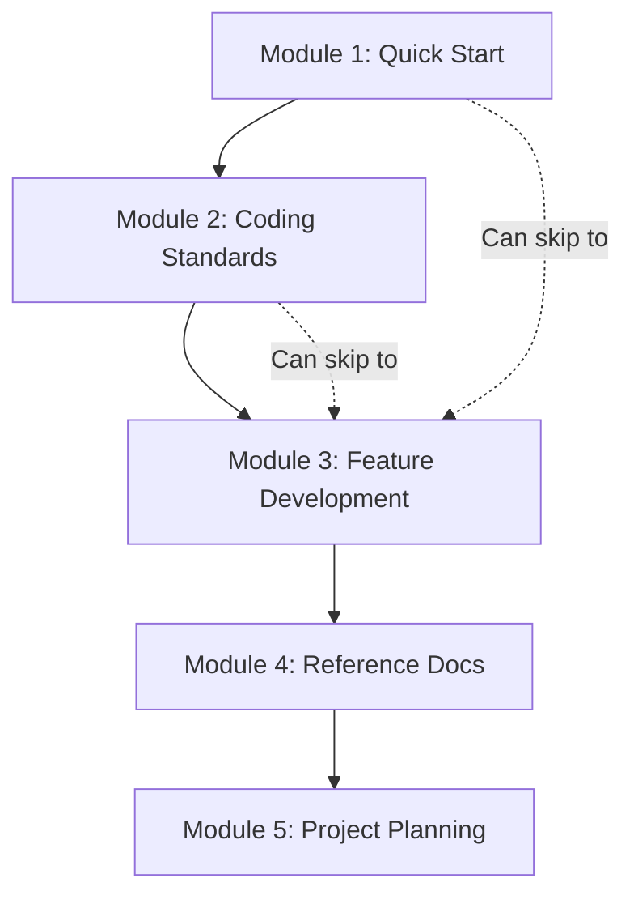

# Modular AI Workflow System

## Overview

Transform the AI Context Docs Lifecycle from a single methodology into 5 independent modules that users can adopt based on their needs. Keep it lightweight (markdown-only, no dependencies) while borrowing best concepts from BMAD (workflow tracks, state management).

## Architecture



### Module Dependencies (Adoption Path)

Numbered by adoption path - start with 1, add more as needed:

- **Module 1 (Quick Start)**: Entry point - Just AGENTS.md, 5-minute setup
- **Module 2 (Coding Standards)**: Code style + doc style rules
- **Module 3 (Feature Development)**: Workflows for building features (quick/standard/complex)
- **Module 4 (Reference Docs)**: Documentation structure, diagrams, freshness rules
- **Module 5 (Project Planning)**: Backlog, roadmap, project-level PRD (optional)

## New Folder Structure

Replace [`content/`](content/) entirely with:

```
content/
├── modules/                          # Independent modules (adopt in order)
│   │
│   ├── 01-quick-start/               # 🚀 START HERE
│   │   ├── README.md                 # 5-minute setup guide
│   │   └── templates/
│   │       └── AGENTS.md             # Minimal AI context file
│   │
│   ├── 02-coding-standards/          # Code + doc style rules
│   │   ├── README.md                 # What this module does
│   │   ├── templates/
│   │   │   └── .cursor/
│   │   │       └── rules/
│   │   │           ├── code-style.mdc
│   │   │           └── doc-style.mdc
│   │   └── examples/
│   │       └── .cursor/
│   │           └── rules/
│   │               ├── code-style.mdc  # Filled example (TypeScript/React)
│   │               └── doc-style.mdc
│   │
│   ├── 03-feature-development/       # 🎯 CORE MODULE - Feature workflows
│   │   ├── README.md                 # Overview + workflow selection
│   │   ├── workflows/
│   │   │   ├── quick-flow.md        # Bug fixes, < 1 hour
│   │   │   ├── standard-flow.md     # Small features, 1-8 hours
│   │   │   └── complex-flow.md      # Large features, multi-day
│   │   ├── templates/
│   │   │   ├── feature-spec.md      # Feature specification
│   │   │   ├── tasks.md             # Task checklist with markers
│   │   │   ├── user-stories.md      # Acceptance criteria (Given/When/Then)
│   │   │   ├── research.md          # Research notes (complex flow)
│   │   │   └── adr.md               # Architecture Decision Record
│   │   ├── examples/
│   │   │   ├── simple-todo/         # Standard flow example
│   │   │   │   ├── README.md        # Walkthrough
│   │   │   │   ├── feature-spec.md  # Filled spec (consistent naming)
│   │   │   │   └── tasks.md         # Filled tasks
│   │   │   └── complex-auth/        # Complex flow example
│   │   │       ├── README.md
│   │   │       ├── feature-spec.md
│   │   │       ├── research.md
│   │   │       ├── user-stories.md
│   │   │       ├── tasks.md
│   │   │       └── adr.md
│   │   └── rules/
│   │       └── feature-workflow.mdc  # Cursor rule for workflow
│   │
│   ├── 04-reference-docs/            # Evergreen documentation
│   │   ├── README.md
│   │   ├── structure.md              # Required doc types
│   │   ├── diagrams.md               # Mermaid patterns
│   │   ├── freshness.md              # Update-or-delete rule + triggers
│   │   ├── templates/
│   │   │   ├── AGENTS.md            # Full AI context template
│   │   │   ├── feature-readme.md    # Feature documentation
│   │   │   └── docs-index.md        # Navigation hub
│   │   ├── rules/
│   │   │   └── reference-freshness.mdc  # Cursor rule for doc updates
│   │   └── examples/
│   │       └── spacebooker/          # SpaceBooker example
│   │
│   └── 05-project-planning/          # OPTIONAL - Multi-feature planning
│       ├── README.md
│       ├── templates/
│       │   ├── PROJECT-PRD.md        # Project-level product vision
│       │   ├── BACKLOG.md           # Feature prioritization
│       │   ├── ROADMAP.md           # Phase/release planning
│       │   └── TASKS.md             # Global progress tracking
│       └── examples/
│
├── guides/                           # Adoption guides
│   ├── getting-started.md            # Module selector
│   ├── new-project.md                # Start from scratch
│   ├── existing-project.md           # Add to existing codebase
│   └── migration-from-v1.md          # Upgrade from old ACDL
│
└── README.md                         # Overview + quick links
```

## Module 3: Feature Development (Primary Focus)

This is the core module - most users will adopt this after Quick Start.

### Three Workflow Tracks

Inspired by BMAD's scale-adaptive approach, but simplified with **feature-based selection** (not time-based, which AI can't estimate well).

#### Workflow Selection Guide (for AI Agents)

| Trigger | Flow | Why |

|---------|------|-----|

| Bug fix, typo, config change | **Quick** | Single-file, no design decisions |

| Single-file edit, minor refactor | **Quick** | Low risk, reversible |

| New component, new endpoint, < 5 files | **Standard** | Needs tracking, no research |

| UI enhancement, feature toggle | **Standard** | Defined scope |

| New system, new integration | **Complex** | Needs research |

| External API integration | **Complex** | Needs research + alternatives |

| Architecture change, > 5 files | **Complex** | High impact, needs ADR |

| User asks "research options" | **Complex** | Explicit research request |

**Decision Tree for AI**:

```
Does this require research or evaluating alternatives?
├─ YES → Complex Flow
└─ NO → Will this change more than 5 files?
         ├─ YES → Complex Flow (likely architectural)
         └─ NO → Is this a bug fix, typo, or config change?
                  ├─ YES → Quick Flow
                  └─ NO → Standard Flow
```

#### 1. Quick Flow

**Triggers**: Bug fix, typo, config change, single-file edit, minor refactor

**Process**:

```markdown
1. Understand the issue
2. Fix code
3. Verify fix works (run tests if exist)
4. Commit with descriptive message
5. Done ✅

No spec needed, no ADR needed.
```

**Template**: None - just good commit messages

**AI Checklist**:

- [ ] Change is isolated (1-2 files max)
- [ ] No new patterns introduced
- [ ] Existing tests still pass

#### 2. Standard Flow

**Triggers**: New component, new endpoint, UI enhancement, < 5 files changed

**Process**:

```markdown
1. Create feature-spec.md (problem + acceptance criteria)
2. Create tasks.md with checklist
3. Mark first task [~] and implement
4. Update tasks.md after each task
5. Verify acceptance criteria
6. Signal "Ready for review"
7. Archive or delete spec
```

**Templates**:

- `feature-spec.md` (1-page spec)
- `tasks.md` (checkbox list)

**Example**: Adding a filter to a list view

**AI Checklist**:

- [ ] Feature spec exists before coding
- [ ] Tasks tracked in tasks.md
- [ ] Only ONE task [~] at a time
- [ ] Progress updated after each task
- [ ] Acceptance criteria verified at end

#### 3. Complex Flow

**Triggers**: New system, external API, architecture change, > 5 files, needs research

**Process**:

```markdown
1. Create research.md (gather options, links, diagrams)
2. Write feature-spec.md with user stories
3. Create tasks.md with grouped checklist
4. Implement with progress tracking
5. Signal "Ready for review" at milestones
6. Create ADR when complete
7. Update AGENTS.md if patterns changed
8. Archive spec
```

**Templates**:

- `research.md` (links, notes, alternatives)
- `feature-spec.md` (detailed with diagrams)
- `user-stories.md` (Given/When/Then format)
- `tasks.md` (grouped checklist)
- `adr.md` (decision record)

**Example**: Building OAuth authentication

**AI Checklist**:

- [ ] Research completed before implementation
- [ ] At least 2 alternatives documented
- [ ] Feature spec approved by human before coding
- [ ] Tasks grouped by category
- [ ] ADR created capturing key decision
- [ ] AGENTS.md updated if new patterns

### Task State Management (Markdown-Only)

No YAML dependency - use markdown checkboxes with enhanced syntax:

```markdown
## Tasks

### Setup
- [ ] T-01: Create database schema
- [~] T-02: Set up API routes (IN PROGRESS)
- [x] T-03: Configure environment variables

### Core Features
- [B] T-04: Implement payment flow (BLOCKED: waiting on API keys)
- [ ] T-05: Add error handling
- [S] T-06: Add rate limiting (SKIPPED: deferred to phase 2)

### Testing
- [ ] T-07: Write unit tests
- [ ] T-08: Integration tests

---

**Progress**: 2/8 tasks complete (25%)
```

**Task Markers**:

| Marker | Status | Renders in GitHub |

|--------|--------|-------------------|

| `[ ]` | Pending | Unchecked ☐ |

| `[~]` | In progress | Unchecked ☐ (non-standard) |

| `[x]` | Completed | Checked ☑ |

| `[B]` | Blocked | Unchecked ☐ (non-standard) |

| `[S]` | Skipped | Unchecked ☐ (non-standard) |

**Note**: Custom markers `[~]`, `[B]`, `[S]` don't render specially in GitHub/standard markdown, but they're easy to search (e.g., `grep "\[B\]"`) and unambiguous for AI agents. The simplicity outweighs visual rendering limitations.

### Terminology: Feature Spec vs Project PRD

**Important distinction**:

- **Feature Spec** (Module 3): Lightweight specification for a SINGLE feature or change. Created per feature, archived or deleted after implementation.
- **Project PRD** (Module 5, optional): High-level product vision document for the ENTIRE project/product. Covers overall goals, target users, business metrics, roadmap. Created once per project, kept evergreen.

**When to use what**:

- Building a new feature? → Feature Spec (Module 3: Feature Development)
- Defining overall product vision? → Project PRD (Module 5: Project Planning, optional)
- Bug fix? → Neither (Quick Flow, just good commit message)

**Note**: We avoid calling feature specs "PRD-lite" to prevent confusion. A feature spec is NOT a mini-PRD - it's a different document type with a different purpose.

---

## AI Agent Instructions

This section defines how AI agents should use this workflow. These instructions will be included in `feature-workflow.mdc`.

### Context Loading Order

Before starting ANY feature work, AI agents must load context in this order:

```markdown
1. AGENTS.md                           → Project overview, tech stack, patterns
2. .cursor/rules/feature-workflow.mdc  → This workflow (if not already loaded)
3. specs/<feature>/feature-spec.md → Requirements for current feature
4. specs/<feature>/tasks.md       → Current task status
5. specs/<feature>/research.md    → Research notes (complex flow only)
6. .cursor/rules/<relevant>.mdc        → Relevant coding rules
```

### Before Starting Work

```markdown
AI MUST check before implementing:

1. Does specs/<feature>/feature-spec.md exist?
   ├─ YES → Read it, proceed to step 2
   └─ NO → ASK USER: "Should I create a feature spec first? 
                      What workflow: quick (bug fix), standard (small feature), 
                      or complex (needs research)?"

2. Does specs/<feature>/tasks.md exist?
   ├─ YES → Find first task not [x], [S], or [B]
   │        Mark it [~] before starting
   └─ NO → Create tasks.md from feature-spec requirements

3. Is there already a task marked [~]?
   ├─ YES → Continue that task OR ask if switching
   └─ NO → Mark next pending task [~]
```

### During Implementation

```markdown
AI MUST follow these rules:

1. ONE task [~] at a time
   - Never have multiple tasks in progress
   - Complete or block current task before starting next

2. Update tasks.md after EACH task
   - Mark completed: [x]
   - Mark blocked: [B] with reason
   - Mark skipped: [S] with reason
   - Recalculate progress

3. Progress calculation
   progress = (completed + skipped) / total * 100
   
   Example: 3 [x] + 1 [S] + 4 [ ] = (3+1)/8 = 50%

4. When blocked
   - Mark task [B] with clear reason
   - Ask user for guidance
   - Do NOT skip to next task without acknowledgment
```

### Signaling Completion

```markdown
When all tasks are [x] or [S], AI MUST:

1. Verify acceptance criteria from feature-spec.md
   - Check each criterion
   - Note any that aren't met

2. Signal ready for review:
   "Ready for review. Implementation complete.
   
   **DoD Checklist**:
   - [x] All tasks completed (X/Y) or skipped
   - [x] Acceptance criteria verified
   - [ ] Human review needed
   
   **Acceptance Criteria Status**:
   - AC-01: ✓ Implemented
   - AC-02: ✓ Implemented
   - AC-03: ⚠️ Partial (explain)
   
   **Next steps**: Please review and provide feedback."

3. For Complex Flow, also:
   - Draft ADR for key decisions
   - List AGENTS.md updates needed
```

### When to Create ADR

AI should create an ADR when ANY of these are true:

- Evaluated 2+ alternatives and chose one
- Introduced a new architectural pattern
- Made a breaking change
- Chose a third-party library/service
- User explicitly requested documentation of decision

### When to Update Reference Docs

Reference docs (AGENTS.md, Feature READMEs) follow the **"Update or Delete"** rule: they must always reflect current state. No stale documentation allowed.

#### Document Lifecycle Types

| Type | Documents | Rule |

|------|-----------|------|

| **Ephemeral** | Feature Spec, Research, tasks.md | Delete/archive after feature complete |

| **Permanent** | ADR | Never delete, only supersede |

| **Evergreen** | AGENTS.md, Feature README, docs-index | **Update or delete** - must be current |

#### AGENTS.md Update Triggers

```markdown
AI MUST update AGENTS.md when:

| Trigger | Section to Update |
|---------|-------------------|
| New tech added to stack | Tech Stack |
| New pattern introduced | Key Patterns |
| File structure changed | File Organization |
| New gotcha discovered | Common Gotchas |
| Feature completed (Complex) | Feature map |
```

#### Feature README Update Triggers

```markdown
AI MUST update Feature README when:

| Trigger | What to Update |
|---------|----------------|
| Feature implemented | Create new README |
| Behavior changed | How it works section |
| Files moved/renamed | Code touchpoints |
| API changed | Usage examples |
```

#### AI Instructions for Reference Updates

```markdown
After completing Standard or Complex Flow, AI MUST:

1. Check AGENTS.md
   - Is tech stack still accurate?
   - Are patterns still accurate?
   - Does file organization reflect reality?
   - Any new gotchas to document?

2. Check Feature README (if exists)
   - Are code touchpoints current?
   - Is "how it works" accurate?

3. If anything is stale:
   - UPDATE it, OR
   - FLAG: "AGENTS.md section X may need review"

4. For Complex Flow:
   - ALWAYS update AGENTS.md (new feature = new context)
   - Create Feature README if doesn't exist
```

#### When NOT to Update Reference Docs

- Quick Flow (bug fixes) - usually no update needed
- Unless the fix changes documented behavior

### Cursor Rule: feature-workflow.mdc

This is the content for `modules/03-feature-development/rules/feature-workflow.mdc`:

```markdown
---
description: Feature development workflow for AI agents
globs:
  - "specs/**/*"
  - "src/**/*"
  - "app/**/*"
alwaysApply: false
---

# Feature Development Workflow

## Workflow Selection

Before starting, determine the workflow:

| Trigger | Flow |
|---------|------|
| Bug fix, typo, config, single-file | Quick |
| New component, endpoint, < 5 files | Standard |
| New system, API integration, > 5 files, needs research | Complex |

## Context Loading

Load in order:
1. `AGENTS.md` - Project context
2. `specs/<feature>/feature-spec.md` - Requirements
3. `specs/<feature>/tasks.md` - Task status

## Task Rules

- Only ONE task `[~]` at a time
- Update tasks.md after each task completion
- Calculate progress: (completed + skipped) / total

## Task Markers

- `[ ]` Pending
- `[~]` In progress (only one)
- `[x]` Completed
- `[B]` Blocked (include reason)
- `[S]` Skipped (include reason)

## Before Coding

1. Check if feature-spec.md exists
2. If not, ask user which workflow to use
3. Find first uncompleted task, mark [~]

## After Each Task

1. Mark task [x] or [B] or [S]
2. Update progress line
3. Mark next task [~] or signal completion

## Signaling Completion

When done, output:
- DoD checklist status
- Acceptance criteria status
- Request human review

## When to Create ADR

Create ADR if:
- Evaluated 2+ alternatives
- New architectural pattern
- Breaking change
- New library/service choice

## Reference Docs Update

After Standard/Complex Flow completion:

1. Check AGENTS.md - update if patterns/stack changed
2. Check Feature README - update code touchpoints
3. Rule: **Update or Delete** - no stale docs

Update triggers:
- New tech → Tech Stack section
- New pattern → Key Patterns section
- Files moved → File Organization section
- Complex Flow complete → Always update AGENTS.md
```

---

### Definition of Done (Simple Version)

For each workflow track:

**Quick Flow DoD**:

- Code works
- No linter errors
- Commit message describes change
- Reference docs updated IF behavior changed (rare)

**Standard Flow DoD**:

- All tasks checked off
- Acceptance criteria met
- Feature README updated (code touchpoints)
- AGENTS.md updated if new patterns introduced

**Complex Flow DoD**:

- All tasks completed or skipped
- All acceptance criteria verified
- Tests written and passing
- ADR created for key decisions
- AGENTS.md updated (required for Complex)
- Feature README created/updated
- Spec archived

## Examples

### Example 1: Simple Todo Feature (Standard Flow)

**Scenario**: Add "Mark all as complete" button to todo app

**Step 1: Create Spec** (`specs/mark-all-complete.md`)

```markdown
# Feature: Mark All Complete Button

## Problem
Users have no way to complete all todos at once.

## Solution
Add "Mark all as complete" button above todo list.

## Acceptance Criteria
- [ ] AC-01: Button visible when 2+ incomplete todos exist
- [ ] AC-02: Clicking button marks all todos as complete
- [ ] AC-03: Button shows confirmation dialog before action
- [ ] AC-04: Button is disabled when no incomplete todos

## Out of Scope
- Undo functionality (future)
- Selective bulk actions

## Tasks
See [tasks.md](./tasks.md)
```

**Step 2: Create Tasks** (`specs/mark-all-complete-tasks.md`)

```markdown
# Tasks: Mark All Complete

## UI
- [ ] T-01: Add button component to TodoList
- [~] T-02: Add confirmation dialog (IN PROGRESS)
- [ ] T-03: Style button with Tailwind

## Logic
- [ ] T-04: Implement markAllComplete function
- [ ] T-05: Update todos state

## Testing
- [ ] T-06: Test button visibility logic
- [ ] T-07: Test bulk update

---
**Progress**: 0/7 (0%)
```

**Step 3: Implement & Track**

As AI completes tasks, it updates tasks.md:

```markdown
## UI
- [x] T-01: Add button component to TodoList
- [x] T-02: Add confirmation dialog
- [x] T-03: Style button with Tailwind

## Logic
- [~] T-04: Implement markAllComplete function (IN PROGRESS)
- [ ] T-05: Update todos state
```

**Step 4: Complete & Archive**

Once all tasks done:

1. Verify acceptance criteria
2. Delete or archive spec (no ADR needed for simple feature)
3. Update feature docs if needed

**Total time**: ~2-3 hours

---

### Example 2: Complex Auth Feature (Complex Flow)

**Scenario**: Implement OAuth authentication for workspace app

**Step 1: Research** (`specs/oauth-auth/research.md`)

```markdown
# OAuth Authentication Research

## Providers Evaluated
- Google OAuth 2.0 ✅ (chosen)
- GitHub OAuth
- Auth0

## Decision: Google OAuth
- Reasons: Most users have Google accounts, simpler setup
- See ADR-015 for full decision rationale

## Resources
- [Google OAuth Docs](https://developers.google.com/identity/protocols/oauth2)
- [NextAuth.js Guide](https://next-auth.js.org/providers/google)
- Example: [GitHub repo](https://github.com/example)

## Security Considerations
- CSRF protection via state parameter
- Token storage in httpOnly cookies
- Refresh token rotation

## Data Flow

\`\`\`mermaid
sequenceDiagram
    participant User
    participant App
    participant Google
    participant DB
    
    User->>App: Click Login
    App->>Google: Redirect with client_id
    Google->>User: Show consent screen
    User->>Google: Approve
    Google->>App: Redirect with code
    App->>Google: Exchange code for tokens
    Google->>App: Return access_token
    App->>DB: Create user session
    App->>User: Redirect to dashboard
\`\`\`
```

**Step 2: Detailed Spec** (`specs/oauth-auth/spec.md`)

```markdown
# Feature: OAuth Authentication

## Problem
Users need secure authentication without password management.

## Success Metrics
- 90%+ users can log in successfully
- < 5 sec auth flow completion
- Zero password storage

## Scope

### In Scope
- Google OAuth integration
- User session management
- Protected route middleware
- Logout functionality

### Out of Scope
- Multi-factor authentication (phase 2)
- Social login (GitHub, Twitter) (phase 3)
- Email/password fallback (phase 2)

## User Stories
See [user-stories.md](./user-stories.md)

## Technical Approach
- NextAuth.js for OAuth flow
- Prisma for user/session storage
- Middleware for route protection

## Risks → Mitigations

| Risk | Mitigation |
|------|------------|
| Google OAuth downtime | Cache user sessions, graceful degradation |
| Token expiry during session | Implement refresh token rotation |
| CSRF attacks | Use NextAuth built-in CSRF protection |

## Dependencies
- Google Cloud project setup (T-01)
- Database schema update (T-02)

## Research
See [research.md](./research.md)
```

**Step 3: User Stories** (`specs/oauth-auth/user-stories.md`)

```markdown
# User Stories: OAuth Authentication

## US-01: Login with Google

**As a** new user  
**I want to** log in with my Google account  
**So that** I don't need to create another password

**Acceptance Criteria**:
- [ ] AC-01: Login button visible on homepage
- [ ] AC-02: Clicking redirects to Google consent screen
- [ ] AC-03: After approval, user lands on dashboard
- [ ] AC-04: User profile shows Google avatar and name

**Given** I'm on the login page  
**When** I click "Login with Google"  
**Then** I'm redirected to Google OAuth  
**And** after approval, I'm logged into my dashboard

---

## US-02: Access Protected Routes

**As a** logged-in user  
**I want to** access protected pages  
**So that** I can use the app features

**Acceptance Criteria**:
- [ ] AC-05: Logged-in users can access /dashboard
- [ ] AC-06: Non-logged users redirect to login
- [ ] AC-07: Session persists across page refreshes

---

## US-03: Logout

**As a** logged-in user  
**I want to** log out securely  
**So that** my session is terminated

**Acceptance Criteria**:
- [ ] AC-08: Logout button in header
- [ ] AC-09: Clicking clears session
- [ ] AC-10: Redirect to homepage after logout
```

**Step 4: Task Breakdown** (`specs/oauth-auth/tasks.md`)

```markdown
# Tasks: OAuth Authentication

## Setup (Dependencies)
- [ ] T-01: Create Google Cloud project, get OAuth credentials
- [ ] T-02: Update Prisma schema (User, Account, Session models)
- [ ] T-03: Run database migration
- [ ] T-04: Install NextAuth.js dependency

## Core Implementation
- [ ] T-05: Configure NextAuth.js with Google provider
- [ ] T-06: Create /api/auth/[...nextauth] route
- [ ] T-07: Add login/logout buttons to UI
- [ ] T-08: Implement session provider wrapper

## Route Protection
- [ ] T-09: Create auth middleware for protected routes
- [ ] T-10: Wrap dashboard routes with auth check
- [ ] T-11: Add redirect logic for unauthenticated users

## User Profile
- [ ] T-12: Fetch user session in components
- [ ] T-13: Display user avatar and name in header
- [ ] T-14: Create user profile page

## Testing
- [ ] T-15: Test login flow end-to-end
- [ ] T-16: Test logout flow
- [ ] T-17: Test protected route access
- [ ] T-18: Test session persistence
- [S] T-19: Load testing (SKIPPED: defer to phase 2)

## Documentation
- [ ] T-20: Update AGENTS.md with auth pattern
- [ ] T-21: Document environment variables
- [ ] T-22: Create feature README

---

**Progress**: 0/21 (0%)  
**Blocked**: None  
**In Progress**: None
```

**Step 5: Implementation with Progress Tracking**

AI updates tasks.md as it works:

```markdown
## Setup (Dependencies)
- [x] T-01: Create Google Cloud project, get OAuth credentials
- [x] T-02: Update Prisma schema (User, Account, Session models)
- [x] T-03: Run database migration
- [x] T-04: Install NextAuth.js dependency

## Core Implementation
- [x] T-05: Configure NextAuth.js with Google provider
- [x] T-06: Create /api/auth/[...nextauth] route
- [~] T-07: Add login/logout buttons to UI (IN PROGRESS)
- [ ] T-08: Implement session provider wrapper

---

**Progress**: 6/21 (29%)
```

**Step 6: Review & Iterate**

Human reviews implementation:

- Checks acceptance criteria
- Tests login flow
- Requests changes if needed
- AI iterates back to implementation

**Step 7: Create ADR** (`docs/decisions/015-oauth-google.md`)

```markdown
# ADR-015: OAuth Authentication with Google

## Status
Accepted

## Context
Users need secure authentication. We evaluated password-based auth, OAuth, and third-party services.

## Decision
Use Google OAuth 2.0 via NextAuth.js.

## Rationale
- Most users have Google accounts (high adoption)
- No password storage/management overhead
- NextAuth.js handles complexity (CSRF, token refresh)
- Proven security model

## Consequences

**Positive**:
- Secure, standard authentication
- Low maintenance
- Better UX (one-click login)

**Negative**:
- Dependency on Google availability
- Limited to Google users initially

## Alternatives Considered

### GitHub OAuth
- Rejected: Smaller user base for our audience

### Auth0
- Rejected: Extra cost, overkill for current scale

### Email/Password
- Rejected: Higher security risk, poor UX

## Implementation
See `docs/features/auth/` for details.
```

**Step 8: Update REFERENCE Docs**

Update AGENTS.md with new auth pattern:

```markdown
## Authentication
- **Provider**: Google OAuth 2.0 via NextAuth.js
- Session: Database sessions (Prisma)
- **Protected routes**: Middleware in `middleware.ts`
- **Pattern**: Wrap pages with `getServerSession()`

See: `docs/features/auth/README.md`
```

**Step 9: Archive Spec**

Move to `specs/_archive/oauth-auth/` or delete (ADR captures the decision).

**Total time**: 2-3 days

---

## Migration from Current Content

### What Gets Moved Where

| Current | New Location | Changes |

|---------|--------------|---------|

| `content/templates/AGENTS.md` | `modules/04-reference-docs/templates/` (full) + `modules/01-quick-start/templates/` (minimal) | Split into minimal and full versions |

| `content/templates/prd-lite.md` | `modules/03-feature-development/templates/feature-spec.md` | Renamed (clarified as feature-level, not project PRD) |

| `content/templates/tasks.md` | `modules/03-feature-development/templates/` | Enhanced with custom markers |

| `content/templates/adr.md` | `modules/03-feature-development/templates/` | Same |

| `content/templates/cursor-rules/` | Split across modules | By domain |

| `content/examples/` | `modules/*/examples/` | Split by module |

| `content/rules/` | `guides/` | Converted to guides |

| `content/guides/` | `guides/` | Updated |

### What Gets Removed

- `_examples/.acdl/` - YAML/CLI approach (too heavy)
- Old markdown-based methodology (replaced)

## Website Updates

Update [`site/src/content/docs/`](site/src/content/docs/) to match new structure:

1. **New landing page**: Module selector quiz
2. **Module pages**: One page per module with adoption guide
3. **Examples section**: Showcase both simple and complex flows
4. **Migration guide**: For existing ACDL users

## Implementation Strategy

Given focus on Module 3 (Feature Development), implement in this order:

### Phase 1: Entry Point

1. Create Module 1 (Quick Start) - simple AGENTS.md template
2. This is what users see first

### Phase 2: Core Feature Development (Module 3)

1. Create module structure
2. Write three workflow guides (quick, standard, complex) with feature-based triggers
3. Create templates (feature-spec, tasks, user-stories, research, adr)
4. Write Cursor rule with AI agent instructions (context loading, task rules, completion signals)

### Phase 3: Examples

1. Document simple todo example (standard flow)
2. Document complex auth example (complex flow)
3. Add step-by-step walkthroughs

### Phase 4: Supporting Modules

1. Create Module 2 (Coding Standards) - code/doc style rules
2. Create Module 4 (Reference Docs) - AGENTS.md full template, structure guides

### Phase 5: Project Planning (Optional)

1. Create Module 5 if time permits - backlog, roadmap, project PRD

### Phase 6: Documentation

1. Update main README
2. Create adoption guides
3. Update website

## Key Principles

1. **Lightweight**: No dependencies, just markdown
2. **Progressive**: Start minimal, add complexity as needed
3. **Practical**: Real examples, not theoretical
4. **Flexible**: Pick modules that fit your workflow
5. **Clear**: Each module solves one problem well

## Success Metrics

- New user can adopt Module 1 (Quick Start) in < 5 minutes
- Module 3 (Feature Development) provides value for both simple and complex features
- No external dependencies required
- Examples are copy-paste ready
- Module names are self-explanatory (no need to read docs to understand purpose)
- **AI Agent Usability**: Workflow can be followed by AI without ambiguity
                                                                                                                                                                                                                                                                                                                                                                                                                                                                                                                                                                                                                                                                                                                                                                                                                                                                                                                                                                                                                                                                                                                                                                                                                                                                                                                                                                                                                                                                                                                                                                                                                                                                                                                                                                                                                                                                                                                                                                                                                                                                                                                                - Feature-based workflow selection (not time-based)
                                                                                                                                                                                                                                                                                                                                                                                                                                                                                                                                                                                                                                                                                                                                                                                                                                                                                                                                                                                                                                                                                                                                                                                                                                                                                                                                                                                                                                                                                                                                                                                                                                                                                                                                                                                                                                                                                                                                                                                                                                                                                                                                - Clear context loading order
                                                                                                                                                                                                                                                                                                                                                                                                                                                                                                                                                                                                                                                                                                                                                                                                                                                                                                                                                                                                                                                                                                                                                                                                                                                                                                                                                                                                                                                                                                                                                                                                                                                                                                                                                                                                                                                                                                                                                                                                                                                                                                                                - Unambiguous task state rules
                                                                                                                                                                                                                                                                                                                                                                                                                                                                                                                                                                                                                                                                                                                                                                                                                                                                                                                                                                                                                                                                                                                                                                                                                                                                                                                                                                                                                                                                                                                                                                                                                                                                                                                                                                                                                                                                                                                                                                                                                                                                                                                                - Explicit completion signals