# Documentation Workflow Diagrams

> Mermaid diagrams visualizing the docs-as-code methodology.

---

## 1. Document Lifecycle (Four Pillars)

Each document type follows a distinct lifecycle pattern:

### Lifecycle Summary

| Type | Lifecycle | Update Rule |
|------|-----------|-------------|
| **Specs** | Draft → In Progress → Done → Archive | Archive after merge |
| **Reference** | Create → Update → (Deprecate) | Update when behavior changes |
| **Rules** | Create → Evolve | Update as patterns emerge |
| **Decisions** | Create → (Supersede) | Never edit, only add new |

---

## 2. Spec Lifecycle Detail

The ephemeral nature of specs - they guide work, then disappear:

---

## 3. AI Agent & Human Collaboration

How AI and humans work together through the docs-as-code workflow:

---

## 4. The 7-Step Workflow Loop

The complete development cycle from spec to completion:

```mermaid
flowchart LR
    subgraph "1️⃣ SPEC"
        S[Define Change]
    end

    subgraph "2️⃣ RULES"
        R[Apply Patterns]
    end

    subgraph "3️⃣ IMPLEMENT"
        I[Code + Tests]
    end

    subgraph "4️⃣ REVIEW"
        V[PR + CI]
    end

    subgraph "5️⃣ DECIDE"
        D[ADR if needed]
    end

    subgraph "6️⃣ UPDATE"
        U[Reference Docs]
    end

    subgraph "7️⃣ CLOSE"
        C[Archive Spec]
    end

    S --> R --> I --> V --> D --> U --> C
    C -.-> S

    style S fill:#fff3e0,stroke:#e65100
    style R fill:#e3f2fd,stroke:#1565c0
    style I fill:#f3e5f5,stroke:#7b1fa2
    style V fill:#e8f5e9,stroke:#2e7d32
    style D fill:#fce4ec,stroke:#c2185b
    style U fill:#e0f7fa,stroke:#00838f
    style C fill:#f5f5f5,stroke:#616161
```

---

## 5. AI Agent Reading Order

What an AI agent should read before starting work:

---

## 6. Document Dependencies

How information flows between document types:

---

## 7. Definition of Done (PR Gate)

Visual checklist for completing work:

```mermaid
flowchart LR
    subgraph CHECKLIST["✅ PR GATE CHECKLIST"]
        direction TB
        C1["☐ Spec criteria met"]
        C2["☐ Tests pass"]
        C3["☐ CI green"]
        C4["☐ Reference updated"]
        C5["☐ ADR added (if needed)"]
        C6["☐ Spec closed"]
    end

    START([PR Ready]) --> C1
    C1 --> C2
    C2 --> C3
    C3 --> C4
    C4 --> C5
    C5 --> C6
    C6 --> DONE([Merge])

    style START fill:#fff3e0,stroke:#e65100
    style DONE fill:#e8f5e9,stroke:#2e7d32
    style CHECKLIST fill:#fafafa,stroke:#9e9e9e,stroke-width:2px
```

---

## Quick Reference

| Diagram | Purpose |
|---------|---------|
| 1. Four Pillars | Overview of all document types and lifecycles |
| 2. Spec Detail | Detailed spec state transitions |
| 3. AI & Human | Collaboration model between AI and human |
| 4. 7-Step Loop | Complete workflow from spec to close |
| 5. Reading Order | What AI should read before starting |
| 6. Dependencies | How information flows between docs |
| 7. PR Gate | Definition of Done checklist |
