# Docs-as-Code: Presentation Diagrams

> Clean, high-level diagrams for presentation slides.
> Enhanced based on AI agent review feedback.

---

## The Core Loop (Recommended for Slides)

```mermaid
flowchart LR
    subgraph HUMAN["👤 Human"]
        H1["Define<br/>WHAT"]
    end

    subgraph DOCS["📄 Docs"]
        D1["Spec"]
        D2["Rules"]
        D3["Reference"]
    end

    subgraph AI["🤖 AI Agent"]
        A1["Build<br/>HOW"]
    end

    subgraph OUTPUT["✅ Result"]
        O1["Code +<br/>Updated Docs"]
    end

    H1 --> D1
    D1 --> A1
    D2 --> A1
    D3 --> A1
    A1 --> O1
    O1 --> D3
    O1 -.->|next cycle| H1

    style HUMAN fill:#e3f2fd,stroke:#1565c0,stroke-width:3px
    style DOCS fill:#fff8e1,stroke:#ff8f00,stroke-width:3px
    style AI fill:#f3e5f5,stroke:#7b1fa2,stroke-width:3px
    style OUTPUT fill:#e8f5e9,stroke:#2e7d32,stroke-width:3px
```

---

## AI Agent Context Loading Protocol

How AI agents efficiently load context in <30 seconds:

```mermaid
flowchart LR
    subgraph LOAD["🤖 AI LOADING ORDER"]
        direction TB
        L1["1️⃣ AGENTS.md<br/>Project overview"]
        L2["2️⃣ .cursor/rules/<br/>Patterns & standards"]
        L3["3️⃣ code-map.md<br/>Where to find what"]
        L4["4️⃣ Feature rules<br/>Domain-specific"]
        L5["5️⃣ Active spec<br/>Current task"]
    end

    L1 --> L2 --> L3 --> L4 --> L5

    subgraph READY["✅ READY TO BUILD"]
        R1["Understands context"]
        R2["Knows patterns"]
        R3["Has current state"]
        R4["Clear requirements"]
    end

    L5 --> R1
    L5 --> R2
    L5 --> R3
    L5 --> R4

    style LOAD fill:#f3e5f5,stroke:#7b1fa2,stroke-width:3px
    style READY fill:#e8f5e9,stroke:#2e7d32,stroke-width:3px
```

---

## Simplified 3-Phase View

```mermaid
flowchart LR
    P1["📝 PLAN<br/><br/>Human writes Spec<br/>AI reads context"]
    P2["🔨 BUILD<br/><br/>AI implements<br/>Human reviews"]
    P3["📚 DOCUMENT<br/><br/>Update Reference<br/>Close Spec"]

    P1 ==> P2 ==> P3
    P3 -.->|repeat| P1

    style P1 fill:#e3f2fd,stroke:#1565c0,stroke-width:3px
    style P2 fill:#f3e5f5,stroke:#7b1fa2,stroke-width:3px
    style P3 fill:#e8f5e9,stroke:#2e7d32,stroke-width:3px
```

---

## The Four Pillars (One Slide)

```mermaid
flowchart TB
    subgraph PILLARS["📑 DOCUMENTATION PILLARS"]
        direction LR
        
        subgraph S["SPECS"]
            S1["What to build<br/>━━━━━━━━━<br/>Ephemeral<br/>Archive after use"]
        end
        
        subgraph R["RULES"]
            R1["How to build<br/>━━━━━━━━━<br/>Stable<br/>Evolve over time"]
        end
        
        subgraph F["REFERENCE"]
            F1["What exists<br/>━━━━━━━━━<br/>Evergreen<br/>Always current"]
        end
        
        subgraph D["DECISIONS"]
            D1["Why we chose<br/>━━━━━━━━━<br/>Append-only<br/>Never delete"]
        end
    end

    style S fill:#fff3e0,stroke:#e65100,stroke-width:2px
    style R fill:#e3f2fd,stroke:#1565c0,stroke-width:2px
    style F fill:#e8f5e9,stroke:#2e7d32,stroke-width:2px
    style D fill:#fce4ec,stroke:#c2185b,stroke-width:2px
    style PILLARS fill:#fafafa,stroke:#bdbdbd,stroke-width:1px
```

---

## Human + AI Collaboration (Visual)

```mermaid
flowchart TD
    subgraph CYCLE["Development Cycle"]
        direction TB
        
        H["👤 HUMAN<br/>━━━━━━━━━━━<br/>• Writes specs<br/>• Sets criteria<br/>• Reviews work<br/>• Approves changes"]
        
        D["📄 DOCS<br/>━━━━━━━━━━━<br/>• Specs (what)<br/>• Rules (how)<br/>• Reference (is)<br/>• Decisions (why)"]
        
        A["🤖 AI AGENT<br/>━━━━━━━━━━━<br/>• Reads context<br/>• Plans changes<br/>• Writes code<br/>• Updates docs"]
    end

    H -->|"writes"| D
    D -->|"guides"| A
    A -->|"updates"| D
    D -->|"informs"| H

    style H fill:#e3f2fd,stroke:#1565c0,stroke-width:3px
    style D fill:#fff8e1,stroke:#ff8f00,stroke-width:3px
    style A fill:#f3e5f5,stroke:#7b1fa2,stroke-width:3px
    style CYCLE fill:#fafafa,stroke:#e0e0e0,stroke-width:1px
```

---

## Before vs After (Problem/Solution)

```mermaid
flowchart LR
    subgraph BEFORE["❌ TRADITIONAL"]
        direction TB
        B1["Code"] --> B2["Docs<br/>(afterthought)"]
        B2 --> B3["Docs rot"]
        B3 --> B4["AI hallucinates"]
        B4 --> B5["Knowledge lost"]
    end

    subgraph AFTER["✅ DOCS-AS-CODE"]
        direction TB
        A1["Spec<br/>(what)"] --> A2["Rules<br/>(how)"]
        A2 --> A3["Code"]
        A3 --> A4["Reference<br/>(updated)"]
        A4 --> A5["AI accurate"]
        A5 -.-> A1
    end

    style BEFORE fill:#ffebee,stroke:#c62828,stroke-width:2px
    style AFTER fill:#e8f5e9,stroke:#2e7d32,stroke-width:2px
```

---

## The Spec Collapse Pattern

Specs are ephemeral - they guide work, then disappear:

```mermaid
flowchart LR
    subgraph ACTIVE["📝 ACTIVE SPEC"]
        S1["Requirements<br/>Acceptance criteria<br/>Doc impact<br/>Implementation notes"]
    end

    subgraph WORK["🔨 WORK"]
        W1["Implement"]
        W2["Test"]
        W3["Review"]
    end

    subgraph COLLAPSED["📎 COLLAPSED"]
        C1["Status: ✅ Done<br/>PR: #123<br/>ADR: Link<br/>Docs: Link"]
    end

    ACTIVE ==> WORK
    WORK ==> COLLAPSED

    style ACTIVE fill:#fff3e0,stroke:#e65100,stroke-width:2px
    style WORK fill:#e3f2fd,stroke:#1565c0,stroke-width:2px
    style COLLAPSED fill:#f5f5f5,stroke:#9e9e9e,stroke-width:2px
```

**Why collapse?** Prevents "spec graveyard" where AI gets confused by multiple conflicting versions.

---

## Single Slide Summary

```mermaid
flowchart TB
    subgraph TITLE["DOCS-AS-CODE WORKFLOW"]
        direction LR
        
        subgraph IN["INPUT"]
            I1["👤 Human<br/>defines WHAT"]
        end
        
        subgraph PROCESS["PROCESS"]
            P1["📄 Docs guide"]
            P2["🤖 AI builds"]
        end
        
        subgraph OUT["OUTPUT"]
            O1["✅ Code +<br/>Updated Docs"]
        end
        
        I1 --> P1 --> P2 --> O1
    end

    O1 -.->|"continuous"| I1

    style IN fill:#e3f2fd,stroke:#1565c0,stroke-width:2px
    style PROCESS fill:#f3e5f5,stroke:#7b1fa2,stroke-width:2px
    style OUT fill:#e8f5e9,stroke:#2e7d32,stroke-width:2px
    style TITLE fill:#ffffff,stroke:#9e9e9e,stroke-width:1px
```

---

## Full SDLC Coverage

The framework covers the complete Software Development Life Cycle:

---

## AI Error Prevention

How the framework prevents common AI mistakes:

```mermaid
flowchart TB
    subgraph PROBLEMS["❌ WITHOUT FRAMEWORK"]
        direction TB
        X1["Inconsistent code"]
        X2["Outdated assumptions"]
        X3["Unknown decisions"]
        X4["Scope creep"]
    end

    subgraph SOLUTIONS["✅ WITH FRAMEWORK"]
        direction TB
        S1["Rules → Consistency"]
        S2["Reference → Current state"]
        S3["ADRs → Decision context"]
        S4["Specs → Clear scope"]
    end

    X1 -.-> S1
    X2 -.-> S2
    X3 -.-> S3
    X4 -.-> S4

    style PROBLEMS fill:#ffebee,stroke:#c62828,stroke-width:2px
    style SOLUTIONS fill:#e8f5e9,stroke:#2e7d32,stroke-width:2px
```

---

## Why Now? AI-First Documentation

```mermaid
flowchart LR
    subgraph PAST["📜 PAST"]
        P1["Docs for<br/>humans only"]
    end

    subgraph PRESENT["🤖 PRESENT"]
        N1["AI agents are<br/>core dev tools"]
    end

    subgraph FUTURE["🚀 FUTURE"]
        F1["Shared context<br/>for both"]
    end

    PAST --> PRESENT --> FUTURE

    style PAST fill:#f5f5f5,stroke:#9e9e9e,stroke-width:2px
    style PRESENT fill:#fff3e0,stroke:#e65100,stroke-width:2px
    style FUTURE fill:#e8f5e9,stroke:#2e7d32,stroke-width:2px
```

> "Both humans and AI agents need the same structured context to work effectively."

---

## Usage Tips for Presentations

| Diagram | Best For |
|---------|----------|
| **Core Loop** | Main explanation - shows full cycle |
| **AI Loading Protocol** | Technical audiences - how AI reads context |
| **3-Phase View** | Executive summary - simplest view |
| **Four Pillars** | Document types and lifecycles |
| **Human + AI** | Roles and responsibilities |
| **Before vs After** | Problem/solution hook |
| **Spec Collapse** | Preventing doc rot |
| **SDLC Coverage** | Enterprise audiences |
| **AI Error Prevention** | AI adoption pitch |
| **Why Now?** | Closing slide |

### Recommended Presentation Flow

**For General Audience:**
1. **Before vs After** - Set up the problem
2. **Four Pillars** - Introduce solution structure
3. **Human + AI** - Explain who does what
4. **Core Loop** - Show complete workflow
5. **3-Phase View** - Simple summary

**For Technical/AI Teams:**
1. **Why Now?** - AI-first context
2. **AI Loading Protocol** - How agents consume docs
3. **AI Error Prevention** - Framework benefits
4. **Spec Collapse** - Lifecycle management
5. **SDLC Coverage** - Complete coverage proof

