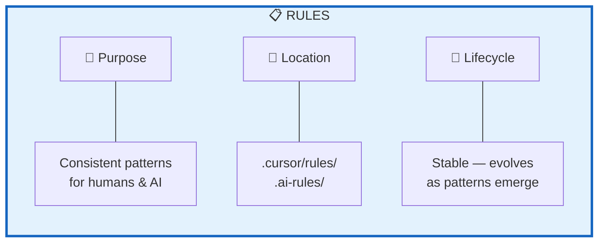
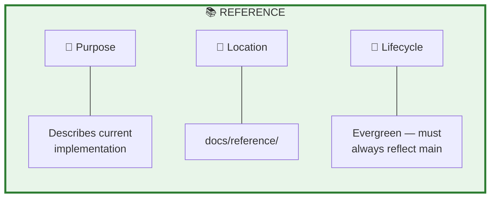
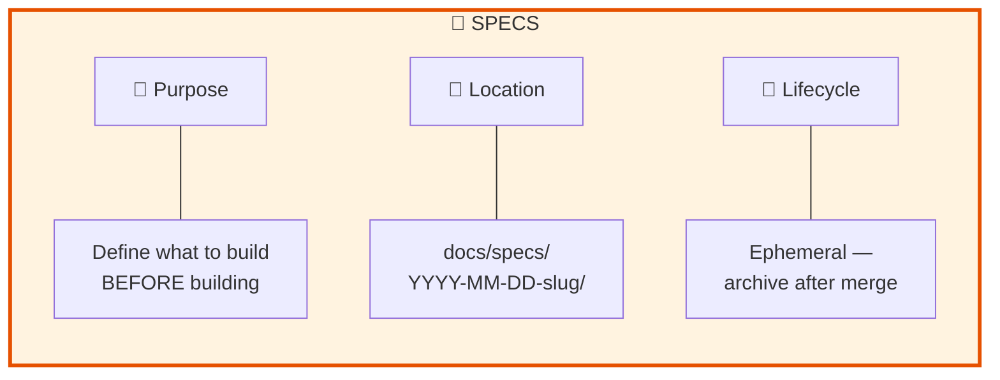
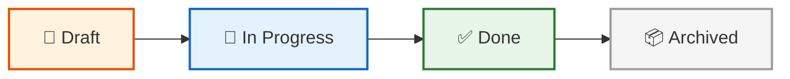
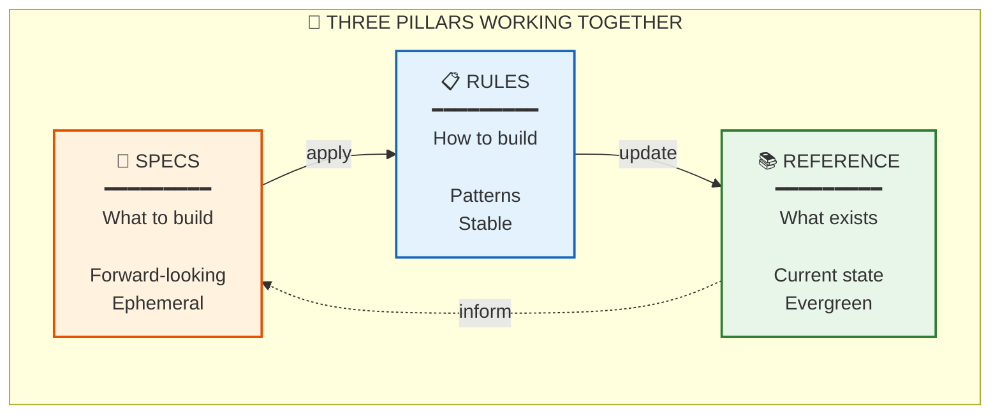
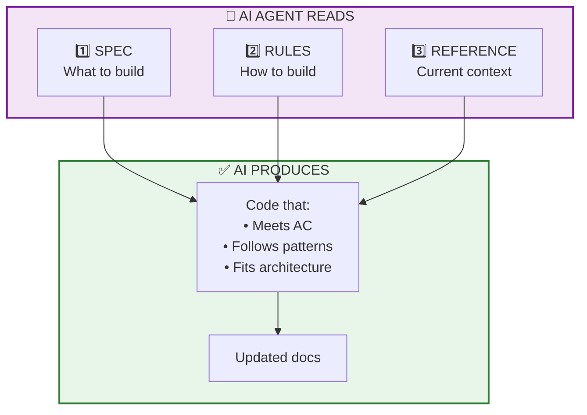

# Docs-as-Code: Presentation Slides

> Ready-to-use slide content for Rules, Reference, and Specs pillars.

---

## Slide 1: RULES — The "How"

### Title: **RULES — How We Build**



### Key Points (Bullet List)

| Aspect | Description |
|--------|-------------|
| **What** | Guidelines and patterns for building consistently |
| **Where** | `.cursor/rules/` or `.ai-rules/` |
| **Lifecycle** | **Stable** — evolves as new patterns emerge |
| **Audience** | Both humans and AI agents |

### Examples

```markdown
# ✅ RULE (Enforceable)
"ALWAYS use `@/` path aliases. NEVER use relative imports deeper than one level."

# ❌ ADVICE (Vague)
"Consider using path aliases for cleaner imports."
```

### The Enforcement Pyramid

```
        ┌──────────────────┐
        │   AUTOMATED      │ ← 100% enforced
        │   ESLint, CI     │
        ├──────────────────┤
        │   TEMPLATED      │ ← 90% enforced
        │   PR templates   │
        ├──────────────────┤
        │   DOCUMENTED     │ ← 70% enforced
        │   Rules files    │
        ├──────────────────┤
        │   VERBAL         │ ← 30% enforced
        │   "We usually..."│
        └──────────────────┘
```

### Talking Points

1. **Rules guide both humans and AI** — same patterns, consistent output
2. **Enforceable > Advisory** — if it can be a lint rule, make it one
3. **Domain-specific patterns** — code style, testing, architecture
4. **Living documents** — update as better patterns emerge

---

## Slide 2: REFERENCE — The "Now"

### Title: **REFERENCE — What the System Is**



### Key Points (Bullet List)

| Aspect | Description |
|--------|-------------|
| **What** | Documentation describing current system state |
| **Where** | `docs/reference/` |
| **Lifecycle** | **Evergreen** — must always reflect `main` branch |
| **Critical Rule** | Updated when behavior changes |

### What Goes in Reference?

```
docs/reference/
├── architecture.md      # System design & components
├── code-map.md          # Where to find what
├── data-model.md        # Database schema & relationships
├── api.md               # API contracts & endpoints
└── runbooks/            # Operational guides
    └── feature-ops.md
```

### The Golden Rule

```
┌─────────────────────────────────────────────────────────────┐
│                                                              │
│   📖 Reference documentation must reflect the main branch   │
│                                                              │
│   ❌ Stale docs are WORSE than no docs                      │
│   ✅ Updated docs = trusted docs = used docs                │
│                                                              │
└─────────────────────────────────────────────────────────────┘
```

### Update Trigger

> **Before merging any PR, ask:**
> "If someone reads only the docs tomorrow, will they understand what this PR changed?"

### Talking Points

1. **Backward-looking** — describes what WAS built, not what will be
2. **Must be accurate** — stale docs mislead developers AND AI
3. **Updated on every behavioral change** — mandatory, not optional
4. **Single source of truth** — code + reference docs = complete picture

---

## Slide 3: SPECS — The "Next"

### Title: **SPECS — What We're Building**



### Key Points (Bullet List)

| Aspect | Description |
|--------|-------------|
| **What** | Document defining what to build with acceptance criteria |
| **Where** | `docs/specs/YYYY-MM-DD-feature-slug/` |
| **Lifecycle** | **Ephemeral** — Draft → In Progress → Done → Archived |
| **Key Feature** | Guides implementation, doesn't record it |

### Spec Lifecycle



### Minimal Spec Template

```markdown
# Feature Name

> **Status**: Draft | In Progress | Done
> **Created**: YYYY-MM-DD

## Why
[Business reason / user need]

## What
### In Scope
- [ ] Feature 1
- [ ] Feature 2

### Out of Scope
- Not doing X (future)

## Acceptance Criteria
- [ ] **AC1**: User can do X
- [ ] **AC2**: System responds within Y ms
- [ ] **AC3**: Data persists across sessions
```

### The Collapse Pattern

After merge, specs **collapse** to links:

```markdown
# User Dashboard Spec

**Status**: ✅ Completed (2025-01-02)

- **PR**: #123
- **ADR**: N/A
- **Docs**: [code-map.md](../reference/code-map.md)
```

**Why?** Prevents "spec graveyard" — AI won't confuse old specs with current state.

### Talking Points

1. **Forward-looking** — defines what SHOULD be built (can be wrong — it's a plan)
2. **Has acceptance criteria** — testable pass/fail conditions
3. **Time-bound** — written before work, archived after merge
4. **Guides AI implementation** — AI reads spec, applies rules, builds to criteria

---

## Slide 4: Three Pillars Together

### Title: **The Documentation Triad**



### How They Work Together

```
1. SPEC defines WHAT to build
        ↓
2. RULES define HOW to build
        ↓
3. Code is written following both
        ↓
4. REFERENCE is updated with result
        ↓
5. SPEC is archived
        ↓
(repeat for next feature)
```

### Comparison Table

| Pillar | Purpose | Lifecycle | Update When |
|--------|---------|-----------|-------------|
| **Specs** | What to build | Ephemeral | Archive on merge |
| **Rules** | How to build | Stable | Patterns evolve |
| **Reference** | What exists | Evergreen | Behavior changes |

---

## Slide 5: AI Agent Workflow

### Title: **How AI Uses These Documents**



### AI Benefits

| Without Framework | With Framework |
|-------------------|----------------|
| ❌ Inconsistent code style | ✅ Follows Rules |
| ❌ Outdated assumptions | ✅ Current Reference |
| ❌ Unknown architecture | ✅ Clear code-map |
| ❌ Vague requirements | ✅ Testable AC |

---

## Quick Reference Card

```
┌─────────────────────────────────────────────────────────────┐
│                  DOCS-AS-CODE PILLARS                       │
├───────────────┬───────────────┬─────────────────────────────┤
│ SPECS         │ RULES         │ REFERENCE                   │
│ (The Next)    │ (The How)     │ (The Now)                   │
├───────────────┼───────────────┼─────────────────────────────┤
│ docs/specs/   │ .cursor/rules/│ docs/reference/             │
├───────────────┼───────────────┼─────────────────────────────┤
│ Ephemeral     │ Stable        │ Evergreen                   │
│ Archive after │ Evolve over   │ Always reflect              │
│ merge         │ time          │ main branch                 │
├───────────────┼───────────────┼─────────────────────────────┤
│ Forward-      │ Patterns &    │ Backward-                   │
│ looking       │ Standards     │ looking                     │
│ (can be wrong)│ (enforceable) │ (must be accurate)          │
└───────────────┴───────────────┴─────────────────────────────┘
```

---

## Speaker Notes Summary

### For RULES slide:
- Emphasize: "Rules make AI output consistent — same patterns every time"
- Demo: Show a `.cursor/rules/` file and how AI follows it
- Key quote: "If it can be automated, automate it. If not, document it."

### For REFERENCE slide:
- Emphasize: "Stale docs are worse than no docs — they actively mislead"
- Demo: Show `code-map.md` and how it helps navigation
- Key quote: "Reference must reflect main branch at all times"

### For SPECS slide:
- Emphasize: "Specs guide work, then disappear — they're not permanent records"
- Demo: Show a collapsed spec with links
- Key quote: "Write the spec before you write the code"

---

## Mermaid Rendering

These diagrams are in **Mermaid** format. To render:
- **Slides**: Use [Mermaid Live Editor](https://mermaid.live/) to export as PNG/SVG
- **Markdown**: GitHub, GitLab, Notion, Obsidian render natively
- **Presentations**: Paste into tools like Slidev, Marp, or export images


