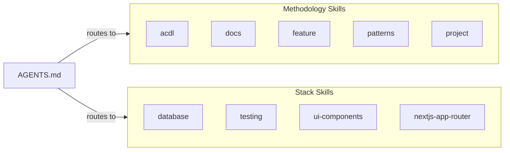

# Skills Catalog

> **What skills exist, when to use each one, and how they load.**

---

## Two Categories



| Category | Purpose | Ships With |
|----------|---------|-----------|
| **Methodology** | Teaches the ACDL workflow itself | This repo's templates |
| **Stack** | Teaches project-specific tech patterns | Authored by user for their project |

---

## Methodology Skills

These ship as templates. Use them to teach AI agents how to follow the workflow.

### `acdl`

| | |
|---|---|
| **When to use** | Setting up ACDL for a project, creating/updating AGENTS.md, configuring skills, understanding the daily workflow |
| **What it covers** | Full bootstrap workflow (4 phases), AGENTS.md authoring (router pattern, section anatomy, token budget), configure for your project, skill setup, daily workflow patterns, maintenance triggers |
| **Module** | 1 (Foundation) |
| **Token cost** | ~2,200-2,500 |
| **Location** | `.agents/skills/acdl/SKILL.md` |
| **Cross-references** | `docs`, `feature` |

**Trigger phrases**: "set up ACDL", "bootstrap this project", "create AGENTS.md", "update project context"

---

### `docs`

| | |
|---|---|
| **When to use** | Writing reference docs, creating guides, writing ADRs, updating documentation, creating a README |
| **What it covers** | Reference doc templates (architecture, API, auth, data model, scripts), ADR templates, guide writing patterns, doc lifecycle rules |
| **Module** | 1 (Foundation) |
| **Token cost** | ~1,000-1,500 |
| **Location** | `.agents/skills/docs/SKILL.md` |
| **Cross-references** | `acdl` |

**Trigger phrases**: "write a doc", "create a README", "write an ADR", "update documentation", "create reference docs"

---

### `feature`

| | |
|---|---|
| **When to use** | Building any feature, executing tasks, managing implementation progress, resuming work, writing specs, debugging, testing, asking "what should I do next?" |
| **What it covers** | Seven-phase workflow (spec, research, design, tasks, build, verify, closeout), project state inspection, spec writing (problem framing, acceptance criteria, scoping), task markers, parallel waves, debugging strategies, testing patterns, verification checklist, git recommendations, doc freshness rule, recovery scenarios |
| **Module** | 2 (Dev Workflow) |
| **Token cost** | ~1,500-2,000 |
| **Location** | `.agents/skills/feature/SKILL.md` |
| **Cross-references** | `acdl`, `patterns` |

**Phases**:

| Phase | Command | Purpose |
|-------|---------|---------|
| spec | `/feature spec` | Define what to build, acceptance criteria |
| research | `/feature research` | Explore unknowns, evaluate options |
| design | `/feature design` | Architecture, APIs, data models |
| tasks | `/feature tasks` | Break into executable tasks |
| build | `/feature build` | Implement step by step (includes debugging + testing) |
| verify | `/feature verify` | Confirm implementation matches spec |
| closeout | `/feature closeout` | Update docs, create ADRs, clean up |

**Trigger phrases**: "build a feature", "implement this", "what's the next task", "mark task complete", "what should I do next", "resume work", "project status", "write a spec", "define acceptance criteria", "scope this feature"

---

### `patterns`

| | |
|---|---|
| **When to use** | Documenting stack-specific patterns, creating coding conventions, teaching AI your project's idioms |
| **What it covers** | Pattern documentation structure, stack skill authoring, convention encoding |
| **Module** | 2 (Dev Workflow) |
| **Token cost** | ~800-1,200 |
| **Location** | `.agents/skills/patterns/SKILL.md` |
| **Cross-references** | `feature` |

**Trigger phrases**: "document patterns", "create coding conventions", "teach AI my patterns", "stack patterns"

---

### `project`

| | |
|---|---|
| **When to use** | Managing multiple features, prioritizing work, tracking project progress, documenting product vision |
| **What it covers** | Roadmap, backlog, global task tracking, PRD — with templates for all four documents, feature state machine, project workflow |
| **Module** | 3 (Project Planning) |
| **Token cost** | ~1,000-1,200 |
| **Location** | `.agents/skills/project/SKILL.md` |
| **Cross-references** | `feature` |

**Phases**:

| Phase | Command | Purpose |
|-------|---------|---------|
| discovery | `/project discovery` | Analyze project and create planning docs |
| plan | `/project plan` | Prioritize and organize work |
| status | `/project status` | Review progress across features |

**Trigger phrases**: "plan the project", "prioritize features", "update roadmap", "manage backlog", "project vision"

---

## Stack Skills (Examples)

These are authored per-project. Common examples:

| Skill | When to Use | Covers |
|-------|-------------|--------|
| `database` | DB queries, migrations, auth, storage | Supabase client, migrations, RLS, React Query |
| `testing` | Writing tests, creating stories, test infra | Vitest + Storybook + Playwright strategy |
| `ui-components` | Building UI, theming, accessibility | shadcn/ui, Tailwind, responsive patterns |
| `nextjs-app-router` | Pages, layouts, server actions | Next.js 15 App Router patterns |

Create your own stack skills — see [Creating New Skills](#creating-new-skills) below.

---

## How Skills Load

### 1. Routing via AGENTS.md

Add entries to your Context Loading table:

```markdown
## Context Loading

| Task | Read First |
|------|------------|
| Building a feature          | load skill `feature` |
| What should I do next?      | load skill `feature` |
| Creating / updating AGENTS.md | load skill `acdl` |
| Writing / reviewing docs    | load skill `docs` |
| Writing specs or tasks      | load skill `feature` |
| Setting up ACDL             | load skill `acdl` |
| Project planning / roadmap  | load skill `project` |
| Database / auth / storage   | load skill `database` |
| Writing tests               | load skill `testing` |
```

### 2. Agent reads the task, matches the table, loads the skill


### 3. Cross-referencing between skills

Skills can reference each other in their Related Docs section:

```markdown
## Related Docs
- load skill `feature`
```

The agent loads the second skill only if the task needs it. Max 2 skills initially.

---

## How to Invoke Skills

| Agent | Invocation |
|-------|------------|
| **Cursor** (v2.4+) | `@skill-name` |
| **Claude Code** | `/skill-name` |
| **GitHub Copilot** | Auto-discovered |
| **Cline** (v3.48+) | Auto-discovered |
| **OpenCode** | Via `skill` tool |
| **Windsurf** | Via UI |
| **OpenAI Codex** | Via commands |

Skills also auto-load when AGENTS.md routes to them via the Context Loading table.

---

## Quick Reference

| Task | Load Skill |
|------|------------|
| Build a feature | `feature` |
| What should I do next? / Resume work | `feature` |
| Write a spec or tasks file | `feature` (phase: spec/tasks) |
| Create/update AGENTS.md | `acdl` |
| Write/review any markdown doc | `docs` |
| Set up or maintain ACDL | `acdl` |
| Plan project / manage backlog | `project` |
| Work with database/auth | `database` (project-specific) |
| Write tests or stories | `testing` (project-specific) |
| Build UI components | `ui-components` (project-specific) |
| Work with pages/routing | `nextjs-app-router` (project-specific) |

---

## Creating New Skills

1. Create `.agents/skills/<skill-name>/SKILL.md`
2. Add frontmatter: `name` and `description` fields
3. Add routing entry to AGENTS.md Context Loading table
4. Keep within 1,200-2,000 tokens

Decision guide:

| Content | Where It Goes |
|---------|---------------|
| 1-2 lines, applies to every task | Inline in AGENTS.md |
| 100+ lines, specific task type, needs code examples | SKILL.md |
| Reference content (architecture, data model) | `docs/` |

For detailed guidance, see the [Skill Routing Policy](./skill-routing.md).

---

## See Also

- [Module 1: Foundation](../modules/01-foundation/README.md) — AGENTS.md + docs templates
- [Module 2: Dev Workflow](../modules/02-dev-workflow/README.md) — Feature workflow + patterns
- [Skill Routing Policy](./skill-routing.md) — Score-based activation rules
- [AGENTS.md Best Practices](./agents-md-best-practices.md) — Context Loading table patterns
- [Tool Compatibility](./tool-compatibility.md) — Multi-tool setup
