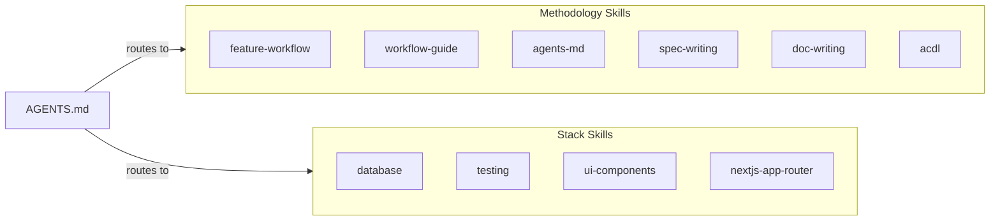
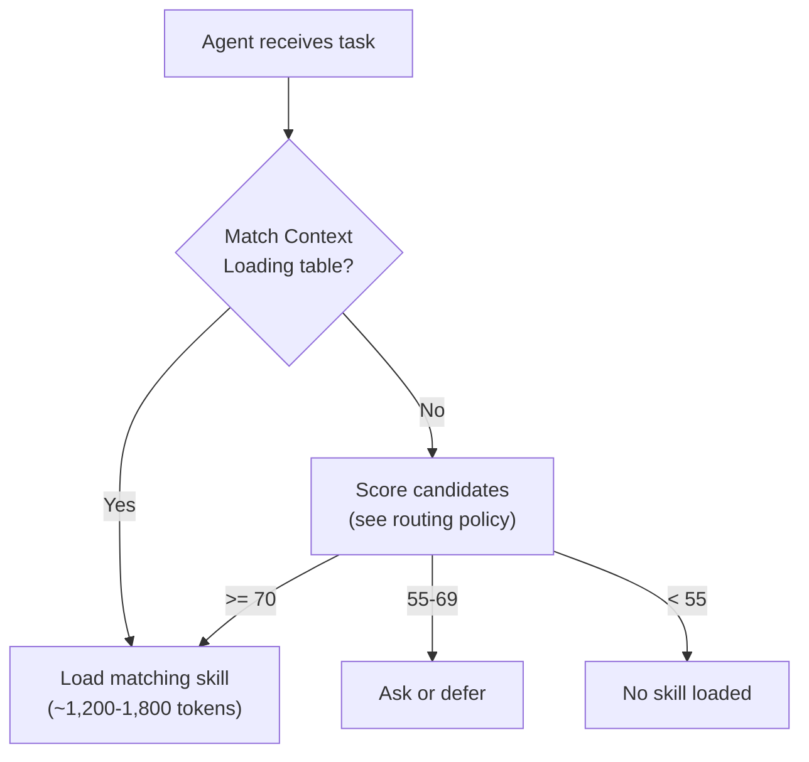

# Skills Catalog

> **What skills exist, when to use each one, and how they load.**

---

## Two Categories



| Category | Purpose | Ships With |
|----------|---------|-----------|
| **Methodology** | Teaches the ACDL workflow itself | This repo's templates |
| **Stack** | Teaches project-specific tech patterns | Authored by user for their project |

---

## Methodology Skills

These ship as templates. Use them to teach AI agents how to follow the workflow.

### `feature-workflow`

| | |
|---|---|
| **When to use** | Building any feature, executing tasks, managing implementation progress |
| **What it covers** | Four-phase workflow (Research → Plan → Implement → Verify), decision tree, task markers, parallel waves, verification checklist, git recommendations, doc freshness rule |
| **Module** | 2 (Feature Development) |
| **Token cost** | ~1,000-1,200 |
| **Location** | `.agents/skills/feature-workflow/SKILL.md` |
| **Cross-references** | `spec-writing` |

**Trigger phrases**: "build a feature", "implement this", "what's the next task", "mark task complete"

---

### `agents-md`

| | |
|---|---|
| **When to use** | Creating a new AGENTS.md, updating project context, onboarding a project |
| **What it covers** | Router pattern, essential sections (core + routing), token budget, what-goes-where decisions, update triggers, anti-patterns |
| **Module** | 1 (Project Context) |
| **Token cost** | ~1,200-1,400 |
| **Location** | `.agents/skills/agents-md/SKILL.md` |
| **Cross-references** | `feature-workflow` |

**Trigger phrases**: "create AGENTS.md", "update project context", "set up AI docs"

---

### `spec-writing`

| | |
|---|---|
| **When to use** | Drafting spec.md content, reviewing acceptance criteria quality, scoping a feature |
| **What it covers** | Spec section anatomy, problem/solution framing, acceptance criteria patterns, scoping discipline, anti-patterns |
| **Module** | 2 (Feature Development) |
| **Token cost** | ~1,200-1,400 |
| **Location** | `.agents/skills/spec-writing/SKILL.md` |
| **Cross-references** | `feature-workflow` |

**Trigger phrases**: "write a spec", "define acceptance criteria", "scope this feature", "review this spec"

> **Boundary with `feature-workflow`**: `spec-writing` teaches how to write quality spec *content* (framing, criteria, scoping). `feature-workflow` teaches the *process* (phases, task execution, progress tracking). When building a feature, load `feature-workflow` first — it will reference `spec-writing` if spec content needs improvement.

---

### `doc-writing`

| | |
|---|---|
| **When to use** | Writing or reviewing any markdown documentation — reference docs, guides, READMEs, ADRs, templates |
| **What it covers** | Three rules (value only, structure over prose, visual over text), doc type routing, section ordering, reference doc patterns, ADR format, template placeholders, cross-referencing, freshness rules, anti-patterns |
| **Module** | 1 (Project Context) |
| **Token cost** | ~1,800-2,000 |
| **Location** | `.agents/skills/doc-writing/SKILL.md` |
| **Cross-references** | `agents-md`, `spec-writing`, `acdl` |

**Trigger phrases**: "write a doc", "create a README", "write an ADR", "update documentation", "review this doc"

---

### `workflow-guide`

| | |
|---|---|
| **When to use** | Resuming work, onboarding, asking "what should I do next?", checking project state |
| **What it covers** | Project state inspection, workflow position mapping, next-action recommendations, recovery scenarios (stale specs, missing docs, incomplete closeout) |
| **Module** | 2 (Feature Development) |
| **Token cost** | ~1,000-1,200 |
| **Location** | `.agents/skills/workflow-guide/SKILL.md` |
| **Cross-references** | `feature-workflow`, `acdl`, `spec-writing` |

**Trigger phrases**: "what should I do next", "where am I", "resume work", "project status", "what's the next step"

---

### `acdl`

| | |
|---|---|
| **When to use** | Setting up ACDL for a project, configuring skills, understanding the daily workflow, maintaining docs |
| **What it covers** | Full bootstrap workflow (4 phases), configure for your project, skill setup, daily workflow patterns, maintenance triggers, warning signs, what-goes-where routing |
| **Module** | All (meta-skill) |
| **Token cost** | ~2,200-2,500 |
| **Location** | `.agents/skills/acdl/SKILL.md` |
| **Cross-references** | `agents-md`, `feature-workflow`, `spec-writing` |

**Trigger phrases**: "set up ACDL", "bootstrap this project", "configure AI docs", "how does ACDL work"

---

## Stack Skills (Examples)

These are authored per-project. Common examples:

| Skill | When to Use | Covers |
|-------|-------------|--------|
| `database` | DB queries, migrations, auth, storage | Supabase client, migrations, RLS, React Query |
| `testing` | Writing tests, creating stories, test infra | Vitest + Storybook + Playwright strategy |
| `ui-components` | Building UI, theming, accessibility | shadcn/ui, Tailwind, responsive patterns |
| `nextjs-app-router` | Pages, layouts, server actions | Next.js 15 App Router patterns |

Create your own stack skills using the template at `content/modules/01-project-context/templates/.agents/skills/skill-template/SKILL.md`.

---

## How Skills Load

### 1. Routing via AGENTS.md

Add entries to your Context Loading table:

```markdown
## Context Loading

| Task | Read First |
|------|------------|
| Building a feature          | load skill `feature-workflow` |
| What should I do next?      | load skill `workflow-guide` |
| Creating / updating AGENTS.md | load skill `agents-md` |
| Writing specs or tasks      | load skill `spec-writing` |
| Writing / reviewing docs    | load skill `doc-writing` |
| Setting up ACDL             | load skill `acdl` |
| Database / auth / storage   | load skill `database` |
| Writing tests               | load skill `testing` |
```

### 2. Agent reads the task, matches the table, loads the skill



### 3. Cross-referencing between skills

Skills can reference each other in their Related Docs section:

```markdown
## Related Docs
- load skill `spec-writing`
```

The agent loads the second skill only if the task needs it. Max 2 skills initially.

---

## How to Invoke Skills

| Agent | Invocation |
|-------|------------|
| **Cursor** (v2.4+) | `@skill-name` |
| **Claude Code** | `/skill-name` |
| **GitHub Copilot** | Auto-discovered |
| **Cline** (v3.48+) | Auto-discovered |
| **OpenCode** | Via `skill` tool |
| **Windsurf** | Via UI |
| **OpenAI Codex** | Via commands |

Skills also auto-load when AGENTS.md routes to them via the Context Loading table.

---

## Quick Reference

| Task | Load Skill |
|------|------------|
| Build a feature | `feature-workflow` |
| What should I do next? / Resume work | `workflow-guide` |
| Create/update AGENTS.md | `agents-md` |
| Write a spec or tasks file | `spec-writing` |
| Write/review any markdown doc | `doc-writing` |
| Set up or maintain ACDL | `acdl` |
| Work with database/auth | `database` (project-specific) |
| Write tests or stories | `testing` (project-specific) |
| Build UI components | `ui-components` (project-specific) |
| Work with pages/routing | `nextjs-app-router` (project-specific) |

---

## Creating New Skills

1. Copy the template: `content/modules/01-project-context/templates/.agents/skills/skill-template/SKILL.md`
2. Place in `.agents/skills/<skill-name>/SKILL.md`
3. Add routing entry to AGENTS.md Context Loading table
4. Keep within 1,200-2,000 tokens

Decision guide:

| Content | Where It Goes |
|---------|---------------|
| 1-2 lines, applies to every task | Inline in AGENTS.md |
| 100+ lines, specific task type, needs code examples | SKILL.md |
| Reference content (architecture, data model) | `docs/` |

For detailed guidance, see the [Skill Routing Policy](./skill-routing.md).

---

## See Also

- [Module 1: Project Context](../modules/01-project-context/README.md) — Full skills documentation
- [Skill Routing Policy](./skill-routing.md) — Score-based activation rules
- [AGENTS.md Best Practices](./agents-md-best-practices.md) — Context Loading table patterns
- [Tool Compatibility](./tool-compatibility.md) — Multi-tool setup
