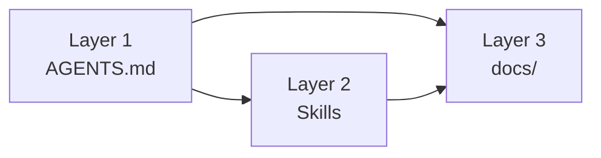

# Methodology

> A docs-first lifecycle system for AI-assisted development.

---

## Why This Exists

AI coding agents are strong at implementation but weak at project memory. Without structure, they default to generic patterns and inconsistent decisions.

This methodology treats documentation as operational memory for agents:

- minimal always-on context
- deep on-demand guidance
- explicit lifecycle rules for docs

---

## Runtime Context Model

The runtime model is progressive disclosure:

| Layer | Purpose | Loading Mode | Typical Content |
|-------|---------|--------------|-----------------|
| **Layer 1** | Fast project orientation | Always loaded | `AGENTS.md` |
| **Layer 2** | Deep task-specific patterns | On-demand | `.agents/skills/*/SKILL.md` |
| **Layer 3** | System reference knowledge | On-demand | `docs/` |



Principle: keep `AGENTS.md` compact and route to deeper context only when needed.

---

## Module Model (4 Modules)

| Module | Teaches | Main Artifacts |
|--------|---------|----------------|
| **1. Project Context** | Core context and reference setup | `AGENTS.md`, `docs/` |
| **2. Skills** | On-demand reusable capabilities | `.agents/skills/` |
| **3. Feature Development** | Research → Plan → Implement workflow | `specs/<feature>/` |
| **4. Project Planning** | Optional multi-feature planning | `PROJECT-PRD.md`, `BACKLOG.md`, `ROADMAP.md`, `TASKS.md` |

Modules are adoption units. Layers are runtime loading behavior.

---

## Document Lifecycles

| Type | Lifecycle | Where |
|------|-----------|-------|
| **Specs** | Ephemeral (create for feature work, then archive/delete) | `specs/` |
| **Reference** | Evergreen (always current or deleted) | `AGENTS.md`, `docs/` |
| **Decisions** | Permanent record (append, do not rewrite history) | `docs/decisions/` |
| **Planning** | Living project management artifacts (optional) | Project root planning files |

Core rule: stale docs are worse than no docs.

---

## Agent Workflow

### 1. Intake and Classification

Classify work before coding:

- **Bug fix / tiny correction**: Quick Flow
- **Feature work**: Standard or Complex Flow
- **Portfolio-level planning**: Project Planning module

### 2. Context Loading

Default load order:

1. `AGENTS.md`
2. Current feature docs in `specs/<feature>/` (if feature work)
3. Relevant skills
4. Relevant `docs/*` references

### 3. Plan Before Implement

For any feature (non-bug-fix), minimum required docs:

- `spec.md`
- `tasks.md`

Optional docs when needed:

- `research.md`
- `design.md`
- `plan.md`
- `user-stories.md`

### 4. Implement with Visible Progress

Rules during execution:

- exactly one task `[~]` in progress at a time
- update `tasks.md` after each completed/blocked/skipped step
- request human validation at checkpoints

### 5. Closeout

After approval:

1. update affected reference docs (`docs/`)
2. create ADR if a significant decision was made
3. archive/delete the feature spec package

---

## Feature Flow Decision Guide

```text
Is this a bug fix with an obvious, low-risk solution?
├─ YES → Quick Flow (no spec package)
└─ NO  → Create spec.md + tasks.md
        Need option evaluation or uncertain approach?
        ├─ YES → Add research.md (Complex Flow)
        └─ NO  → Continue with Standard Flow
```

Use complexity signals, not file count:

- multiple valid approaches
- security/auth/data-model impact
- external integration risk
- non-trivial dependency ordering

---

## Task State Markers

| Marker | Meaning |
|--------|---------|
| `[ ]` | Pending |
| `[~]` | In progress (only one) |
| `[x]` | Completed |
| `[B]` | Blocked (must include reason) |
| `[S]` | Skipped (must include reason) |

Progress formula:

`(completed + skipped) / total * 100`

---

## ADR Rules

Create an ADR when a feature introduces a meaningful technical choice:

- architecture or integration strategy selection
- trade-off with alternatives considered
- major policy/protocol/technology choice
- breaking behavior or long-term constraint

Do not create ADRs for routine bug fixes and straightforward local refactors.

---

## Reference Freshness Rules

Update reference docs in the same PR as code changes:

| Change Type | Update |
|-------------|--------|
| Data schema/model change | `docs/data-model.md` |
| API/action surface change | `docs/api.md` |
| Auth flow/guards change | `docs/auth.md` |
| System boundary/structure change | `docs/architecture.md` + ADR if significant |

---

## Monorepo Guidance

For monorepos:

- root `AGENTS.md` is a router
- each major package/service has its own local `AGENTS.md`
- nearest `AGENTS.md` to changed files is authoritative

This preserves global constraints while keeping local context precise.

---

## Tool Stance

Methodology artifacts are tool-agnostic:

- `AGENTS.md` for universal context
- `SKILL.md` for on-demand capabilities
- markdown specs/docs for workflow and reference

Tool-specific rule files are optional bridges, not required architecture.

---

## Anti-Patterns

Avoid:

- monolithic always-loaded context dumps
- workflow decisions based on file-count heuristics
- stale reference docs left after code changes
- mixing permanent architectural knowledge into ephemeral specs

Prefer:

- router-style context
- risk-based flow selection
- explicit lifecycle transitions
- disciplined closeout (docs + ADR + spec cleanup)

---

## See Also

- [Modules](./modules/README.md)
- [Module 1: Project Context](./modules/01-project-context/README.md)
- [Module 2: Skills](./modules/02-skills/README.md)
- [Module 3: Feature Development](./modules/03-feature-development/README.md)
- [Module 4: Project Planning](./modules/04-project-planning/README.md)
