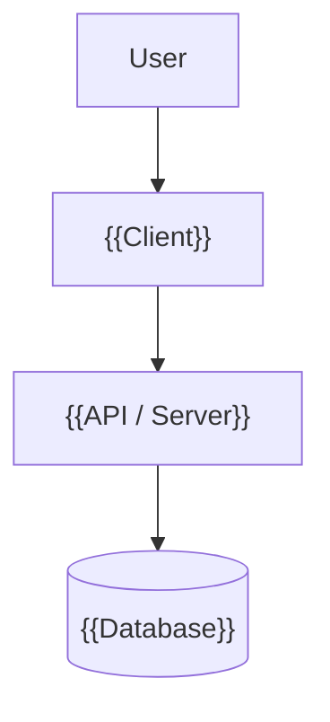
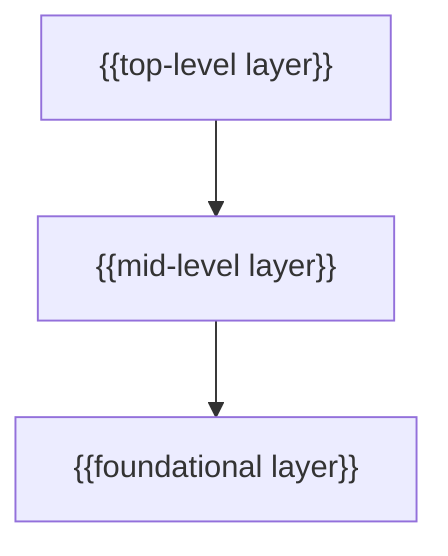

# System Architecture

> High-level system overview, layers, and dependency rules.

## Overview

{{1-2 sentences describing the system.}}

## Diagram

<!-- Replace with the actual system diagram. Adjust nodes to match your architecture
     (e.g., remove Database if not applicable, add message queues, caches, etc.) -->

## Layers

| Layer | Technology | Purpose |
|-------|------------|---------|
| {{layer-name}} | {{technology}} | {{purpose}} |
| {{layer-name}} | {{technology}} | {{purpose}} |
| {{layer-name}} | {{technology}} | {{purpose}} |

## Dependency Rules

<!-- Replace with your project's actual directory/module dependency rules.
     Examples:
     - Python: views/ → services/ → models/
     - Go: cmd/ → internal/ → pkg/
     - React: pages/ → features/ → shared/
     - Rust: bin/ → lib/ modules -->

- `{{top-level}}` depends on `{{mid-level}}` and `{{foundational}}`
- `{{mid-level}}` depends on `{{foundational}}` only
- `{{foundational}}` has no internal dependencies

## Key Decisions

| Decision | ADR | Summary |
|----------|-----|---------|
| {{Decision 1}} | @docs/decisions/001-{{name}}.md | {{One-line summary}} |

## Related

<!-- Link to other project docs that exist. Remove entries for docs not in this project. -->
- {{@docs/data-model.md — if project has a database}}
- {{@docs/api.md — if project has an API}}
- {{@docs/auth.md — if project has authentication}}
