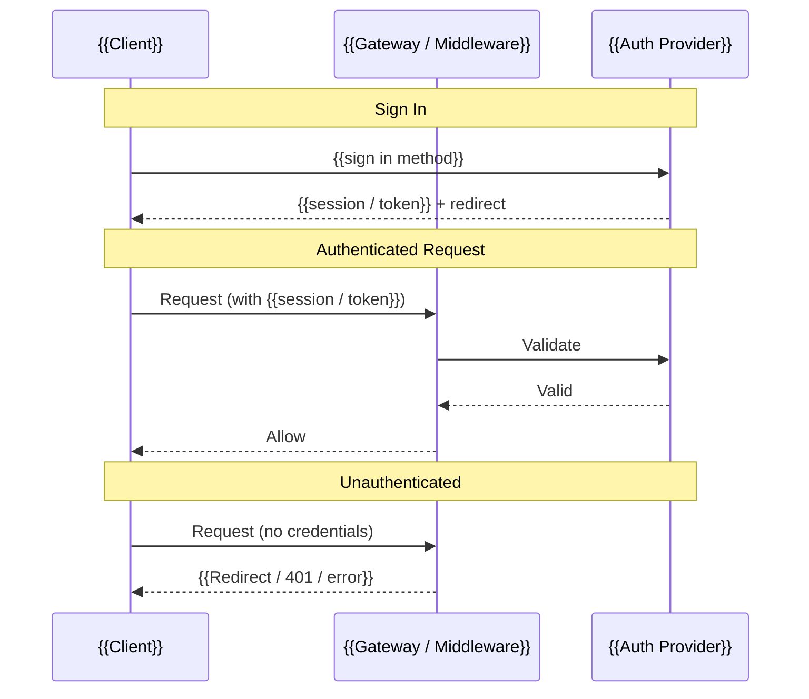

# Authentication

> Auth provider, session management, and route/resource protection.

## Auth Flow

<!-- Replace participants and flow with your actual auth architecture.
     Adapt for: session cookies, JWT, API keys, OAuth, mTLS, etc. -->

## Protected Routes / Resources

| Route / Resource | Auth Required | Behavior |
|------------------|--------------|----------|
| `{{public-path}}` | No | — |
| `{{auth-pages}}` | No (redirect if logged in) | → `{{redirect-target}}` |
| `{{protected-path}}` | Yes | → `{{redirect-or-error}}` |

<!-- Adapt for your routing model:
     - Web apps: URL patterns and redirects
     - APIs: endpoint paths and HTTP status codes
     - CLI tools: command permissions
     Remove this section if auth is API-only with no route protection. -->

## Auth Provider

| Context | Client / Method | Why |
|---------|----------------|-----|
| {{context, e.g., server-side}} | {{client or method}} | {{reason}} |
| {{context, e.g., client-side}} | {{client or method}} | {{reason}} |

<!-- Describe how auth is accessed in different parts of the application.
     Examples: server client vs browser client, middleware vs handler, etc. -->

## Role-Based Access

| Role | Permissions |
|------|-------------|
| `{{role_1}}` | {{Description}} |
| `{{role_2}}` | {{Description}} |
| `{{role_3}}` | {{Description}} |

<!-- Remove this section if the project has no role differentiation. -->

## Related

<!-- Link to other project docs that exist. Remove entries for docs not in this project. -->
- {{@docs/api.md — API endpoints that require auth}}
- {{@docs/data-model.md — user/role data model}}
