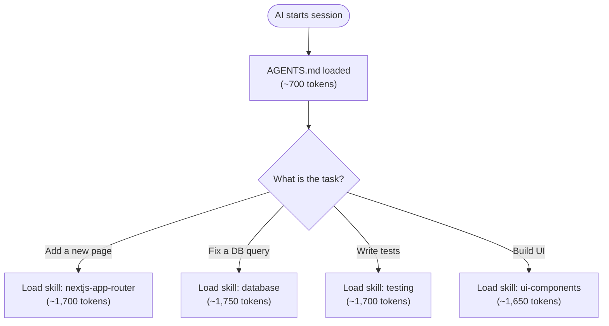

# Module 1: Project Context

> **Give AI agents complete context about your project** with AGENTS.md, reference docs, and on-demand skills.

---

## The Problem

AI coding assistants have no memory. Every session starts fresh, leading to:
- Generic code that doesn't match your patterns
- Repeated explanations of your tech stack
- Suggestions that conflict with past decisions

**The solution**: A lightweight context file + reference docs + skill packages that AI reads on-demand.

---

## Adoption Tiers

Pick the tier that matches your needs. Each tier builds on the previous one.

| Tier | What You Add | When |
|------|-------------|------|
| **Basic** | `AGENTS.md` only | Minimum viable context — stack, structure, boundaries |
| **Standard** | `AGENTS.md` + `docs/` | Project has domain knowledge worth documenting |
| **Full** | `AGENTS.md` + `docs/` + `.agents/skills/` | Deep patterns you keep re-explaining to AI |

You can start at Basic and grow. Each tier is independently useful.

---

## What This Module Does

Sets up a three-stage loading model:

1. **Discovery** — `AGENTS.md` (always loaded, compact routing context)
2. **Activation** — domain docs in `docs/` + skill packages in `.agents/skills/` (loaded when task-relevant)
3. **Execution** — command catalog in `docs/scripts.md` (loaded only when running/verifying commands)

Together they form **Progressive Disclosure**: minimal upfront context with deep knowledge available on-demand.

### How Progressive Disclosure Works

| Stage | What | When Loaded | Token Cost |
|-------|------|-------------|------------|
| **Discovery: AGENTS.md** | Stack, structure, boundaries, routing hints | Every session | ~500-700 |
| **Activation: docs/** | Project-specific domain docs (varies by project) | When task-relevant | ~1,000-1,200 each |
| **Activation: .agents/skills/** | On-demand instruction packages | When task matches skill | ~1,600-1,800 each |
| **Execution: docs/scripts.md** | Verified runnable commands + provenance | Only when executing/verifying | ~300-700 |

**Always-on context:** Only AGENTS.md = ~500-700 tokens.
**Typical plan/research session:** AGENTS.md + 1-2 docs = ~1,500-3,000 tokens.
**Typical implementation session:** AGENTS.md + domain docs + skills + scripts doc = task-relevant execution context.

**Single App:**

```
Discovery (Always)             Activation (On-demand)          Execution (On-demand)
┌─────────────────────┐        ┌────────────────────────┐
│ AGENTS.md           │  ───►  │ @docs/ (only the docs  │
│ • Stack, structure  │        │  this project needs)   │
│ • Routing hints     │        │ @docs/decisions/       │
│ • Task mode policy  │        │ .agents/skills/        │
│ • Boundaries        │        │  (task-matched only)   │
└─────────────────────┘        └────────────────────────┘
                                      │
                                      └──────────────►  @docs/scripts.md
```

**Monorepo:**

```
Discovery (Always)             Activation (Subproject + docs)   Execution (On-demand)
┌─────────────────────┐        ┌─────────────────────┐       ┌──────────────────┐
│ Root AGENTS.md      │        │ {{subproject}}/      │       │ @docs/ (only the │
│ • Structure         │  ───►  │   AGENTS.md          │ ───►  │  docs this proj  │
│ • Subproject Routes │        │ • Local routing      │       │  actually needs) │
│ • Global boundaries │        │ • Context Loading    │       │ .agents/skills/  │
└─────────────────────┘        └─────────────────────┘       └──────────────────┘
                                                                 │
                                                                 └──► @docs/scripts.md
```

---

## What You Get

```
your-project/
├── AGENTS.md                    # Discovery: always loaded (~80 lines)
├── docs/
│   ├── {{relevant-docs}}.md     # Activation: only the docs your project needs
│   ├── scripts.md               # Execution: canonical command catalog
│   └── decisions/               # Architecture Decision Records
│       └── NNN-decision.md      # Permanent, never deleted
└── .agents/skills/              # Activation: on-demand instruction packages
    ├── {{methodology-skill}}/   # Shipped with ACDL (optional)
    │   └── SKILL.md
    └── {{stack-skill}}/         # User-authored for project tech
        └── SKILL.md
```

The contents of `docs/` vary by project. A simple CLI might only have `scripts.md`. A full-stack app might have `architecture.md`, `data-model.md`, `api.md`, `auth.md`, and `scripts.md`. Skills are optional — add them when you find yourself re-explaining deep patterns. The AI agent or you decide what's relevant — see the template catalogs below.

---

## Choose Your Template

### AGENTS.md Templates

| Template | Use When |
|----------|----------|
| [Single App](./skills/acdl/templates/AGENTS-single-app.md) | Standard apps, libraries, CLIs |
| [Monorepo Root](./skills/acdl/templates/AGENTS-monorepo-root.md) | Monorepo root (routes to subprojects) |
| [Monorepo Subproject](./skills/acdl/templates/AGENTS-monorepo-subproject.md) | Each package/service in monorepo |

### Reference Doc Templates (pick what fits your project)

These are a **template catalog** — use only the ones that match your project. The AI agent selects from this catalog during bootstrap, or you can pick manually.

| Template | Include When | Purpose |
|----------|-------------|---------|
| [architecture.md](./skills/acdl/templates/docs/architecture.md) | Project has multiple layers or services | System overview, layers, dependency rules |
| [data-model.md](./skills/acdl/templates/docs/data-model.md) | Project has a database | Schema, ERD, relationships, access patterns |
| [api.md](./skills/acdl/templates/docs/api.md) | Project exposes or consumes APIs | Endpoints, actions, or API surface catalog |
| [auth.md](./skills/acdl/templates/docs/auth.md) | Project has authentication | Auth flows, middleware, role-based access |
| [scripts.md](./skills/acdl/templates/docs/scripts.md) | Project has runnable commands | Canonical commands with verification metadata |
| [decisions/adr.md](./skills/acdl/templates/docs/decisions/adr.md) | Significant technical decision made | Architecture Decision Record template |

You can also create **project-specific docs** not in this catalog (e.g., `docs/integrations.md`, `docs/deployment.md`, `docs/testing.md`). The catalog covers common patterns — your project may need different ones.

---

## Setup

### 1. CLI Setup (Recommended)

From your project root:

```bash
npx @acdl/cli init
```

Then tell your AI agent:

```text
Bootstrap AGENTS.md for this project.
load skill `acdl`
```

The `acdl` skill contains the full bootstrap workflow and all AGENTS.md templates.

### 2. Manual Setup (Simple)

1. Copy the right AGENTS.md template from `.agents/skills/acdl/templates/` to your project root
2. Fill in the placeholders (stack, structure, conventions, boundaries)
3. Create `docs/` with only the reference doc templates that apply to your project
4. Fill in the Context Loading table in AGENTS.md with only the docs you created
5. Done!

### 3. Interactive Bootstrap (Smart)

Tell your AI agent to `load skill acdl` and bootstrap AGENTS.md. The skill will:
1. Detect if single-app or monorepo
2. Scan project structure
3. Auto-detect tech stack and which reference docs are relevant
4. Mark commands as verified vs inferred in `docs/scripts.md`
5. Generate `AGENTS.md` + only the `docs/` files that match detected signals

---

## Reference Docs: What to Include

Not every project needs every doc. Only create docs that match your project:

| Doc | Include When | Update When |
|-----|-------------|-------------|
| `architecture.md` | Project has multiple layers or services | Architecture changes |
| `data-model.md` | Project has a database | Schema changes |
| `api.md` | Project has an API / server actions | New endpoints or actions |
| `auth.md` | Project has authentication | Auth flow changes |
| `scripts.md` | Project has runnable commands | Tooling/script changes |
| `decisions/NNN-*.md` | Significant technical decision made | Never (permanent record) |
| `{{custom}}.md` | Project has a domain not covered above | When that domain changes |

**A simple CLI** may only need `scripts.md`. **A full-stack web app** may need all five. **A library** might only need `architecture.md` and `scripts.md`. Let the project's actual needs drive what docs you create.

### Doc Freshness Rules

Docs are **evergreen** — always current or deleted. Never stale.

| Rule | Why |
|------|-----|
| Update docs in the same PR as code changes | Prevents drift |
| Delete docs for removed features | No dead references |
| ADRs are permanent | Record of reasoning, even if decision is later reversed |
| Update `scripts.md` when scripts/tooling change | Prevents command drift |
| Review docs quarterly | Catch gradual drift |

### Cross-Reference Convention

Docs reference each other and skills using a standard format:

| Referencing | Format | Example |
|-------------|--------|---------|
| A doc file | `@docs/<path>` | `@docs/architecture.md` |
| A skill | `load skill \`<name>\`` | `load skill \`database\`` |
| An ADR | `@docs/decisions/<NNN>-<name>.md` | `@docs/decisions/001-server-first.md` |
| Command catalog | `@docs/scripts.md` | `@docs/scripts.md` |

Only cross-reference docs that exist in the project.

---

## Skills: On-Demand Instruction Packages

Short conventions (naming, component patterns) belong inline in AGENTS.md. But deep knowledge (database migration patterns, testing strategies, UI component systems) is too large to load every session. **Skills** solve this — instruction packages loaded only when the task matches.

### What a Skill Is

A **Skill** is a `SKILL.md` file in `.agents/skills/` that teaches an AI agent how to do something specific. Skills follow the open standard from [agentskills.io](https://agentskills.io/specification).

```
.agents/skills/
├── agents-md/                # Methodology: AGENTS.md authoring (Module 1)
│   └── SKILL.md
├── doc-writing/              # Methodology: Reference docs, guides, ADRs (Module 1)
│   └── SKILL.md
├── acdl/                     # Methodology: Full ACDL bootstrap (Module 1)
│   └── SKILL.md
├── feature-workflow/         # Methodology: Research → Plan → Implement → Verify (Module 2)
│   └── SKILL.md
├── spec-writing/             # Methodology: Spec and task file authoring (Module 2)
│   └── SKILL.md
├── database/                 # Stack: Your DB patterns (user-authored)
│   └── SKILL.md
└── testing/                  # Stack: Your test strategy (user-authored)
    └── SKILL.md
```

All skills install to `.agents/skills/` in your project. Templates come from the module that owns each skill's domain.

### Skills vs Inline Conventions

| Characteristic | Inline in AGENTS.md | SKILL.md |
|---------------|---------------------|----------|
| Length | 1-2 lines | 100+ lines |
| Applies to | Every task | Specific task types |
| Example | "Use camelCase for functions" | "How to write a Supabase migration" |
| Changes | Rarely | When patterns evolve |
| Token cost | Always loaded (~700 total) | On-demand (~1,600-1,800 each) |

**Rule of thumb**: If it fits in one bullet point, it goes in AGENTS.md. If it needs code examples and multiple sections, it's a skill.

### SKILL.md Format

Every skill has two parts: **YAML frontmatter** (name + description) and **Markdown content** (instructions).

```markdown
---
name: database
description: Supabase integration patterns — migrations, RLS, React Query, and type generation. Use when working with database queries, schema changes, or auth.
---

# Database Patterns

> **References:** Data model → @docs/data-model.md (if exists) | Auth → @docs/auth.md (if exists)

## Migrations
{{Detailed patterns with code examples}}

## Quick Checklist
- [ ] Run type generation after schema changes
- [ ] Verify access control on new tables

## Related Docs
- @docs/data-model.md (if exists)
- load skill `{{related-skill}}`
```

| Field | Required | Purpose |
|-------|----------|---------|
| `name` | Yes | Unique identifier (used in `load skill \`name\``) |
| `description` | Yes | 1-2 sentences. AI reads this to decide whether to load the full skill |

### How Skills Load



### When to Create a Skill

1. You find yourself explaining the same deep pattern to AI repeatedly
2. A technology in your stack has specific conventions (e.g., "always use Server Actions, never API routes")
3. A workflow has multiple steps with code examples (e.g., "how to add a new database table")
4. You want the AI to follow project-specific patterns that differ from defaults

### Methodology Skills

These skills teach AI agents how to use the ACDL workflow itself. They ship as templates from the module that owns each domain.

#### Module 1 Skills (Project Context)

| Skill | Covers |
|-------|--------|
| `agents-md` | AGENTS.md authoring — section anatomy, token budget, router pattern, update triggers |
| `doc-writing` | Reference docs, guides, READMEs, ADRs, templates — structure, style, freshness rules |
| `acdl` | Full ACDL bootstrap and configuration — setup, daily usage, maintenance triggers |

Source: `content/modules/01-project-context/skills/`

#### Module 2 Skills (Feature Development)

| Skill | Covers |
|-------|--------|
| `feature-workflow` | Four-phase workflow (Research → Plan → Implement → Verify), project state inspection, task markers, parallel waves, git workflow, verification, recovery scenarios |
| `spec-writing` | Spec and task authoring — problem framing, acceptance criteria, scoping, task breakdown |

Source: `content/modules/02-feature-development/skills/`

### Stack Skills

These skills teach project-specific tech stack patterns. Users author them for their own project.

| Skill | Covers |
|-------|--------|
| `database` | ORM/client patterns, migrations, queries, caching |
| `testing` | Testing strategy, which tool for what, patterns |
| `ui-components` | Component library, theming, accessibility |
| `nextjs-app-router` | Pages, layouts, server actions, streaming |
| `api-design` | Endpoint conventions, error handling, validation |
| `deployment` | CI/CD, environment config, release process |

---

## Tool Compatibility

| Agent | AGENTS.md | @docs/ References | Skills |
|-------|-----------|-------------------|--------|
| **Cursor** (v2.4+) | Auto-reads | `@docs/file.md` | `@skill-name` |
| **Claude Code** | Via `CLAUDE.md` symlink | Direct read | `/skill-name` |
| **GitHub Copilot** | Auto-reads | Direct read | Preview |
| **Cline** (v3.48+) | Via `.clinerules` | Direct read | Auto-discovered |
| **OpenCode** | Auto-reads | Direct read | Via `skill` tool |
| **Windsurf** | Auto-reads | Direct read | Via UI |
| **OpenAI Codex** | Auto-reads | Direct read | Via commands |
| **Aider** | Via `/read` | Via `/read` | Use `/read` |

AGENTS.md works with **every** AI coding agent. No tool-specific files required.

### Cursor Bridge (Optional)

If your team uses Cursor, you can create lightweight `.mdc` rules that point to skills:

```
---
description: Database patterns
globs:
  - "**/migrations/**"
  - "**/supabase/**"
---

Load skill `database` for Supabase patterns, migrations, and RLS.
```

This gives you glob-based auto-loading while keeping the knowledge in portable `SKILL.md` files.

---

## What's Next?

| Signal | What It Means | Add Module |
|--------|---------------|------------|
| Building features > 3 files | Need structured workflow | [Module 2: Feature Development](../02-feature-development/README.md) |
| Managing multiple features | Need project-level planning | [Module 3: Project Planning](../03-project-planning/README.md) |

**Rule of thumb**: Short conventions go inline in AGENTS.md. Deep patterns become skills in `.agents/skills/`.

---

## Learn More

- [AGENTS.md Best Practices](../../guides/agents-md-best-practices.md) — Research-backed writing guide
- [Tool Compatibility](../../guides/tool-compatibility.md) — Setup for Cursor, Claude Code, Copilot
