# AGENTS.md Bootstrap Workflow

> Comprehensive workflow for AI agents to analyze a project and generate/update context files.

---

## Goal

Create or update `AGENTS.md` so agents have high-signal project context with minimal always-on tokens.

Use the **Discovery -> Activation -> Execution** model:

1. **Discovery**: compact `AGENTS.md` (always loaded)
2. **Activation**: domain docs loaded only when task-relevant
3. **Execution**: command catalog (`docs/scripts.md`) loaded only before running/verifying commands

---

## Workflow Phases

```mermaid
flowchart LR
    subgraph ask [0. Ask User]
        U1[Monorepo or Single App?]
        U2[List subprojects if monorepo]
    end
    subgraph detect [1. Detect]
        A1[Inventory existing docs]
        A2[Check AGENTS.md exists]
        A3[Identify stack and structure]
        A4[Assess doc signals]
    end
    subgraph analyze [2. Analyze]
        B1[Gather domain context]
        B2[Extract commands]
        B3[Classify commands: verified vs inferred]
    end
    subgraph preview [3. Preview]
        C1[Show proposed files + routing]
        C2[User confirms/edits]
    end
    subgraph create [4. Create]
        D1[Write AGENTS.md]
        D2[Write/Update docs files]
        D3[Suggest next modules]
    end
    ask --> detect --> analyze --> preview --> create
```



---

## Phase 0: User Selection (Interactive)

Start by asking the user, do not assume project type.

### Step 1: Ask Project Type

> "Is this a monorepo or single app?"
>
> 1. Single App
> 2. Monorepo
>
> Reply `1` or `2`.

### Step 2: If Monorepo, Ask for Subprojects

> "Which folders should have their own AGENTS.md?"
>
> - List folders directly
> - Or reply `scan` and the agent will propose candidates

---

## Phase 1: Detection

### 1.0 Inventory Existing Docs

Before writing anything:

1. Inventory existing docs and templates
2. Mark each as keep / update / replace / delete
3. Map reusable docs into `AGENTS.md` routing tables
4. Plan only missing docs needed for coverage

### 1.1 Check if `AGENTS.md` Exists

- **Exists**: update mode
  - Preserve user-authored sections
  - Regenerate only structured sections that are clearly templated
- **Not exists**: create mode
  - Generate from correct template

### 1.2 Detect Subprojects (When User Says `scan`)

Use structural signals:

- package manifests (`package.json`, `go.mod`, `Cargo.toml`, `pyproject.toml`)
- workspace/orchestration files
- independently deployable folders

Propose subprojects and request confirmation before writing.

### 1.3 Detect Stack + Task Signals

| Signal | Detection | Target File |
|--------|-----------|-------------|
| Architecture complexity | Multi-layer or multi-service structure | `docs/architecture.md` |
| Database present | Migrations, schema, ORM models, SQL | `docs/data-model.md` |
| API/server actions | `api/`, `routes/`, action modules | `docs/api.md` |
| Auth present | Middleware, provider config, login flows | `docs/auth.md` |
| Runnable commands | Scripts/targets/task files | `docs/scripts.md` |

---

## Phase 2: Analysis

### 2.1 Domain Context Extraction

Capture initial content for each detected doc:

- architecture boundaries and dependency flow
- data entities and relationships
- API surface and auth requirements
- auth flow and route protection

### 2.2 Command Extraction and Classification

Priority order:

1. **Verified**: explicit scripts/targets from project config
2. **Verified**: commands already documented in repo docs with clear source
3. **Inferred**: framework defaults only when verified command is unavailable

Write rule:

- Mark commands as `verified` or `inferred`
- Never present inferred commands as fully trusted
- Ask for confirmation when inferred commands are necessary

---

## Phase 3: Preview (Interactive)

Show proposed output before writing.

Example:

> "I analyzed your project.
>
> Project type: Single App (Next.js + TypeScript)
>
> Proposed docs:
> - `docs/architecture.md`
> - `docs/api.md`
> - `docs/scripts.md`
>
> Commands:
> - `npm run dev` (verified, source: `package.json`)
> - `npm run test` (verified, source: `package.json`)
> - `npm run lint` (inferred, needs confirmation)
>
> AGENTS.md will use Discovery -> Activation -> Execution routing.
>
> Proceed?"

---

## Phase 4: Create

### 4.1 Write `AGENTS.md` (Always)

Use the template structure:

```markdown
# [Project Name]

## Discovery -> Activation -> Execution
[Short loading policy]

## Command Policy
[Package manager + `@docs/scripts.md` as canonical command source]

## Task Mode Routing
[Research/Design/Plan vs Implement/Fix vs Verify/Release]

## Stack
[Detected stack table]

## Structure
[Top-level tree + key areas]

## Context Loading
[Task-to-doc routing table]

## Boundaries
[Always / Ask First / Never]
```

### 4.2 Write/Enhance Reference Docs (Conditional)

Create detected docs and populate with initial data:

- `docs/architecture.md`
- `docs/data-model.md`
- `docs/api.md`
- `docs/auth.md`
- `docs/scripts.md` (with status and source provenance)

Then enhance content with deeper findings from analysis.

### 4.3 Suggest Next Steps

- Suggest **Module 2** when deep patterns repeat (skills)
- Suggest **Module 3** when feature work spans multiple files/workstreams
- Suggest **Module 4** when roadmap/backlog management is needed

---

## Output Scenarios

### Scenario A: Simple App

Result:

- `AGENTS.md`
- `docs/scripts.md`

(Other docs optional unless corresponding signals are present.)

### Scenario B: Complex Service App

Result:

- `AGENTS.md`
- `docs/architecture.md`
- `docs/data-model.md`
- `docs/api.md`
- `docs/auth.md`
- `docs/scripts.md`

### Scenario C: Monorepo

Result:

- Root router `AGENTS.md`
- Subproject `AGENTS.md` files
- Shared cross-cutting docs (including root `docs/scripts.md`)

---

## Bootstrap Prompts

### Single App

```text
Bootstrap AGENTS.md for this single app project.
Follow: https://raw.githubusercontent.com/sergiusavva/ai-context-docs-lifecycle/main/content/modules/01-project-context/bootstrap-workflow.md
```

### Monorepo

```text
Bootstrap AGENTS.md for this monorepo.
Subprojects: [LIST FOLDERS]
Follow: https://raw.githubusercontent.com/sergiusavva/ai-context-docs-lifecycle/main/content/modules/01-project-context/bootstrap-workflow.md
```
