# AGENTS.md Bootstrap Workflow

> **Comprehensive workflow for AI agents to analyze a project and generate/update context files.**

---

## Goal

Create or update `AGENTS.md` to give AI agents immediate context about the project.
**Strategy**: Keep `AGENTS.md` concise (50-80 lines, 150 max) and generate detailed reference docs only if needed.

**This is a full core initialization** - thorough analysis and setup, not a quick template copy.

---

## Workflow Phases

```mermaid
flowchart LR
    subgraph ask [0. Ask User]
        U1[Monorepo or Single App?]
        U2[List subprojects if monorepo]
    end
    subgraph detect [1. Detect]
        A1[Check AGENTS.md exists]
        A2[Identify tech stack]
        A3[Assess complexity + gather initial data]
        A4[Create docs/ folder]
        A5[Write Reference Docs with initial data]
    end
    subgraph analyze [2. Analyze]
        B1[Scan structure]
        B2[Extract commands]
        B3[Find patterns]
    end
    subgraph preview [3. Preview]
        C1[Show proposed content]
        C2[User confirms/edits]
    end
    subgraph create [4. Create]
        D1[Write AGENTS.md]
        D2[Enhance Ref Docs]
        D3[Suggest next modules]
    end
    ask --> detect --> analyze --> preview --> create
```



---

## Phase 0: User Selection (Interactive)

**Start by asking the user** - don't try to auto-detect project type.

### Step 1: Ask Project Type

> "Is this a **monorepo** or **single app**?"
>
> 1. **Single App** - One deployable unit (web app, API, CLI, library)
> 2. **Monorepo** - Multiple packages/services that could be separate repos
>
> Reply `1` or `2`.

### Step 2: If Monorepo, Ask for Subprojects

> "Which folders should have their own AGENTS.md?"
>
> - List them (e.g., `application/`, `services/aws/`, `packages/`)
> - Or reply `scan` and I'll suggest based on structure

### Why Ask Instead of Auto-Detect?

| Auto-Detect | User Selection |
|-------------|----------------|
| Fails on unusual structures | Always correct |
| Wastes tokens scanning | Zero overhead |
| May miss nested subprojects | User knows their project |

**After user responds, proceed to Phase 1.**

---

## Phase 1: Detection

### 1.0 Inventory Existing Docs

Before writing anything, check what already exists:

1. **Inventory** existing docs (paths + purpose)
2. **Assess** each doc: keep / update / replace / delete
3. **Map** usable docs into the `AGENTS.md` context loading table
4. **Plan** only missing docs needed for coverage

If inventory is empty, proceed to create from templates. If docs exist, integrate them.

### 1.1 Check if AGENTS.md exists

- **EXISTS**: Enter "update mode"
  - Read existing file
  - Identify user customizations (sections not in template)
  - Plan updates to auto-generated sections only
- **NOT EXISTS**: Enter "create mode"
  - Generate fresh from template

### 1.2 Detect Subprojects (If User Said "Scan")

If user selected monorepo but asked you to scan for subprojects:

**Structural Analysis (not hardcoded names):**

1. **Find package manifests** at different levels:
   ```bash
   find . -maxdepth 3 -name "package.json" -o -name "go.mod" -o -name "Cargo.toml" -o -name "pyproject.toml"
   ```

2. **Identify independent units** - folders that:
   - Have their own package manifest
   - Could be deployed separately
   - Have distinct concerns (frontend, backend, services)

3. **Check for orchestration configs**:
   - `workspaces` field in root `package.json`
   - `docker-compose.yml` with multiple services
   - CI config building multiple artifacts

4. **Common patterns** (examples, not requirements):
   - `apps/`, `application/`, `projects/` - main applications
   - `packages/`, `libs/`, `modules/` - shared code
   - `services/`, `functions/` - backend services
   - `tools/`, `scripts/` - utilities

**Suggest subprojects to user for confirmation before proceeding.**

### 1.3 Identify Tech Stack

| Stack | Signals |
|-------|---------|
| **Node/JS/TS** | `package.json`, `tsconfig.json` |
| **Python** | `requirements.txt`, `pyproject.toml`, `setup.py`, `Pipfile` |
| **Go** | `go.mod` |
| **Rust** | `Cargo.toml` |
| **Docker** | `Dockerfile`, `docker-compose.yml` |

### 1.4 Assess Complexity (Tier Selection)

Determine which additional docs are needed based on project signals and gather initial data for those docs:

| Signal | Detection | Generated Doc | Template | Initial Data to Gather |
|--------|-----------|---------------|----------|------------------------|
| **Monorepo / multi-service** | Multiple independent packages or services | `docs/architecture.md` | `templates/docs/architecture.md` | Top-level folder structure, service names, boundaries |
| **Database present** | Schema, migrations, ORM models, SQL files | `docs/data-model.md` | `templates/docs/data-model.md` | Core entities, relationships, key fields, access patterns |
| **API or Server Actions present** | `api/`, `routes/`, `route.ts`, action modules | `docs/api.md` | `templates/docs/api.md` | Endpoint/action list, auth requirements, error patterns |
| **Auth present** | Auth middleware, provider config, login flows | `docs/auth.md` | `templates/docs/auth.md` | Protected routes, auth flow, roles/permissions |

> **Signal-based rule**: Prefer creating a doc when the concern exists in the project. AGENTS.md stays compact and routes to these docs.

**During scan, capture:**
- Folder structure and service boundaries (for architecture)
- Entities, schema patterns, and key relationships (for data model)
- Route/action files and endpoint patterns (for API)
- Auth middleware, protected routes, and role patterns (for auth)

**Store this initial data** to populate docs in Phase 1.5.

### 1.5 Create Reference Docs (Conditional)

**Purpose**: Create docs immediately after complexity assessment WITH initial data from Phase 1.4 scan. This ensures docs exist with useful content when AGENTS.md references them, enabling AGENTS.md to offload large context into separate docs.

Follow these steps in order:

1. **Check if reference docs are needed**: Review Phase 1.4 assessment to determine which docs to generate (e.g., `docs/architecture.md`, `docs/data-model.md`, `docs/api.md`, `docs/auth.md`).

2. **Create `docs/` folder FIRST** (if any reference docs are needed):
   - **REQUIRED**: Create the `docs/` folder at project root before writing any reference doc files
   - If the folder already exists, skip this step
   - This step MUST be completed before proceeding to step 3

3. **Generate specific docs with initial data**: For each doc identified in Phase 1.4:
   - Create the file in `docs/` using the appropriate template from `templates/docs/`
   - Populate with initial data gathered during Phase 1.4 scan:
     - `docs/architecture.md`: Add folder structure and service names
     - `docs/data-model.md`: Add core entities, relationships, and schema notes
     - `docs/api.md`: List route files/endpoints or server actions found
     - `docs/auth.md`: Add auth flow, protected routes, and role model

4. **Note**: These docs will be enhanced with detailed analysis in Phase 4.2, but they already contain useful initial content from the Phase 1.4 scan.

---

## Phase 2: Analysis

### 2.1 Command Extraction (AI Auto-detect)

**Priority Order:**
1. **Explicit Scripts**: Look for `dev`, `start`, `test`, `build` in `package.json` or `Makefile`
2. **Common Patterns**: `npm run dev`, `make dev`, `python -m pytest`
3. **Framework Defaults**:
   - Next.js: `next dev`
   - Vite: `vite`
   - Django: `python manage.py runserver`
   - FastAPI: `uvicorn main:app --reload`
   - Go: `go run .`

### 2.2 Pattern Detection

Scan for:
- **Naming**: camelCase vs kebab-case filenames
- **Organization**: Feature-based (`features/auth`) vs Layer-based (`controllers/`, `models/`)
- **Testing**: `__tests__` folder vs `*.test.ts` vs `tests/` folder

---

## Phase 3: Preview (Interactive)

Present findings to the user before writing files.

**Example Interaction:**

> "I've analyzed your project. Here is the proposed context setup:
>
> **Project Type**: Single App (Next.js + TypeScript)
> **Commands Detected**:
> - Dev: `npm run dev`
> - Test: `npm run test`
>
> **Complexity Check**:
> - Database schema detected → Generating `docs/data-model.md`
> - API routes found → Generating `docs/api.md`
> - Auth middleware found → Generating `docs/auth.md`
>
> **Proposed AGENTS.md**:
> [Preview of content...]
>
> Shall I proceed with creating these 3 files?"

---

## Phase 4: Create

### 4.1 Write AGENTS.md (Always)

Create `AGENTS.md` in project root using the tiered structure:

```markdown
# [Project Name] - AI Agent Instructions

## Commands
[Detected commands]

## Project Overview
[1-2 sentences generated from README or user input]

## Tech Stack
[Detected stack table]

## Structure
[Top-level tree with key areas]

## Key Patterns
[Detected patterns]

## Need More Context?
| Topic | Document | When to Read |
|-------|----------|--------------|
| Data model | [docs/data-model.md] | changing schema or queries |
| API | [docs/api.md] | working on endpoints |
| Auth | [docs/auth.md] | working on login, middleware, roles |
```

### 4.2 Enhance Reference Docs (Conditional)

**Note**: Reference docs were already created in Phase 1.5 with initial data from Phase 1.4 scan. This phase enhances them with detailed analysis results from Phase 2.

- Review docs created in Phase 1.5
- Enhance each doc with detailed scan data from Phase 2 analysis:
  - `docs/architecture.md`: Add detailed architecture diagrams, data flows, integration points
  - `docs/data-model.md`: Add entities, relationships, constraints, and access patterns
  - `docs/api.md`: Document API endpoints/actions with methods, params, responses
  - `docs/auth.md`: Add auth flow details, middleware behavior, route protection matrix
- Update docs with any additional patterns discovered during Phase 2 analysis
- Refine and expand initial data with deeper insights

### 4.3 Suggest Next Steps

- If project has many features → Suggest **Module 3 (Feature Development)**
- If deep stack patterns repeat often → Suggest **Module 2 (Skills)**

---

## Example Output Scenarios

### Scenario A: Simple React App
**Result**: Single `AGENTS.md` file.
- Complexity low (no extra docs needed)
- Contains all context inline

### Scenario B: Complex Python Monorepo
**Result**: `AGENTS.md` + 3 Reference Docs
- `AGENTS.md`: Links to architecture and reference docs
- `docs/architecture.md`: Explains monorepo structure
- `docs/data-model.md`: Captures schema and key entities
- `docs/api.md`: Aggregates API endpoints/actions

### Scenario C: Any Monorepo
**Key insight**: Monorepos have no standard structure. Folder names vary by team.

**Result**: Ask the user which folders need their own `AGENTS.md`.
Don't assume folder names - let the user define their subprojects.

---

## Bootstrap Prompts

> **Note**: If you've forked this repo or the branch changes, update the URLs below to match your fork's raw URL.

### Single App
```
Bootstrap AGENTS.md for this single app project.
Follow: https://raw.githubusercontent.com/sergiusavva/ai-context-docs-lifecycle/main/content/modules/01-project-context/bootstrap-workflow.md
```

### Monorepo
```
Bootstrap AGENTS.md for this monorepo.
Subprojects: [LIST YOUR FOLDERS]
Follow: https://raw.githubusercontent.com/sergiusavva/ai-context-docs-lifecycle/main/content/modules/01-project-context/bootstrap-workflow.md
```
