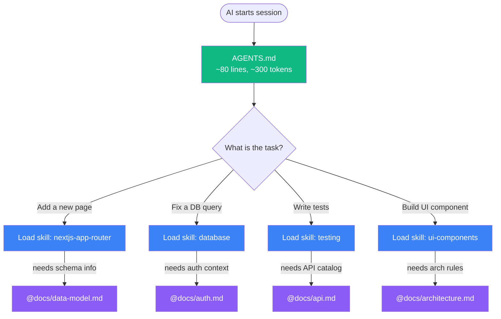

# Demo: AGENTS.md + Skills + Docs as Code

> A complete example showing **minimal context, maximum value** with three layers of progressive disclosure.

---

## The Idea

AI agents get dumber with too much context upfront. The solution: give them a **tiny index** that routes to **deep knowledge on-demand**.

Three layers. Zero tool-specific files. Works with every AI agent.

---

## Three-Layer Architecture

```
Layer 1: AGENTS.md (~80 lines)           ← Always loaded
    │
    ├── Layer 2: Skills (on-demand)      ← Loaded when task matches
    │   AI reads name + description,
    │   loads full instructions when needed
    │
    └── Layer 3: Docs (reference)        ← Loaded via @docs/ references
        Permanent knowledge: architecture,
        data model, API catalog, ADRs
```

### How It Works in Practice



### What Each Layer Contains

| Layer | Content | When Loaded | Token Cost |
|-------|---------|-------------|------------|
| **1: AGENTS.md** | Stack, commands, structure, conventions, boundaries | Every session | ~700 |
| **2: Skills** | How-to patterns (Next.js, Supabase, testing, UI) | When task matches | ~1,600-1,800 each |
| **3: Docs** | What exists (architecture, schema, API, auth, ADRs) | When referenced | ~1,000-1,200 each |

**Always-on context:** Only AGENTS.md = **~700 tokens**.
**Typical session:** AGENTS.md + 1 skill + 1 doc = **~3,500 tokens** loaded, all task-relevant.
**Old approach (14 rules):** ~5,000 tokens always loaded, mostly irrelevant to current task.

**Key advantage:** Not raw token count, but *relevance*. Loading 3,500 tokens of exactly the right context outperforms 5,000 tokens of everything-at-once.

---

## File Map

```
demo-taskflow/
│
├── AGENTS.md                                  # Layer 1: Always loaded
│                                              #   Stack, commands, conventions
│                                              #   References to skills and docs
│
├── .agents/skills/                            # Layer 2: On-demand skills
│   ├── nextjs-app-router/SKILL.md             #   Pages, layouts, server actions
│   ├── database/SKILL.md                      #   Supabase, migrations, RLS, React Query
│   ├── testing/SKILL.md                       #   Vitest + Storybook + Playwright
│   └── ui-components/SKILL.md                 #   shadcn/ui, theming, accessibility
│
└── docs/                                      # Layer 3: Reference docs
    ├── architecture.md                        #   System overview, layers, dependency rules
    ├── data-model.md                          #   ERD, tables, enums, access patterns
    ├── api.md                                 #   Server Actions catalog, revalidation
    ├── auth.md                                #   Auth flows, middleware, role-based access
    └── decisions/                             #   Architecture Decision Records
        ├── 001-server-first.md                #   Why server components by default
        └── 002-react-query.md                 #   Why React Query over useEffect
```

---

## Cross-Reference Map

Everything links to everything else — the AI navigates naturally:

```
AGENTS.md
├── references → docs/architecture.md
├── references → docs/data-model.md
├── references → docs/api.md
├── references → docs/auth.md
├── references → docs/decisions/
├── points to → skill: nextjs-app-router
├── points to → skill: database
├── points to → skill: testing
└── points to → skill: ui-components

Skills reference docs:
├── nextjs-app-router → @docs/architecture.md, @docs/api.md, @docs/auth.md
├── database          → @docs/data-model.md, @docs/auth.md, @docs/decisions/002
├── testing           → @docs/api.md, @docs/data-model.md, @docs/auth.md
└── ui-components     → @docs/architecture.md

Skills reference skills:
├── ui-components     → skill: testing, skill: nextjs-app-router
└── (skills can chain to each other when relevant)

Docs reference docs:
├── architecture.md   → data-model.md, api.md, auth.md, decisions/
├── data-model.md     → api.md, architecture.md
├── api.md            → data-model.md, auth.md, architecture.md, decisions/
└── auth.md           → api.md, data-model.md, decisions/
```

---

## Why Docs as Code?

| Principle | How It's Applied |
|-----------|-----------------|
| **Version controlled** | All docs committed with the code they describe |
| **Co-located** | Docs live next to the code, not in a wiki |
| **Machine readable** | AI agents parse `@docs/` references naturally |
| **Always fresh** | Docs update in the same PR as code changes |
| **Progressive** | Load only what's needed for the current task |
| **Cross-referenced** | Every doc links to related docs and skills |

---

## Rules vs Skills vs Docs

| | Rules (.mdc) | Skills (SKILL.md) | Docs (@docs/) |
|-|-------------|-------------------|---------------|
| **Loading** | Always on / glob-matched | On-demand (name + description) | On-demand (@reference) |
| **Purpose** | Code conventions | How-to procedures | What exists (reference) |
| **Example** | "Use camelCase" | "How to write a migration" | "Tasks table has these columns" |
| **Changes** | Rarely | When patterns evolve | When code changes |
| **In this demo** | Inline in AGENTS.md | `.agents/skills/` | `docs/` |

**Key insight:** This demo puts conventions inline in AGENTS.md (always loaded, short), making separate rule files unnecessary.

---

## Compatibility

| Agent | AGENTS.md | Skills | @docs/ refs |
|-------|-----------|--------|-------------|
| **Cursor** (v2.4+) | Auto-reads | `@skill-name` | `@docs/file.md` |
| **Claude Code** | `CLAUDE.md` symlink | `/skill-name` | Direct read |
| **GitHub Copilot** | Auto-reads | Auto-discovered (preview) | Direct read |
| **Cline** (v3.48+) | Via `.clinerules` | Auto-discovered | Direct read |
| **OpenCode** | Auto-reads | Via `skill` tool | Direct read |
| **Windsurf** | Auto-reads | Via UI | Direct read |
| **Aider** | Via `/read` | Not supported | Via `/read` |

---

## How to Apply

1. Copy this folder structure to your project
2. Replace TaskFlow content with your project details
3. Customize AGENTS.md: stack, commands, conventions
4. Replace skills with your tech stack (e.g., swap Supabase for Prisma)
5. Write docs that describe what exists in your codebase
6. Add ADRs for significant decisions
7. Commit everything to version control
