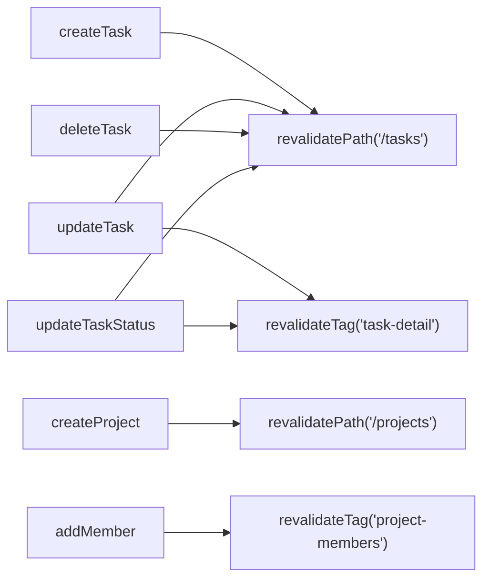

# API: Server Actions

> All mutations are Server Actions. No REST API routes for CRUD.
> See @docs/decisions/001-server-first.md for rationale.

## Actions Catalog

### Tasks (`features/tasks/actions/`)

| Action | Input | Behavior |
|--------|-------|----------|
| `getTasks(projectId, filters?)` | Project ID + optional filters | Returns tasks with assignee profile joined |
| `getTask(id)` | Task ID | Returns single task with comments, labels |
| `createTask(formData)` | FormData: title, projectId, assigneeId?, priority? | Creates task, revalidates `/tasks` |
| `updateTask(id, data)` | Task ID + partial update | Updates task, revalidates task detail + list |
| `updateTaskStatus(id, status)` | Task ID + new status | Validates transition, updates, revalidates |
| `updateTaskPosition(id, position, status?)` | Task ID + position + optional column | Board drag-and-drop |
| `deleteTask(id)` | Task ID | Soft delete, revalidates list |

### Projects (`features/projects/actions/`)

| Action | Input | Behavior |
|--------|-------|----------|
| `getProjects()` | — | Returns user's projects with role and member count |
| `getProject(id)` | Project ID | Returns project with members |
| `createProject(formData)` | FormData: name, description? | Creates project + owner membership |
| `updateProject(id, data)` | Project ID + partial update | Admin/owner only |
| `deleteProject(id)` | Project ID | Owner only, cascades tasks |
| `addMember(projectId, email, role)` | Project ID + email + role | Admin/owner only |
| `removeMember(projectId, userId)` | Project ID + user ID | Admin/owner only, can't remove owner |
| `updateMemberRole(projectId, userId, role)` | Project ID + user ID + new role | Admin/owner only |

### Auth (`features/auth/actions/`)

| Action | Input | Behavior |
|--------|-------|----------|
| `signIn(formData)` | FormData: email, password | Authenticates, redirects to `/dashboard` |
| `signUp(formData)` | FormData: email, password, name | Creates account + profile, redirects |
| `signOut()` | — | Clears session, redirects to `/login` |
| `resetPassword(formData)` | FormData: email | Sends reset email |

### Comments (`features/tasks/actions/comments.ts`)

| Action | Input | Behavior |
|--------|-------|----------|
| `getComments(taskId)` | Task ID | Returns comments with author profile |
| `addComment(taskId, formData)` | Task ID + FormData: body | Creates comment, revalidates task detail |
| `deleteComment(id)` | Comment ID | Author only |

## Revalidation Strategy



| Mutation | Revalidates |
|----------|-------------|
| Task created/deleted | `/tasks` path |
| Task updated | `/tasks` path + `task-detail` tag |
| Project created/deleted | `/projects` path |
| Member added/removed | `project-members` tag |

## Error Handling

All actions return `{ error: string }` on failure instead of throwing:

```typescript
// Action definition
export async function createTask(formData: FormData) {
  const title = formData.get('title') as string
  if (!title) return { error: 'Title is required' }

  const supabase = await createClient()
  const { error } = await supabase.from('tasks').insert({ title, ... })
  if (error) return { error: error.message }

  revalidatePath('/tasks')
  redirect(`/tasks`)
}
```

```typescript
// Usage with useActionState
const [state, action, isPending] = useActionState(createTask, null)
// state?.error contains the error message if any
```

## Query Keys

Used by React Query on the client side (see @docs/decisions/002-react-query.md):

```typescript
export const queryKeys = {
  tasks: {
    all:    ['tasks'],
    list:   (projectId: string, filters?: object) => ['tasks', 'list', projectId, filters],
    detail: (id: string) => ['tasks', 'detail', id],
  },
  projects: {
    all:    ['projects'],
    list:   () => ['projects', 'list'],
    detail: (id: string) => ['projects', 'detail', id],
    members: (id: string) => ['projects', id, 'members'],
  },
}
```

## Related

- Data model and schema: @docs/data-model.md
- Auth flow details: @docs/auth.md
- Architecture: @docs/architecture.md
- Database skill (migrations, RLS, React Query patterns): load skill `database`
