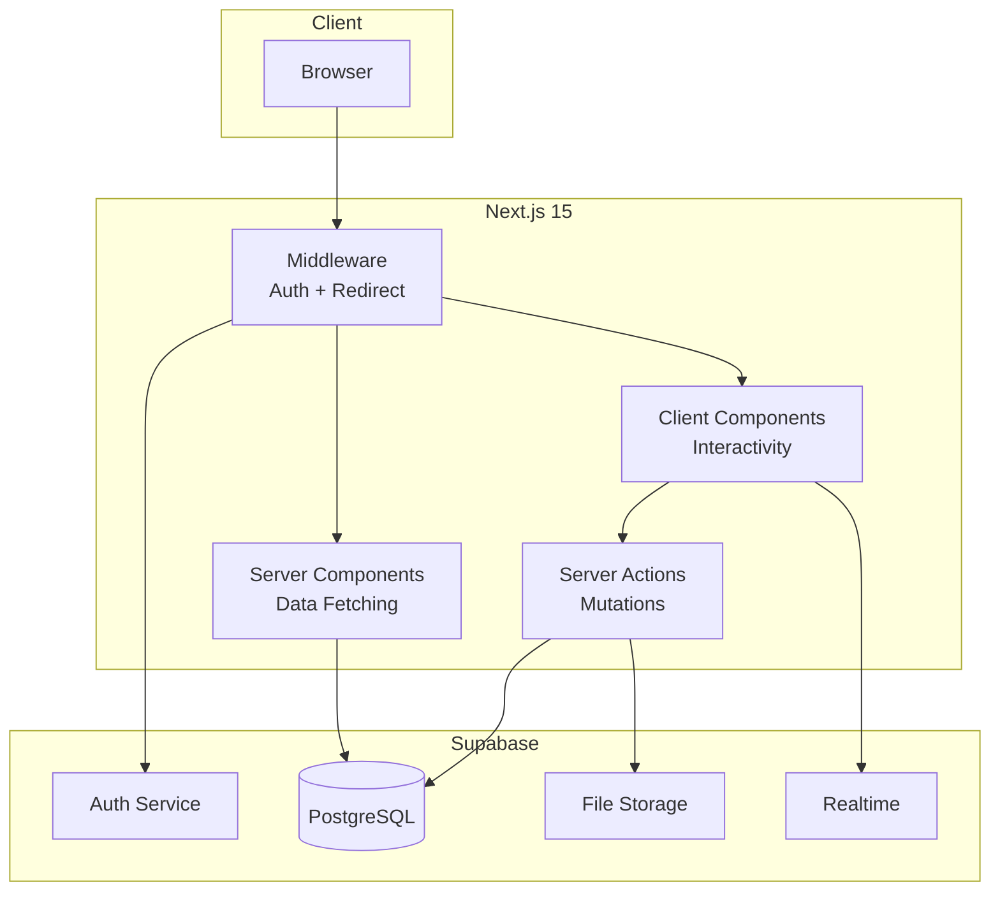
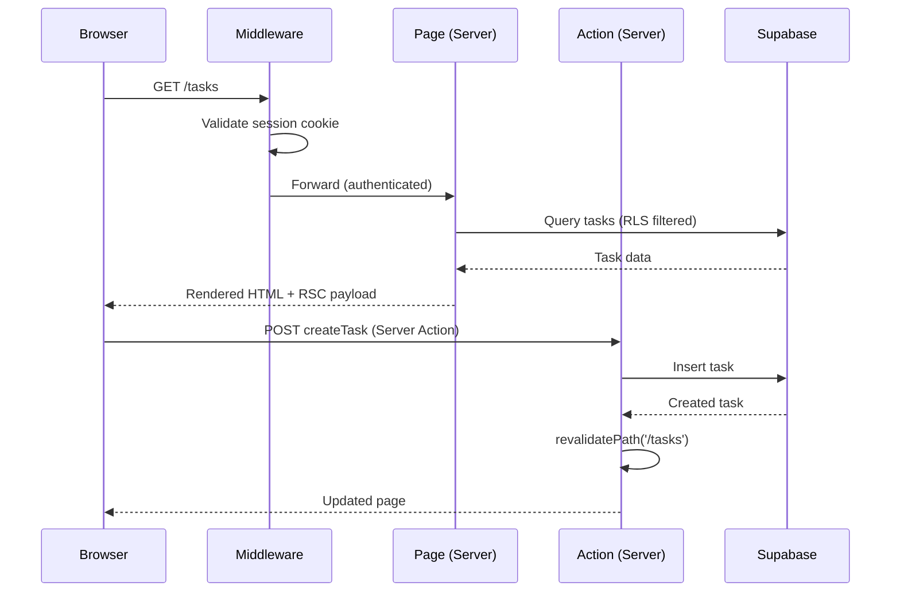
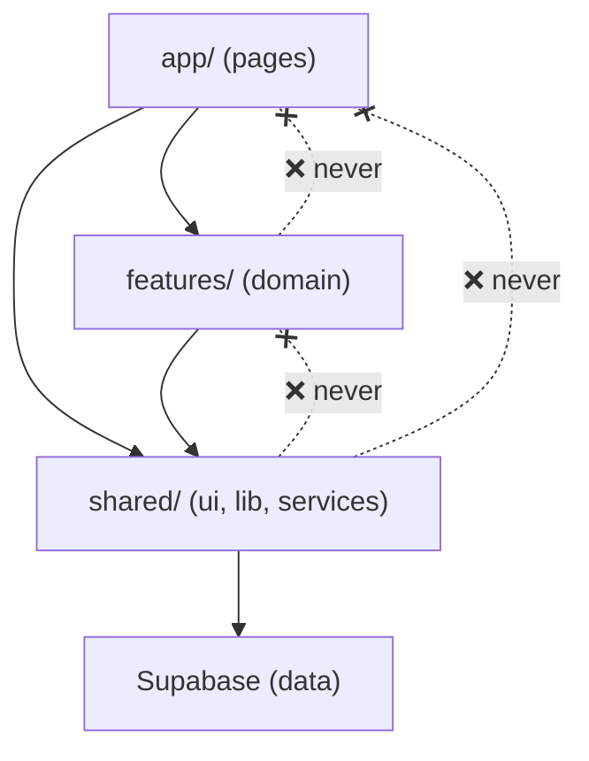

# Architecture

> How TaskFlow is structured and why.

## System Overview



## Request Flow



## Layer Architecture

```
┌─────────────────────────────────────────────────┐
│  Presentation Layer                              │
│  app/ — Pages, layouts, loading/error states     │
│  Route: URL → Page → Server Component            │
├─────────────────────────────────────────────────┤
│  Feature Layer                                   │
│  features/ — Domain logic grouped by feature     │
│  Each: components/ + hooks/ + actions/ + types   │
├─────────────────────────────────────────────────┤
│  Shared Layer                                    │
│  shared/ui/ — shadcn/ui components (design sys)  │
│  shared/lib/ — Utilities, cn(), formatters       │
│  shared/services/ — Supabase clients, queries    │
├─────────────────────────────────────────────────┤
│  Data Layer                                      │
│  Supabase — PostgreSQL + Auth + Storage          │
│  RLS policies enforce access at DB level         │
│  React Query — Client-side cache + mutations     │
└─────────────────────────────────────────────────┘
```

## Dependency Rules



| Rule | Description |
|------|-------------|
| `app/` imports from `features/` and `shared/` | Pages compose features |
| `features/` imports from `shared/` only | Features are independent |
| `shared/` imports from external packages only | No upward dependencies |
| Features never import from each other | Use shared layer for cross-cutting |

## Key Decisions

| Decision | Rationale | ADR |
|----------|-----------|-----|
| Server-first rendering | Performance, security, simplicity | @docs/decisions/001-server-first.md |
| React Query over useEffect | Caching, dedup, optimistic updates | @docs/decisions/002-react-query.md |

## Related

- Data model: @docs/data-model.md
- API surface: @docs/api.md
- Auth flows: @docs/auth.md
