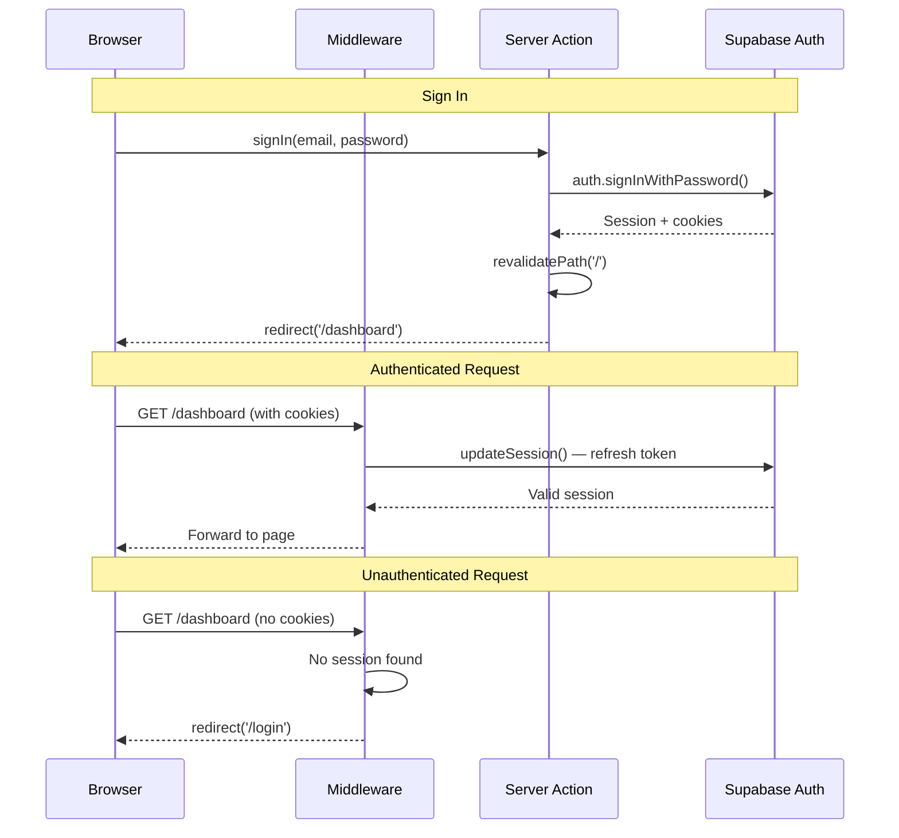

# Authentication

> Supabase Auth with cookie-based sessions, middleware protection, and Server Actions.

## Auth Flow



## Protected Routes

### Middleware (`middleware.ts`)

```typescript
import { updateSession } from '@/shared/services/supabase/middleware'

export async function middleware(request: NextRequest) {
  const { response, user } = await updateSession(request)

  const isAuthRoute = request.nextUrl.pathname.startsWith('/login') ||
                      request.nextUrl.pathname.startsWith('/signup')

  if (!user && !isAuthRoute) {
    return NextResponse.redirect(new URL('/login', request.url))
  }

  if (user && isAuthRoute) {
    return NextResponse.redirect(new URL('/dashboard', request.url))
  }

  return response
}

export const config = {
  matcher: ['/dashboard/:path*', '/tasks/:path*', '/projects/:path*', '/login', '/signup'],
}
```

### Route Protection Matrix

| Route Pattern | Auth Required | Redirect |
|---------------|--------------|----------|
| `/` | No | — |
| `/login`, `/signup` | No (redirects if logged in) | → `/dashboard` |
| `/dashboard/**` | Yes | → `/login` |
| `/tasks/**` | Yes | → `/login` |
| `/projects/**` | Yes | → `/login` |

## Supabase Client per Context

| Context | Client | Why |
|---------|--------|-----|
| Middleware | `createServerClient` with cookie handling | Refresh tokens on every request |
| Server Components | `await createClient()` from `server.ts` | Read session from cookies |
| Server Actions | `await createClient()` from `server.ts` | Read session + mutate |
| Client Components | `createClient()` from `client.ts` | Browser-side auth state |

**Critical:** Server client must be created per-request (`await createClient()`), never stored globally.

## Auth State on Client

```typescript
// shared/services/supabase/auth-provider.tsx
'use client'

export function AuthProvider({ children }: { children: React.ReactNode }) {
  const [user, setUser] = useState<User | null>(null)
  const supabase = createClient()

  useEffect(() => {
    const { data: { subscription } } = supabase.auth.onAuthStateChange(
      (_event, session) => setUser(session?.user ?? null)
    )
    return () => subscription.unsubscribe()
  }, [supabase])

  return <AuthContext.Provider value={{ user }}>{children}</AuthContext.Provider>
}

// Usage
const { user } = useAuth()
```

## Password Reset Flow

```mermaid
flowchart LR
    A[User clicks 'Forgot Password'] --> B[Enter email]
    B --> C[Server Action: resetPassword]
    C --> D[Supabase sends reset email]
    D --> E[User clicks email link]
    E --> F[/auth/callback — exchange code]
    F --> G[/auth/reset — new password form]
    G --> H[Server Action: updatePassword]
    H --> I[redirect to /dashboard]
```

## Role-Based Access

Roles are stored in `project_members.role` (not Supabase Auth roles):

| Check | Where | How |
|-------|-------|-----|
| Is authenticated? | Middleware | Session cookie exists |
| Is project member? | RLS policy | `project_members` join |
| Is project admin? | Server Action | Query `project_members.role` |
| Is project owner? | Server Action | Query `project_members.role = 'owner'` |

```typescript
// Server Action — check role before mutation
export async function deleteProject(projectId: string) {
  const supabase = await createClient()
  const { data: { user } } = await supabase.auth.getUser()

  const { data: membership } = await supabase
    .from('project_members')
    .select('role')
    .eq('project_id', projectId)
    .eq('user_id', user!.id)
    .single()

  if (membership?.role !== 'owner') {
    return { error: 'Only the project owner can delete it' }
  }

  // ... proceed with deletion
}
```

## Related

- Server Actions catalog: @docs/api.md
- Data model (project_members, roles): @docs/data-model.md
- Server-first decision: @docs/decisions/001-server-first.md
- Supabase client patterns: load skill `database`
