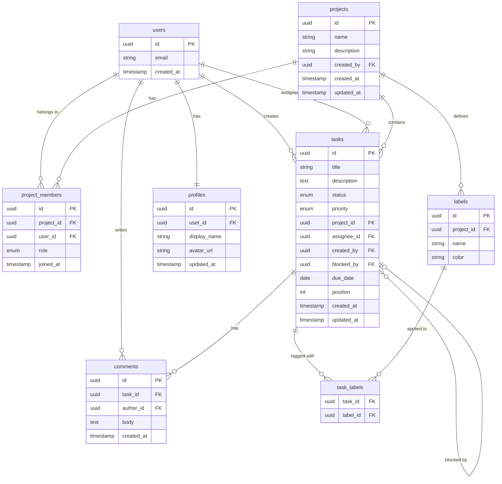

# Data Model

> Database schema, relationships, and access patterns.

## Entity Relationship Diagram



## Tables

### Core

| Table | Purpose | RLS |
|-------|---------|-----|
| `profiles` | User display info | Public read, own write |
| `projects` | Project containers | Member access |
| `project_members` | User ↔ Project mapping | Member access |
| `tasks` | Task items | Project member access |

### Supporting

| Table | Purpose | RLS |
|-------|---------|-----|
| `comments` | Task comments | Project member access |
| `labels` | Project-scoped labels | Project member access |
| `task_labels` | Task ↔ Label mapping | Project member access |

## Enums

### Task Status

```sql
CREATE TYPE task_status AS ENUM ('todo', 'in_progress', 'in_review', 'done', 'blocked');
```

| Value | Board Column | Can transition to |
|-------|-------------|-------------------|
| `todo` | To Do | `in_progress`, `blocked` |
| `in_progress` | In Progress | `in_review`, `blocked`, `todo` |
| `in_review` | Review | `done`, `in_progress` |
| `done` | Done | `todo` (reopen) |
| `blocked` | Blocked | `todo`, `in_progress` |

### Task Priority

```sql
CREATE TYPE task_priority AS ENUM ('low', 'medium', 'high', 'urgent');
```

### Project Member Role

```sql
CREATE TYPE member_role AS ENUM ('viewer', 'member', 'admin', 'owner');
```

| Role | Can view | Can edit tasks | Can manage members | Can delete project |
|------|----------|---------------|-------------------|-------------------|
| `viewer` | Yes | No | No | No |
| `member` | Yes | Yes | No | No |
| `admin` | Yes | Yes | Yes | No |
| `owner` | Yes | Yes | Yes | Yes |

## Access Patterns

### Common Queries

| Query | Table(s) | Index |
|-------|----------|-------|
| Tasks by project | `tasks` | `idx_tasks_project_id` |
| Tasks assigned to user | `tasks` | `idx_tasks_assignee_id` |
| Tasks by status | `tasks` | `idx_tasks_project_status` |
| Project members | `project_members` | `idx_pm_project_id` |
| User's projects | `project_members` | `idx_pm_user_id` |
| Comments on task | `comments` | `idx_comments_task_id` |

### Board View Query

```sql
-- Tasks for board view (grouped by status)
SELECT t.*, p.display_name as assignee_name, p.avatar_url
FROM tasks t
LEFT JOIN profiles p ON p.user_id = t.assignee_id
WHERE t.project_id = $1
ORDER BY t.position ASC;
```

## TypeScript Types

```typescript
import type { Tables } from '@/shared/services/supabase/types'

type Task       = Tables<'tasks'>
type Project    = Tables<'projects'>
type Profile    = Tables<'profiles'>
type Comment    = Tables<'comments'>

// Joined types for common queries
type TaskWithAssignee = Task & {
  assignee: Pick<Profile, 'display_name' | 'avatar_url'> | null
}

type ProjectWithRole = Project & {
  role: MemberRole
  member_count: number
}
```

## Related

- RLS policies and migration patterns: load skill `database`
- Architecture overview: @docs/architecture.md
- API / Server Actions: @docs/api.md
