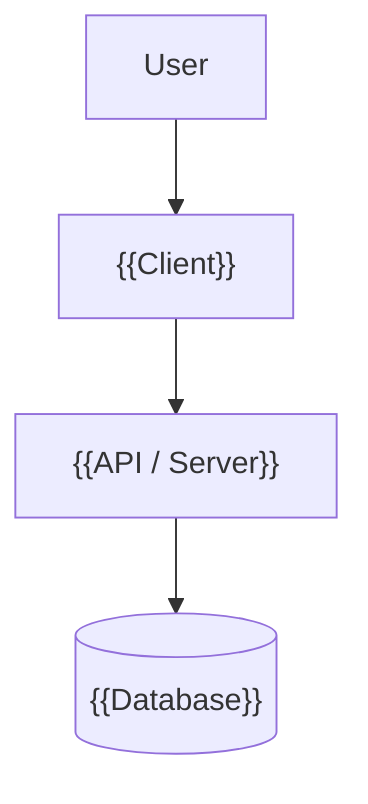
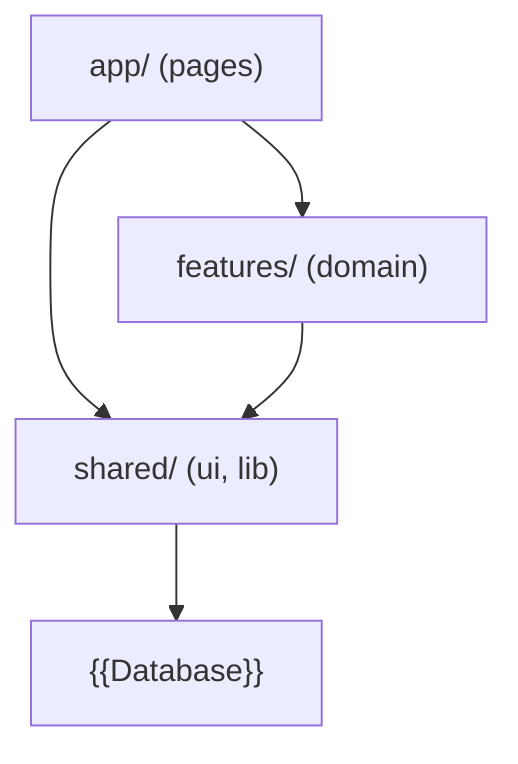

# System Architecture

> High-level system overview, layers, and dependency rules.

## Overview

{{1-2 sentences describing the system.}}

## Diagram

## Layers

| Layer | Technology | Purpose |
|-------|------------|---------|
| {{Presentation}} | {{e.g. Next.js}} | User interface |
| {{Business}} | {{e.g. Server Actions}} | Business logic |
| {{Data}} | {{e.g. PostgreSQL}} | Data storage |

## Dependency Rules

- `app/` depends on `features/` and `shared/`
- `features/` depends on `shared/` only
- `shared/` never depends on `app/` or `features/`

## Key Decisions

| Decision | ADR | Summary |
|----------|-----|---------|
| {{Decision 1}} | @docs/decisions/001-{{name}}.md | {{One-line summary}} |

## Related

- Data model: @docs/data-model.md
- API surface: @docs/api.md
- Auth flows: @docs/auth.md
