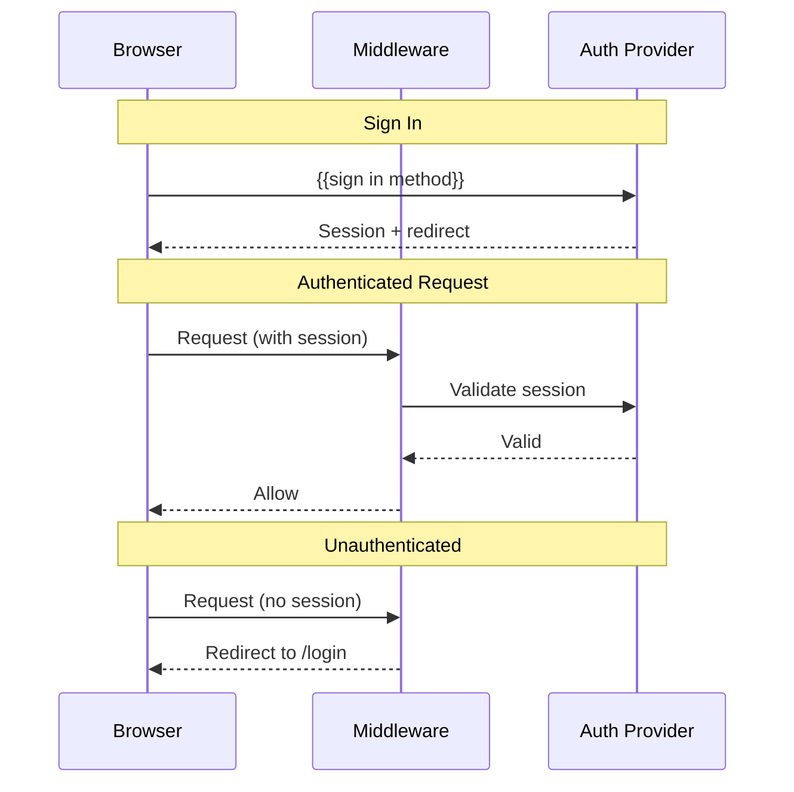

# Authentication

> Auth provider, session management, and route protection.

## Auth Flow

## Protected Routes

| Route Pattern | Auth Required | Redirect |
|---------------|--------------|----------|
| `/` | No | — |
| `/login`, `/signup` | No (redirect if logged in) | → `/dashboard` |
| `/dashboard/**` | Yes | → `/login` |

## Auth Provider

| Context | Client | Why |
|---------|--------|-----|
| {{Server}} | {{client type}} | {{reason}} |
| {{Client}} | {{client type}} | {{reason}} |

## Role-Based Access

| Role | Permissions |
|------|-------------|
| `{{role_1}}` | {{Description}} |
| `{{role_2}}` | {{Description}} |
| `{{role_3}}` | {{Description}} |

## Related

- Server Actions catalog: @docs/api.md
- Data model (roles table): @docs/data-model.md
