# AGENTS.md Bootstrap Workflow

> **Workflow for AI agents to analyze a project and generate/update context files.**

---

## Goal

Create or update `AGENTS.md` to give AI agents immediate context about the project.
**Strategy**: Keep `AGENTS.md` concise (50-80 lines, 150 max) and generate detailed reference docs only if needed.

---

## Workflow Phases

```mermaid
flowchart LR
    subgraph ask [0. Ask User]
        U1[Monorepo or Single App?]
        U2[List subprojects if monorepo]
    end
    subgraph detect [1. Detect]
        A1[Check AGENTS.md exists]
        A2[Identify tech stack]
        A3[Assess complexity]
    end
    subgraph analyze [2. Analyze]
        B1[Scan structure]
        B2[Extract commands]
        B3[Find patterns]
    end
    subgraph preview [3. Preview]
        C1[Show proposed content]
        C2[User confirms/edits]
    end
    subgraph create [4. Create]
        D1[Write AGENTS.md]
        D2[Write Ref Docs]
        D3[Suggest next modules]
    end
    ask --> detect --> analyze --> preview --> create
```



---

## Phase 0: User Selection (Interactive)

**Start by asking the user** - don't try to auto-detect project type.

### Step 1: Ask Project Type

> "Is this a **monorepo** or **single app**?"
>
> 1. **Single App** - One deployable unit (web app, API, CLI, library)
> 2. **Monorepo** - Multiple packages/services that could be separate repos
>
> Reply `1` or `2`.

### Step 2: If Monorepo, Ask for Subprojects

> "Which folders should have their own AGENTS.md?"
>
> - List them (e.g., `application/`, `services/aws/`, `packages/`)
> - Or reply `scan` and I'll suggest based on structure

### Why Ask Instead of Auto-Detect?

| Auto-Detect | User Selection |
|-------------|----------------|
| Fails on unusual structures | Always correct |
| Wastes tokens scanning | Zero overhead |
| May miss nested subprojects | User knows their project |

**After user responds, proceed to Phase 1.**

---

## Phase 1: Detection

### 1.1 Check if AGENTS.md exists

- **EXISTS**: Enter "update mode"
  - Read existing file
  - Identify user customizations (sections not in template)
  - Plan updates to auto-generated sections only
- **NOT EXISTS**: Enter "create mode"
  - Generate fresh from template

### 1.2 Detect Subprojects (If User Said "Scan")

If user selected monorepo but asked you to scan for subprojects:

**Structural Analysis (not hardcoded names):**

1. **Find package manifests** at different levels:
   ```bash
   find . -maxdepth 3 -name "package.json" -o -name "go.mod" -o -name "Cargo.toml" -o -name "pyproject.toml"
   ```

2. **Identify independent units** - folders that:
   - Have their own package manifest
   - Could be deployed separately
   - Have distinct concerns (frontend, backend, services)

3. **Check for orchestration configs**:
   - `workspaces` field in root `package.json`
   - `docker-compose.yml` with multiple services
   - CI config building multiple artifacts

4. **Common patterns** (examples, not requirements):
   - `apps/`, `application/`, `projects/` - main applications
   - `packages/`, `libs/`, `modules/` - shared code
   - `services/`, `functions/` - backend services
   - `tools/`, `scripts/` - utilities

**Suggest subprojects to user for confirmation before proceeding.**

### 1.3 Identify Tech Stack

| Stack | Signals |
|-------|---------|
| **Node/JS/TS** | `package.json`, `tsconfig.json` |
| **Python** | `requirements.txt`, `pyproject.toml`, `setup.py`, `Pipfile` |
| **Go** | `go.mod` |
| **Rust** | `Cargo.toml` |
| **Docker** | `Dockerfile`, `docker-compose.yml` |

### 1.4 Assess Complexity (Tier Selection)

Determine which additional docs are needed based on thresholds:

| Signal | Threshold | Generated Doc | Template |
|--------|-----------|---------------|----------|
| **Monorepo** | Detected | `docs/architecture.md` | `templates/docs/architecture.md` |
| **Components** | > 20 files in `components/` | `docs/components.md` | `templates/docs/components.md` |
| **API** | `routes/` or `api/` folder exists | `docs/api.md` | `templates/docs/api.md` |
| **Structure** | > 10 top-level folders | `docs/structure.md` | (Auto-generated tree) |

---

## Phase 2: Analysis

### 2.1 Command Extraction (AI Auto-detect)

**Priority Order:**
1. **Explicit Scripts**: Look for `dev`, `start`, `test`, `build` in `package.json` or `Makefile`
2. **Common Patterns**: `npm run dev`, `make dev`, `python -m pytest`
3. **Framework Defaults**:
   - Next.js: `next dev`
   - Vite: `vite`
   - Django: `python manage.py runserver`
   - FastAPI: `uvicorn main:app --reload`
   - Go: `go run .`

### 2.2 Pattern Detection

Scan for:
- **Naming**: camelCase vs kebab-case filenames
- **Organization**: Feature-based (`features/auth`) vs Layer-based (`controllers/`, `models/`)
- **Testing**: `__tests__` folder vs `*.test.ts` vs `tests/` folder

---

## Phase 3: Preview (Interactive)

Present findings to the user before writing files.

**Example Interaction:**

> "I've analyzed your project. Here is the proposed context setup:
>
> **Project Type**: Single App (Next.js + TypeScript)
> **Commands Detected**:
> - Dev: `npm run dev`
> - Test: `npm run test`
>
> **Complexity Check**:
> - High component count (45 detected) → Generating `docs/components.md`
> - API routes found → Generating `docs/api.md`
>
> **Proposed AGENTS.md**:
> [Preview of content...]
>
> Shall I proceed with creating these 3 files?"

---

## Phase 4: Create

### 4.1 Write AGENTS.md (Always)

Create `AGENTS.md` in project root using the tiered structure:

```markdown
# [Project Name] - AI Agent Instructions

## Quick Start
[Detected commands]

## Project Overview
[1-2 sentences generated from README or user input]

## Tech Stack
[Detected stack table]

## File Structure
[Top-level tree]

## Key Patterns
[Detected patterns]

## Need More Context?
| Topic | Document | When to Read |
|-------|----------|--------------|
| Components | [docs/components.md] | modifying UI |
| API | [docs/api.md] | working on endpoints |
```

### 4.2 Write Reference Docs (Conditional)

- Create `docs/` folder if needed
- Generate specific docs based on Phase 1.4 assessment
- Populate with initial scan data (e.g., list top 10 components in `components.md`)

### 4.3 Suggest Next Steps

- If project has many features → Suggest **Module 3 (Feature Development)**
- If code style is mixed → Suggest **Module 2 (Coding Standards)**

---

## Example Output Scenarios

### Scenario A: Greenfield React App (Simple)
**Result**: Single `AGENTS.md` file.
- Complexity low (no extra docs needed)
- Contains all context inline

### Scenario B: Brownfield Python Monorepo (Complex)
**Result**: `AGENTS.md` + 3 Reference Docs
- `AGENTS.md`: Links to architecture and service docs
- `docs/architecture.md`: Explains monorepo structure
- `docs/services.md`: Lists the 5 python services found
- `docs/api.md`: Aggregates API endpoints

### Scenario C: Any Monorepo
**Key insight**: Monorepos have no standard structure. Folder names vary by team.

**Result**: Ask the user which folders need their own `AGENTS.md`.
Don't assume folder names - let the user define their subprojects.

---

## Quick Start Prompts

### Single App
```
Bootstrap AGENTS.md for this single app project.
Follow: https://raw.githubusercontent.com/sergiusavva/ai-context-docs-lifecycle/main/content/modules/01-quick-start/bootstrap-workflow.md
```

### Monorepo
```
Bootstrap AGENTS.md for this monorepo.
Subprojects: [LIST YOUR FOLDERS]
Follow: https://raw.githubusercontent.com/sergiusavva/ai-context-docs-lifecycle/main/content/modules/01-quick-start/bootstrap-workflow.md
```
