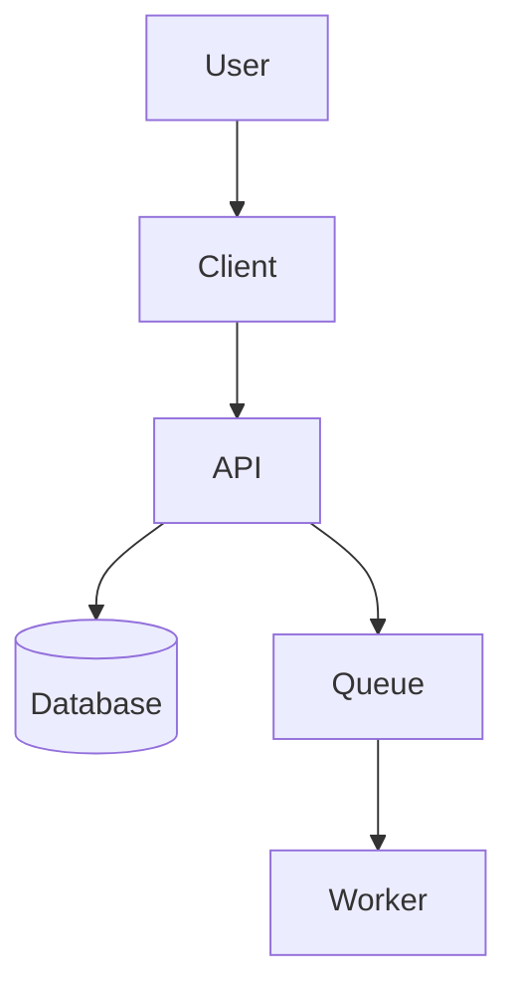

# System Architecture

## Overview

[High-level description of the system architecture]

## Diagram

## Core Systems

| System | Technology | Purpose |
|--------|------------|---------|
| Frontend | [e.g. Next.js] | User interface |
| Backend | [e.g. Node.js] | Business logic |
| Database | [e.g. Postgres] | Data storage |
| Cache | [e.g. Redis] | Session/data caching |

## Data Flow

1. **[Flow 1]**: [Description]
2. **[Flow 2]**: [Description]

## Integration Points

- [External Service 1]
- [External Service 2]
