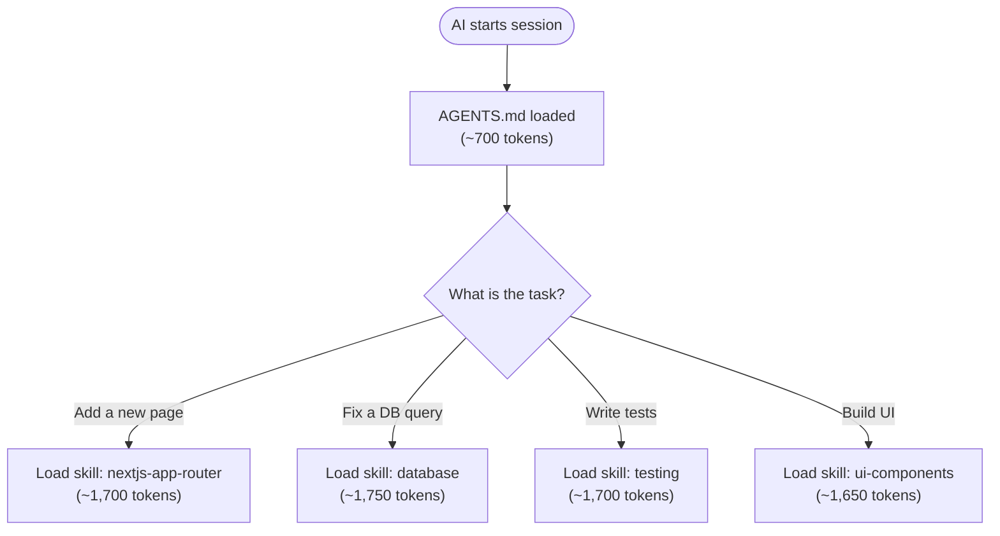

# Module 2: Skills

> **On-demand instruction packages** that give AI agents deep, task-specific knowledge.

---

## The Problem

Short conventions (naming, component patterns) belong inline in AGENTS.md. But deep knowledge (database migration patterns, testing strategies, UI component systems) is too large to load every session.

Loading everything upfront wastes context tokens and degrades AI performance.

**The solution**: Skills — instruction packages loaded only when the task matches.

---

## What Skills Are

A **Skill** is a `SKILL.md` file that teaches an AI agent how to do something specific. Skills follow the open standard from [agentskills.io](https://agentskills.io/specification).

```
.agents/skills/
├── database/
│   └── SKILL.md          # Supabase patterns, migrations, RLS
├── testing/
│   └── SKILL.md          # Vitest + Storybook + Playwright strategy
├── ui-components/
│   └── SKILL.md          # shadcn/ui, theming, accessibility
└── nextjs-app-router/
    └── SKILL.md          # Pages, layouts, server actions
```

### How Skills Load



Only the relevant skill loads. The rest stay dormant.

---

## Skills vs Inline Conventions

Not everything should be a skill. Use this decision guide:

| Characteristic | Inline in AGENTS.md | SKILL.md |
|---------------|---------------------|----------|
| Length | 1-2 lines | 100+ lines |
| Applies to | Every task | Specific task types |
| Example | "Use camelCase for functions" | "How to write a Supabase migration" |
| Changes | Rarely | When patterns evolve |
| Token cost | Always loaded (~700 total) | On-demand (~1,600-1,800 each) |

**Rule of thumb**: If it fits in one bullet point, it goes in AGENTS.md. If it needs code examples and multiple sections, it's a skill.

---

## SKILL.md Format

Every skill has two parts: **YAML frontmatter** (name + description) and **Markdown content** (instructions).

```markdown
---
name: database
description: Supabase integration patterns — migrations, RLS, React Query, and type generation. Use when working with database queries, schema changes, or auth.
---

# Database Patterns

> **References:** Data model → @docs/data-model.md | Auth → @docs/auth.md

## Migrations

{{Detailed patterns with code examples}}

## RLS Policies

{{Patterns}}

## Quick Checklist

- [ ] Run `npm run db:types` after schema changes
- [ ] Every table has RLS policies

## Related Docs

- @docs/data-model.md
- @docs/decisions/002-react-query.md
- load skill `nextjs-app-router`
```

### Frontmatter Fields

| Field | Required | Purpose |
|-------|----------|---------|
| `name` | Yes | Unique identifier (used in `load skill \`name\``) |
| `description` | Yes | 1-2 sentences. AI reads this to decide whether to load the full skill |

### Content Sections

| Section | Purpose |
|---------|---------|
| **References** | Links to `@docs/` files the skill relates to |
| **Patterns** | Deep how-to knowledge with code examples |
| **Quick Checklist** | Key things to remember |
| **Related Docs** | Cross-references to docs and other skills |

---

## Cross-Referencing

Skills connect to the broader context through references:

### Skills reference docs

```markdown
> **References:** Data model → @docs/data-model.md | Auth → @docs/auth.md
```

### Skills reference other skills

```markdown
## Related Docs

- load skill `testing`
- load skill `nextjs-app-router`
```

### AGENTS.md routes to skills

```markdown
## Context Loading

| Task | Load Skill |
|------|------------|
| Building pages / layouts | `nextjs-app-router` |
| Database / auth / storage | `database` |
| Writing tests / stories | `testing` |
```

---

## When to Create a Skill

Create a skill when:

1. You find yourself explaining the same deep pattern to AI repeatedly
2. A technology in your stack has specific conventions (e.g., "always use Server Actions, never API routes")
3. A workflow has multiple steps with code examples (e.g., "how to add a new database table")
4. You want the AI to follow project-specific patterns that differ from defaults

### Common Skills

| Skill | Covers |
|-------|--------|
| `database` | ORM/client patterns, migrations, queries, caching |
| `testing` | Testing strategy, which tool for what, patterns |
| `ui-components` | Component library, theming, accessibility |
| `nextjs-app-router` | Pages, layouts, server actions, streaming |
| `api-design` | Endpoint conventions, error handling, validation |
| `deployment` | CI/CD, environment config, release process |
| `feature-workflow` | Research → Plan → Implement phases |

---

## Skill File Structure

A skill can be a single file or a directory with supporting content:

```
.agents/skills/
└── database/
    ├── SKILL.md             # Required: frontmatter + instructions
    ├── docs/                # Optional: additional reference files
    │   └── migration-examples.md
    └── scripts/             # Optional: executable scripts
        └── generate-types.sh
```

Only `SKILL.md` is required. The `docs/` and `scripts/` directories are optional for skills that need supporting files.

---

## Tool Compatibility

| Agent | Skills Support | Invocation |
|-------|---------------|------------|
| **Cursor** (v2.4+) | Yes | `@skill-name` |
| **Claude Code** | Yes | `/skill-name` |
| **GitHub Copilot** | Preview | Auto-discovered |
| **Cline** (v3.48+) | Yes | Auto-discovered |
| **OpenCode** | Yes | Via `skill` tool |
| **Windsurf** | Yes | Via UI |
| **OpenAI Codex** | Yes | Via commands |
| **Aider** | No | Use `/read` as alternative |

### Cursor Bridge (Optional)

If your team uses Cursor, you can create lightweight `.mdc` rules that point to skills:

```
---
description: Database patterns
globs:
  - "**/migrations/**"
  - "**/supabase/**"
---

Load skill `database` for Supabase patterns, migrations, and RLS.
```

This gives you glob-based auto-loading while keeping the knowledge in portable `SKILL.md` files.

---

## Template

Use the [SKILL.md template](./templates/.agents/skills/skill-template/SKILL.md) to create new skills.

---

## Example

See the [demo-taskflow](../01-project-context/examples/demo-taskflow/README.md) example for 4 complete skills in action:
- `nextjs-app-router` — Pages, layouts, server actions
- `database` — Supabase, migrations, RLS, React Query
- `testing` — Vitest + Storybook + Playwright
- `ui-components` — shadcn/ui, theming, accessibility

---

## What's Next?

| Signal | What It Means | Add Module |
|--------|---------------|------------|
| Building features > 3 files | Need structured workflow | [Module 3: Feature Development](../03-feature-development/README.md) |
| Managing multiple features | Need project-level planning | [Module 4: Project Planning](../04-project-planning/README.md) |
