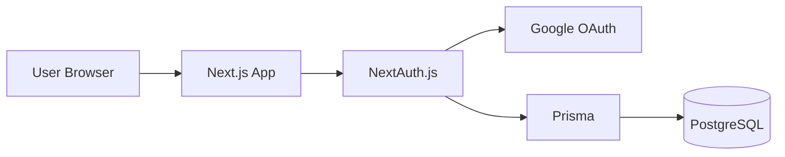
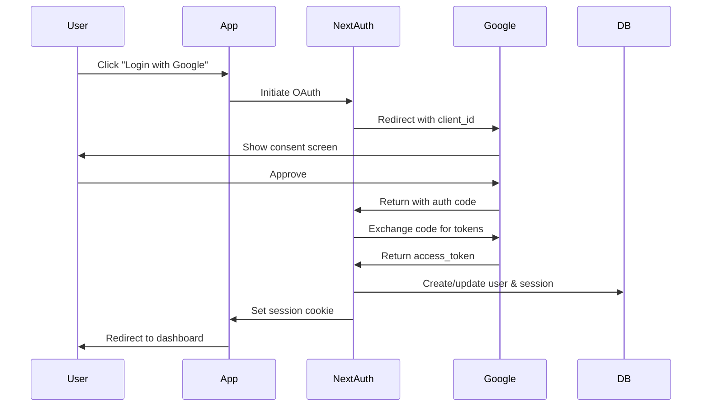

# Research: OAuth Authentication

> **Example**: This is a filled-in research document demonstrating the Complex Flow.

---

## Problem Statement

Users need secure authentication to access the workspace app. We want to avoid password management complexity and provide a seamless login experience.

**Constraints**:
- Must be secure (industry-standard protocols)
- Should be easy to implement
- Must work with Next.js App Router
- Need to store user sessions for protected routes

---

## Options Evaluated

### Option A: Google OAuth 2.0

**Description**: Use Google's OAuth 2.0 service via NextAuth.js for authentication.

**Pros**:
- Most users already have Google accounts
- Well-documented, battle-tested
- Free for any scale
- NextAuth.js has excellent Google support
- Handles token refresh automatically

**Cons**:
- Dependency on Google's availability
- Limited to Google users initially
- Requires Google Cloud project setup

**Effort**: Medium

**Links**:
- [Google OAuth Docs](https://developers.google.com/identity/protocols/oauth2)
- [NextAuth.js Google Provider](https://next-auth.js.org/providers/google)

---

### Option B: GitHub OAuth

**Description**: Use GitHub's OAuth for authentication.

**Pros**:
- Good for developer-focused apps
- Simple setup
- Free

**Cons**:
- Smaller user base (not everyone has GitHub)
- Less suitable for non-developer users
- Limited user profile data

**Effort**: Low

**Links**:
- [GitHub OAuth Docs](https://docs.github.com/en/developers/apps/building-oauth-apps)

---

### Option C: Auth0

**Description**: Use Auth0 as a third-party authentication service.

**Pros**:
- Supports multiple providers in one
- Enterprise features (SSO, MFA)
- Managed service, less code to maintain

**Cons**:
- Costs money at scale ($23/month for 1000 MAU)
- Another service to manage
- Overkill for simple auth needs
- Vendor lock-in

**Effort**: Low-Medium

**Links**:
- [Auth0 Pricing](https://auth0.com/pricing)
- [Auth0 Next.js SDK](https://github.com/auth0/nextjs-auth0)

---

## Comparison Matrix

| Criteria | Google OAuth | GitHub OAuth | Auth0 |
|----------|-------------|--------------|-------|
| User base reach | ⭐⭐⭐ | ⭐ | ⭐⭐⭐ |
| Ease of setup | ⭐⭐ | ⭐⭐⭐ | ⭐⭐ |
| Cost | Free | Free | $$ |
| Maintenance | Low | Low | Very Low |
| Scalability | ⭐⭐⭐ | ⭐⭐⭐ | ⭐⭐⭐ |
| Next.js support | ⭐⭐⭐ | ⭐⭐⭐ | ⭐⭐ |

---

## Recommendation

**Chosen Option**: Google OAuth 2.0 via NextAuth.js

**Rationale**:
1. **Widest user base** - Almost everyone has a Google account
2. **Zero cost** - No pricing tiers to worry about
3. **Excellent Next.js integration** - NextAuth.js is purpose-built
4. **Proven security** - Google handles the hard parts
5. **Easy to add more providers later** - NextAuth.js supports multiple providers

**Trade-offs Accepted**:
- Users without Google accounts can't log in initially (can add more providers later)
- Dependency on Google's availability (acceptable risk)

---

## Technical Details

### Architecture Diagram

### Authentication Flow

---

## Security Considerations

- **CSRF Protection**: NextAuth.js includes built-in CSRF protection
- **Token Storage**: Tokens stored server-side, only session ID in cookie
- **Session Management**: Database sessions with configurable expiry
- **Secure Cookies**: httpOnly, secure, sameSite flags set automatically

---

## Performance Considerations

- Session lookups add ~10-20ms per request
- Consider caching session data if performance critical
- Database sessions scale better than JWT for revocation

---

## Resources

### Documentation
- [NextAuth.js Documentation](https://next-auth.js.org/)
- [Google Cloud Console](https://console.cloud.google.com/)
- [Prisma Auth Adapter](https://authjs.dev/reference/adapter/prisma)

### Examples
- [NextAuth.js Example](https://github.com/nextauthjs/next-auth-example)
- [T3 Stack Auth](https://create.t3.gg/)

---

## Open Questions

- [x] Which session strategy? → Database sessions (better for revocation)
- [x] Where to store user data? → Prisma with PostgreSQL
- [ ] Future: Add more OAuth providers?

---

## Next Steps

After research approval:
1. ✅ Create detailed spec.md
2. ✅ Write user stories with acceptance criteria
3. ✅ Break down into implementation tasks

---

*Researched: 2026-01-19*
*Status: Approved*
