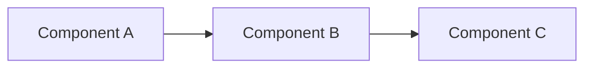
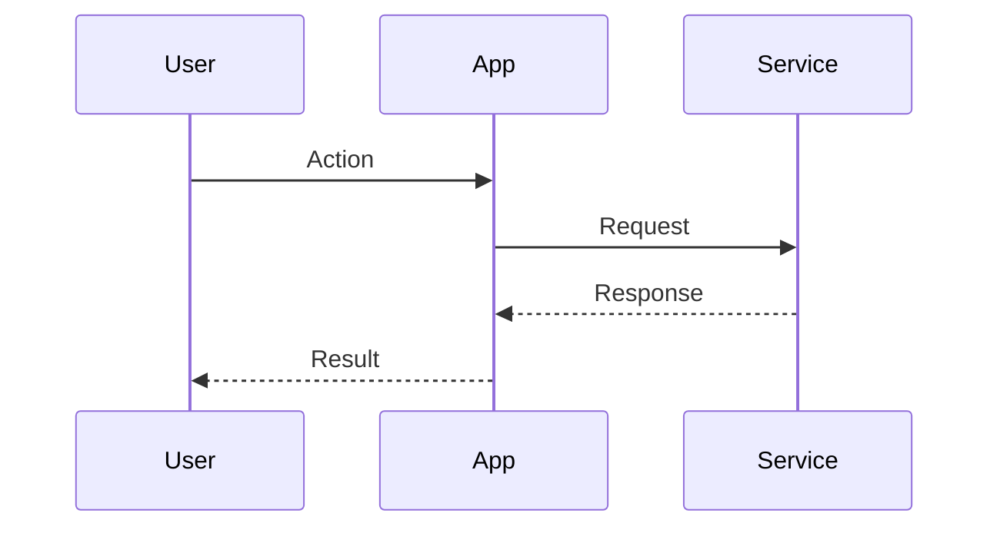

# Research: [Feature Name]

> **Template**: Copy to `specs/[feature-name]/research.md`
> Use when exploring options, evaluating libraries, or unfamiliar territory.

---

## Problem Statement

[What are we trying to solve? What constraints exist?]

---

## Options Evaluated

### Option A: [Name]

**Description**: [What is this option?]

**Pros**:
- [Advantage 1]
- [Advantage 2]

**Cons**:
- [Disadvantage 1]
- [Disadvantage 2]

**Effort**: Low / Medium / High

**Links**:
- [Documentation](URL)
- [Example](URL)

---

### Option B: [Name]

**Description**: [What is this option?]

**Pros**:
- [Advantage 1]
- [Advantage 2]

**Cons**:
- [Disadvantage 1]
- [Disadvantage 2]

**Effort**: Low / Medium / High

**Links**:
- [Documentation](URL)
- [Example](URL)

---

### Option C: [Name] (if applicable)

**Description**: [What is this option?]

**Pros**:
- [Advantage 1]

**Cons**:
- [Disadvantage 1]

**Effort**: Low / Medium / High

---

## Comparison Matrix

| Criteria | Option A | Option B | Option C |
|----------|----------|----------|----------|
| Ease of implementation | ⭐⭐⭐ | ⭐⭐ | ⭐ |
| Performance | ⭐⭐ | ⭐⭐⭐ | ⭐⭐ |
| Maintainability | ⭐⭐⭐ | ⭐⭐ | ⭐⭐⭐ |
| Cost | Free | $$ | Free |
| Community support | Large | Medium | Small |

---

## Recommendation

**Chosen Option**: [Option X]

**Rationale**:
- [Reason 1]
- [Reason 2]
- [Reason 3]

**Trade-offs Accepted**:
- [Trade-off 1]

---

## Technical Details

### Architecture Diagram

### Data Flow

---

## Security Considerations

- [Security consideration 1]
- [Security consideration 2]

---

## Performance Considerations

- [Performance consideration 1]
- [Expected load/scale]

---

## Resources

### Documentation
- [Official docs](URL)
- [API reference](URL)

### Examples
- [Example repo](URL)
- [Tutorial](URL)

### Related
- [Related ADR](../decisions/NNN-related.md)
- [Related feature](../features/related/)

---

## Open Questions

- [ ] [Question 1 that needs answering]
- [ ] [Question 2 that needs answering]

---

## Next Steps

After research approval:
1. Create spec.md with acceptance criteria
2. Create design.md if architecture decisions needed
3. Create tasks.md with implementation breakdown

---

*Researched: [Date]*
*Status: Draft | Approved*
