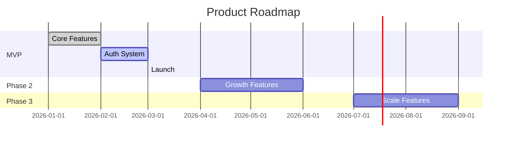

# Product Roadmap

> **Template**: Copy to `ROADMAP.md`
> High-level phase or release planning.

---

## Current Phase: [MVP / Phase 2 / etc.]

**Goal**: [What this phase achieves]
**Target**: [Date or milestone]
**Status**: [On Track / At Risk / Behind]

---

## Phase Overview

---

## MVP

**Goal**: [Core value proposition - what makes this usable]
**Target**: [Date]
**Status**: 🟡 In Progress

### Features

| Feature | Status | Owner | Notes |
|---------|--------|-------|-------|
| [Core Setup] | ✅ Complete | - | |
| [User Auth] | 🔨 Building | AI | Google OAuth |
| [Dashboard] | 📋 Specified | - | Next up |
| [Feature 3] | 💡 Planned | - | |

### Success Criteria

- [ ] Users can [core action 1]
- [ ] Users can [core action 2]
- [ ] [Technical requirement]

---

## Phase 2: [Growth]

**Goal**: [What this phase achieves - usually growth/engagement]
**Target**: [Date]
**Status**: ⏳ Planned

### Features

| Feature | Priority | Notes |
|---------|----------|-------|
| [Feature 4] | High | [Brief description] |
| [Feature 5] | High | [Brief description] |
| [Feature 6] | Medium | [Brief description] |

### Success Criteria

- [ ] [Metric 1]
- [ ] [Metric 2]

---

## Phase 3: [Scale]

**Goal**: [What this phase achieves - usually scale/enterprise]
**Target**: [Date]
**Status**: ⏳ Planned

### Features

| Feature | Priority | Notes |
|---------|----------|-------|
| [Feature 7] | High | |
| [Feature 8] | Medium | |

---

## Future Considerations

Features that may be built eventually:

- [Future idea 1]
- [Future idea 2]
- [Future idea 3]

---

## Phase Definitions

| Phase | Focus | Criteria to Exit |
|-------|-------|------------------|
| MVP | Core value | Users can complete primary workflow |
| Phase 2 | Growth | [Growth metrics met] |
| Phase 3 | Scale | [Scale metrics met] |

---

## Risks & Dependencies

| Risk | Phase | Mitigation |
|------|-------|------------|
| [Risk 1] | MVP | [Strategy] |
| [Risk 2] | Phase 2 | [Strategy] |

---

*Last updated: [Date]*
