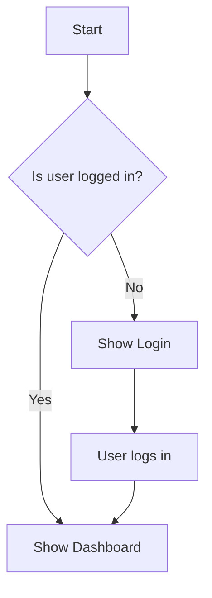
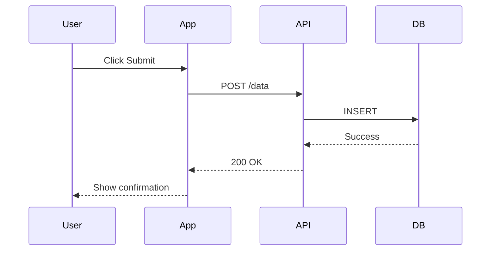
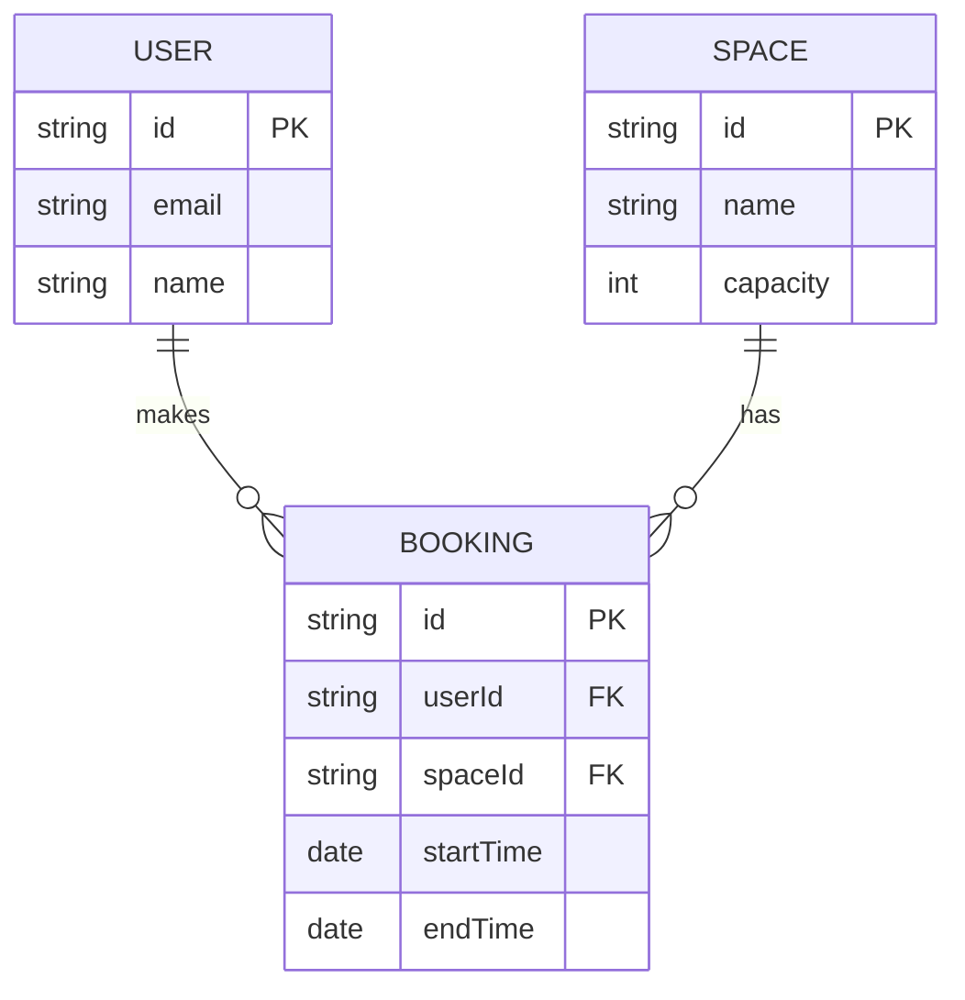
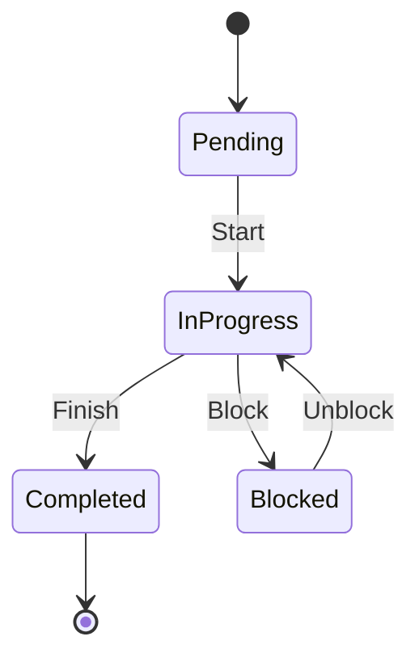
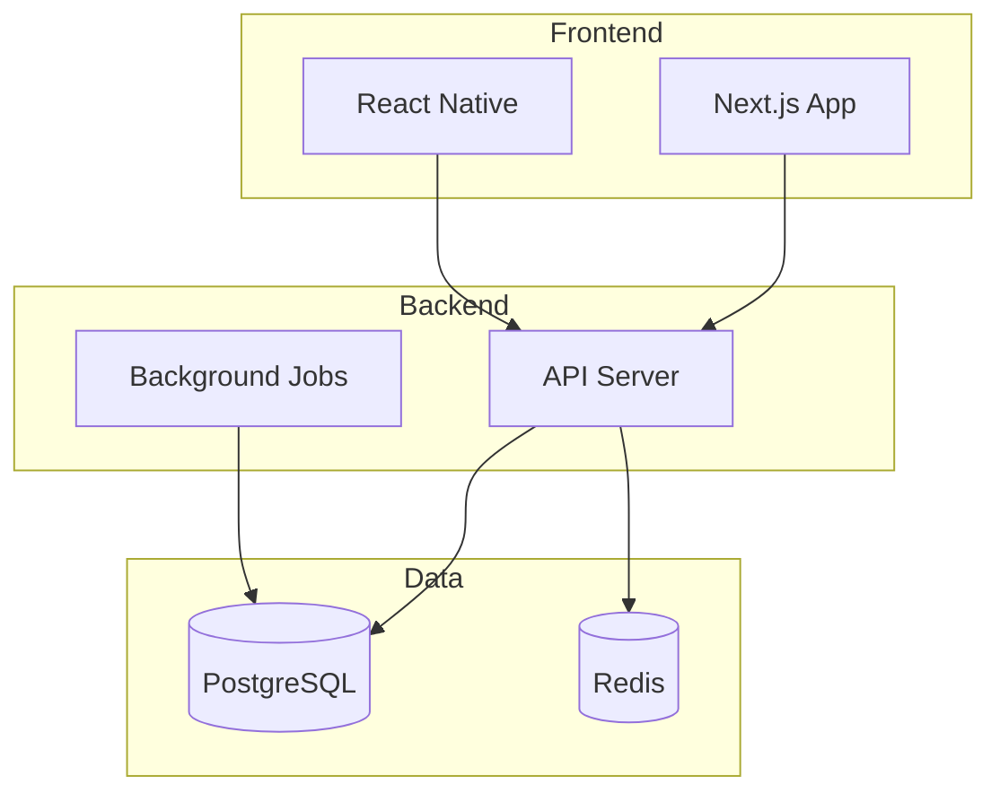
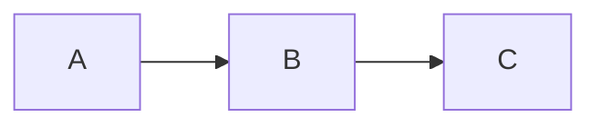
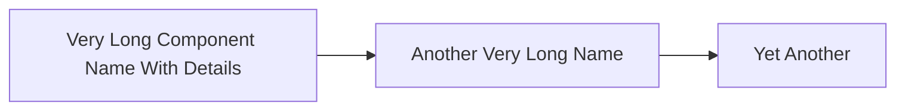
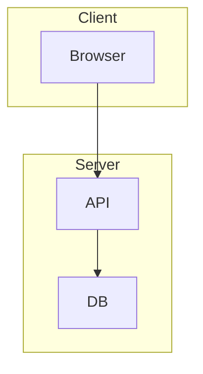
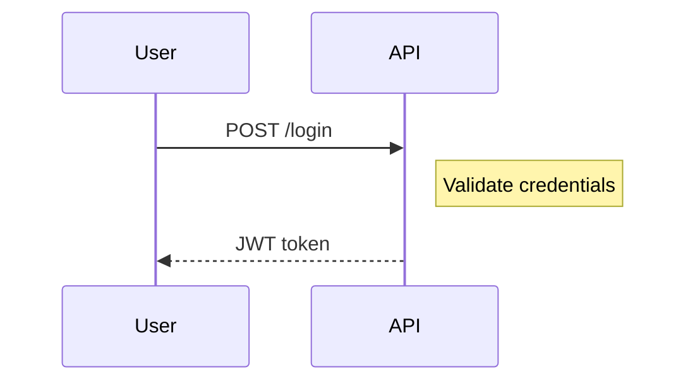
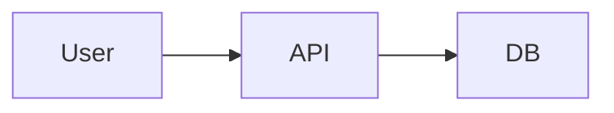

# Diagrams with Mermaid

> **Docs as code** - Diagrams in markdown that version with your code.

---

## Why Mermaid?

- **Version controlled**: Diagrams are text, tracked in Git
- **No external tools**: Renders in GitHub, VS Code, most markdown viewers
- **Easy to update**: Change text, not image files
- **AI-friendly**: AI agents can read and modify

---

## Common Diagram Types

### 1. Flowchart - Processes & Decisions

Use for: User flows, decision trees, processes



**Syntax**:
```
flowchart TD
    A[Rectangle] --> B{Diamond}
    B -->|Label| C[Next]
```

- `TD` = Top to Down, `LR` = Left to Right
- `[text]` = Rectangle
- `{text}` = Diamond (decision)
- `-->|label|` = Arrow with label

---

### 2. Sequence Diagram - Interactions

Use for: API flows, system interactions, auth flows



**Syntax**:
```
sequenceDiagram
    participant A
    participant B
    
    A->>B: Solid arrow (request)
    B-->>A: Dashed arrow (response)
    A->>+B: Activate B
    B-->>-A: Deactivate B
```

---

### 3. Entity Relationship - Data Models

Use for: Database schema, data relationships



**Syntax**:
```
erDiagram
    ENTITY1 ||--o{ ENTITY2 : relationship
    ENTITY1 {
        type name
    }
```

Relationship symbols:
- `||` = exactly one
- `o{` = zero or more
- `|{` = one or more

---

### 4. State Diagram - Object States

Use for: Order status, task states, workflow states



**Syntax**:
```
stateDiagram-v2
    [*] --> State1
    State1 --> State2: transition
    State2 --> [*]
```

---

### 5. Architecture - System Components

Use for: System overview, component relationships



---

## Best Practices

### Keep It Simple



Not:



### Use Subgraphs for Grouping



### Add Labels to Clarify



---

## When to Use Diagrams

| Scenario | Diagram Type |
|----------|--------------|
| User authentication flow | Sequence |
| Order state machine | State |
| Database schema | ER Diagram |
| System architecture | Flowchart with subgraphs |
| Decision process | Flowchart |
| API request/response | Sequence |

---

## Embedding in Docs

In markdown files:

````markdown
## System Architecture


````

The diagram renders automatically in GitHub, VS Code (with extension), and most documentation sites.

---

## AI Agent Instructions

When creating diagrams:

1. **Match diagram type to content** - Don't force-fit
2. **Keep nodes short** - 1-3 words per node
3. **Use subgraphs** - For logical grouping
4. **Add labels** - When relationships need explanation
5. **Test rendering** - Preview before committing
