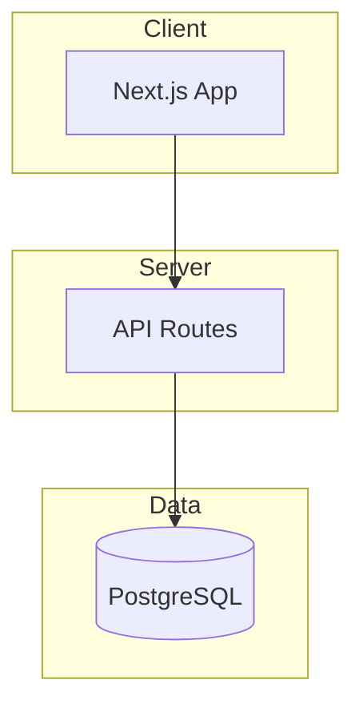

# Documentation Index

> **Template**: Copy to `docs/INDEX.md`
> This is the navigation hub for human developers.

---

## Quick Links

- [AGENTS.md](../AGENTS.md) - AI context and quick reference
- [Getting Started](#getting-started)
- [Architecture](#architecture)

---

## Getting Started

### Prerequisites

- [Node.js 18+]
- [PostgreSQL]
- [Required accounts/keys]

### Setup

```bash
# Clone and install
git clone [repo-url]
cd [project-name]
npm install

# Set up environment
cp .env.example .env
# Edit .env with your values

# Set up database
npx prisma db push

# Start development
npm run dev
```

---

## Architecture

See [AGENTS.md](../AGENTS.md) for tech stack and patterns.



---

## Features

| Feature | Status | Documentation |
|---------|--------|---------------|
| [Auth] | Complete | [docs/features/auth/](./features/auth/) |
| [Feature 2] | Complete | [docs/features/feature2/](./features/feature2/) |
| [Feature 3] | In Progress | [docs/specs/feature3/](./specs/feature3/) |

### [Auth]

[Brief description of auth feature]

See: [Auth Documentation](./features/auth/README.md)

### [Feature 2]

[Brief description]

See: [Feature 2 Documentation](./features/feature2/README.md)

---

## Decisions (ADRs)

Architecture Decision Records document why we made significant choices.

| # | Decision | Status |
|---|----------|--------|
| [001](./decisions/001-database-choice.md) | [Database Choice] | Accepted |
| [002](./decisions/002-auth-provider.md) | [Auth Provider] | Accepted |
| [003](./decisions/003-state-management.md) | [State Management] | Accepted |

---

## Active Development

Current work in progress:

| Feature | Spec | Status |
|---------|------|--------|
| [Feature Name] | [docs/specs/feature/](./specs/feature/) | [In Progress] |

---

## Contributing

### Before You Start

1. Read [AGENTS.md](../AGENTS.md) for context
2. Check [Active Development](#active-development) for current work
3. Review relevant [ADRs](#decisions-adrs)

### Workflow

1. Create feature spec in `docs/specs/<feature>/`
2. Implement following patterns in `.cursor/rules/`
3. Create Feature README in `docs/features/<feature>/`
4. Create ADR if significant decision made

---

## Support

- **Bugs**: [Issue tracker URL]
- **Questions**: [Discussion URL or Slack]
- **Code**: Check `.cursor/rules/` for patterns

---

*Last updated: [Date]*
