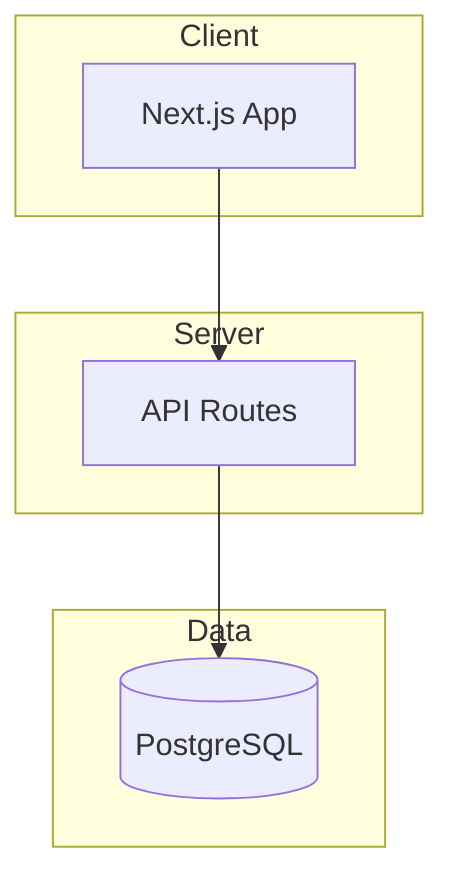

# Documentation Index

> **Template**: Copy to `docs/INDEX.md`
> This is the navigation hub for human developers.

---

## Quick Links

- `AGENTS.md` (project root) - AI context and quick reference
- [Getting Started](#getting-started)
- [Architecture](#architecture)

---

## Getting Started

### Prerequisites

- [Node.js 18+]
- [PostgreSQL]
- [Required accounts/keys]

### Setup

```bash
# Clone and install
git clone [repo-url]
cd [project-name]
npm install

# Set up environment
cp .env.example .env
# Edit .env with your values

# Set up database
npx prisma db push

# Start development
npm run dev
```

---

## Architecture

See `AGENTS.md` (project root) for tech stack and patterns.



---

## Features

| Feature | Status | Documentation |
|---------|--------|---------------|
| [Feature Name] | Complete | `docs/features/[feature]/` |
| [Feature Name] | Complete | `docs/features/[feature]/` |
| [Feature Name] | In Progress | `specs/[feature]/` |

### [Feature Name]

[Brief description of feature]

See: `docs/features/[feature]/README.md`

### [Feature Name]

[Brief description]

See: `docs/features/[feature]/README.md`

---

## Decisions (ADRs)

Architecture Decision Records document why we made significant choices.

| # | Decision | Status |
|---|----------|--------|
| 001 | [Decision Title] | Accepted |
| 002 | [Decision Title] | Accepted |
| 003 | [Decision Title] | Accepted |

Location: `decisions/NNN-[title].md`

---

## Active Development

Current work in progress:

| Feature | Spec | Status |
|---------|------|--------|
| [Feature Name] | `specs/[feature]/` | [In Progress] |

---

## Contributing

### Before You Start

1. Read `AGENTS.md` (project root) for context
2. Check [Active Development](#active-development) for current work
3. Review relevant [ADRs](#decisions-adrs)

### Workflow

1. Create feature spec in `docs/specs/<feature>/`
2. Implement following patterns in `.cursor/rules/`
3. Create Feature README in `docs/features/<feature>/`
4. Create ADR if significant decision made

---

## Support

- **Bugs**: [Issue tracker URL]
- **Questions**: [Discussion URL or Slack]
- **Code**: Check `.cursor/rules/` for patterns

---

*Last updated: [Date]*
