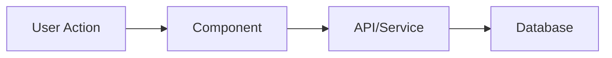

# Feature: [Name]

> **Template**: Copy to `docs/features/<feature-name>/README.md`
> Replace all `[bracketed]` placeholders.

---

## Overview

[2-3 sentences: What does this feature do? Why does it exist?]

---

## How It Works

[Explain the feature at a high level. Include a diagram if helpful.]



### Key Concepts

- **[Concept 1]**: [Brief explanation]
- **[Concept 2]**: [Brief explanation]

### Flow

1. [Step 1: What happens first]
2. [Step 2: What happens next]
3. [Step 3: Final outcome]

---

## Code Touchpoints

Main files for this feature:

| File | Purpose |
|------|---------|
| `[path/to/main.ts]` | [Main logic] |
| `[path/to/component.tsx]` | [UI component] |
| `[path/to/hook.ts]` | [Data fetching/state] |
| `[path/to/api/route.ts]` | [API endpoint] |

### Directory Structure

```
features/[feature-name]/
├── components/
│   ├── [Component1].tsx
│   └── [Component2].tsx
├── hooks/
│   └── use[Feature].ts
├── utils/
│   └── [helpers].ts
└── types.ts
```

---

## Usage

### Basic Usage

```typescript
// Example code showing how to use this feature
import { useFeature } from '@/features/[feature]/hooks';

function MyComponent() {
  const { data, isLoading } = useFeature();
  
  if (isLoading) return <Loading />;
  return <Display data={data} />;
}
```

### Common Patterns

```typescript
// Pattern 1: [Description]
[code example]

// Pattern 2: [Description]
[code example]
```

---

## Configuration

### Environment Variables

| Variable | Required | Description |
|----------|----------|-------------|
| `[VAR_NAME]` | Yes/No | [What it does] |

### Options

| Option | Default | Description |
|--------|---------|-------------|
| `[option]` | `[default]` | [What it does] |

---

## Gotchas

1. **[Issue]**: [Description and how to avoid/fix]
2. **[Issue]**: [Description and how to avoid/fix]

---

## Related

- **ADR**: [ADR-NNN](../../decisions/NNN-title.md) - [Why we built it this way]
- **Feature**: [Related Feature](../related-feature/) - [How they connect]
- **External**: [Documentation link](URL) - [What it explains]

---

## Changelog

| Date | Change |
|------|--------|
| [YYYY-MM-DD] | Initial implementation |
| [YYYY-MM-DD] | [What changed] |

---

*Last updated: [Date]*
