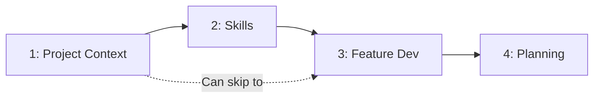

# Modules

> **Pick what you need** — Independent modules for AI-assisted development.

---

## Overview

| # | Module | Purpose |
|---|--------|---------|
| 1 | [Project Context](./01-project-context/README.md) | AGENTS.md + docs/ (always-loaded context + reference) |
| 2 | [Skills](./02-skills/README.md) | On-demand instruction packages (.agents/skills/) |
| 3 | [Feature Development](./03-feature-development/README.md) | Workflows for building features |
| 4 | [Project Planning](./04-project-planning/README.md) | Multi-feature management (optional) |

---

## Adoption Path

Start with Module 1, add more as needed:



---

## Recommended Combinations

### Minimal

```
Module 1 only
```

AGENTS.md + docs/ for basic AI context.

### Standard

```
Modules 1 + 2
```

Add Skills for deep tech stack patterns.

### Full

```
Modules 1 + 2 + 3
```

Add feature workflows for structured development.

### Enterprise

```
All modules (1-4)
```

Add project planning for multi-feature management.

---

## Getting Started

See [guides/getting-started.md](../guides/getting-started.md)
