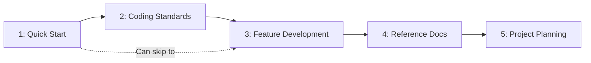

# Modules

> **Pick what you need** - Independent modules for AI-assisted development.

---

## Overview

| # | Module | Purpose | Time |
|---|--------|---------|------|
| 1 | [Quick Start](./01-quick-start/) | Minimal AI context (AGENTS.md) | 5 min |
| 2 | [Coding Standards](./02-coding-standards/) | Code & doc style rules | 10 min |
| 3 | [Feature Development](./03-feature-development/) | Workflows for building features | 15 min |
| 4 | [Reference Docs](./04-reference-docs/) | Documentation structure | 20 min |
| 5 | [Project Planning](./05-project-planning/) | Multi-feature management | 15 min |

---

## Adoption Path

Start with Module 1, add more as needed:



---

## Recommended Combinations

### Minimal (5 minutes)

```
Module 1 only
```

Just AGENTS.md for basic AI context.

### Standard (30 minutes)

```
Modules 1 + 2 + 3
```

AI context + coding standards + feature workflows.

### Complete (1 hour)

```
All modules (1-5)
```

Full documentation and project management.

---

## Getting Started

See [guides/getting-started.md](../guides/getting-started.md)
