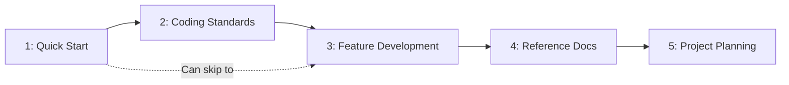

# Modules

> **Pick what you need** - Independent modules for AI-assisted development.

---

## Overview

| # | Module | Purpose |
|---|--------|---------|
| 1 | [Core Init](./01-quick-start/README.md) | Comprehensive AI context (AGENTS.md) |
| 2 | [Coding Standards](./02-coding-standards/README.md) | Code & doc style rules |
| 3 | [Feature Development](./03-feature-development/README.md) | Workflows for building features |
| 4 | [Reference Docs](./04-reference-docs/README.md) | Documentation structure |
| 5 | [Project Planning](./05-project-planning/README.md) | Multi-feature management |

---

## Adoption Path

Start with Module 1, add more as needed:



---

## Recommended Combinations

### Minimal

```
Module 1 only
```

Just AGENTS.md for basic AI context.

### Standard

```
Modules 1 + 2 + 3
```

AI context + coding standards + feature workflows.

### Complete

```
All modules (1-5)
```

Full documentation and project management.

---

## Getting Started

See [guides/getting-started.md](../guides/getting-started.md)
