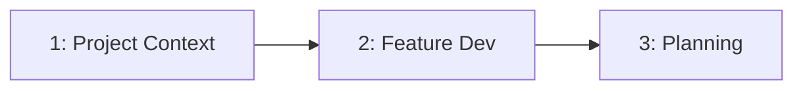

# Modules

> **Pick what you need** — Independent modules for AI-assisted development.

---

## Overview

| # | Module | Purpose |
|---|--------|---------|
| 1 | [Project Context](./01-project-context/README.md) | AGENTS.md + docs/ + .agents/skills/ |
| 2 | [Feature Development](./02-feature-development/README.md) | Workflows for building features |
| 3 | [Project Planning](./03-project-planning/README.md) | Multi-feature management (optional) |

---

## Adoption Path

Start with Module 1, add more as needed:


```mermaid
graph LR
    M1["1: Project Context"] --> M2["2: Feature Dev"]
    M2 --> M3["3: Planning"]
```

Module 1 has three tiers: Basic (`AGENTS.md` only), Standard (`AGENTS.md` + `docs/`), Full (+ `.agents/skills/`). For a solo side project, Standard tier is the recommended starting point.

---

## Recommended Combinations

### Starter

```
Module 1 — Standard tier (AGENTS.md + docs/)
```

AGENTS.md + `docs/scripts.md` (and any docs your project needs). Best for personal projects, prototypes, and side projects.

### Production

```
Module 1 — Full tier (AGENTS.md + docs/ + .agents/skills/)
```

Adds on-demand skills for deep tech stack patterns. Best for production apps with specific framework or library conventions.

### Team

```
Modules 1 + 2
```

Add feature workflows for structured development. Best for team projects building multiple features.

### Enterprise

```
All modules (1-3)
```

Add project planning for multi-feature management. Best for products with roadmaps.

---

## Getting Started

See [guides/getting-started.md](../guides/getting-started.md)
