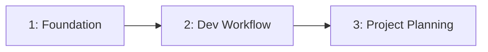

# Modules

> **Pick what you need** — Independent modules for AI-assisted development.

---

## Overview

| # | Module | Purpose | Default? |
|---|--------|---------|----------|
| 1 | [Foundation](./01-foundation/README.md) | AGENTS.md bootstrap + reference doc templates | Yes |
| 2 | [Dev Workflow](./02-dev-workflow/README.md) | Feature workflow + stack pattern skills | Yes |
| 3 | [Project Planning](./03-project-planning/README.md) | Multi-feature management | No (optional) |

---

## Adoption Path

Start with Modules 1-2 (installed by default), add Module 3 when needed:


```mermaid
graph LR
    M1["1: Foundation"] --> M2["2: Dev Workflow"]
    M2 --> M3["3: Project Planning"]
```

Module 1 has three tiers: Basic (`AGENTS.md` only), Standard (`AGENTS.md` + `docs/`), Full (+ `.agents/skills/`). For a solo side project, Standard tier is the recommended starting point.

---

## Recommended Combinations

### Starter

```
Module 1 — Standard tier (AGENTS.md + docs/)
```

AGENTS.md + `docs/scripts.md` (and any docs your project needs). Best for personal projects, prototypes, and side projects.

### Production

```
Modules 1-2 — Full tier (AGENTS.md + docs/ + .agents/skills/ + feature workflow)
```

Adds on-demand skills for deep tech stack patterns and structured feature workflows. Best for production apps with specific framework or library conventions.

### Enterprise

```
All modules (1-3)
```

Add project planning for multi-feature management. Best for products with roadmaps.

---

## Getting Started

See [guides/getting-started.md](../guides/getting-started.md)
