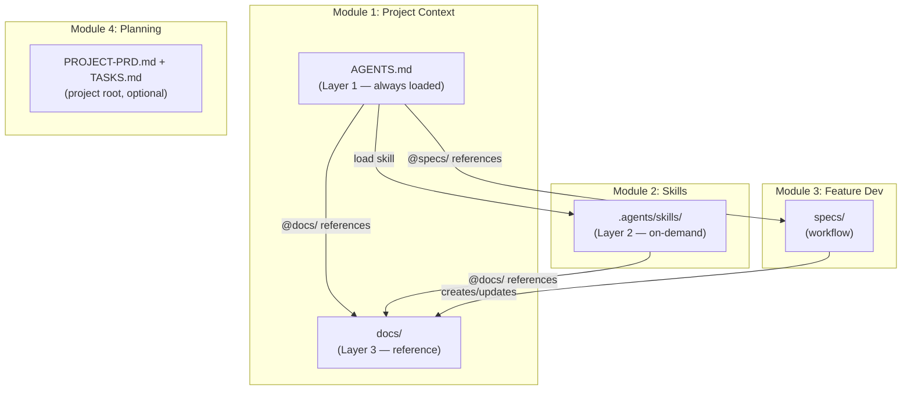
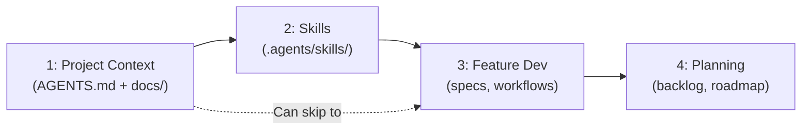

# Design: Module Restructure

> Consolidate 5 modules into 4 around the three-layer architecture: AGENTS.md + Skills + Docs.

---

## Current State (5 Modules)

```
Module 1: Quick Start        → AGENTS.md setup
Module 2: Coding Standards   → Cursor .mdc rules (tool-specific)
Module 3: Feature Development → Workflows, specs, tasks
Module 4: Reference Docs     → docs/ structure, freshness, ADRs
Module 5: Project Planning   → Backlog, roadmap (optional)
```

**Problems:**
- Module 2 is Cursor-only (`.mdc` files) — not portable
- Module 4 is a separate concept but docs/ directly supports AGENTS.md
- No Skills coverage (emerging standard, 6+ agents support it)
- Three layers (AGENTS.md, Skills, Docs) span modules 1, 2, and 4 awkwardly

---

## Proposed State (4 Modules)

```
Module 1: Project Context     → AGENTS.md + docs/ (Layer 1 + Layer 3)
Module 2: Skills               → .agents/skills/ (Layer 2)
Module 3: Feature Development  → Workflows, specs, tasks (unchanged)
Module 4: Project Planning     → Backlog, roadmap (renumbered from 5)
```

### How the layers map

> **Note: Layers ≠ Modules.** Layers describe *how context loads at runtime* (always → on-demand → reference). Modules describe *what the methodology teaches*. Module 1 owns both Layer 1 and Layer 3 because docs/ directly supports AGENTS.md.

| Layer | What | Loading | Lives in Module |
|-------|------|---------|----------------|
| Layer 1 | AGENTS.md | Always loaded | Module 1 |
| Layer 2 | .agents/skills/ | On-demand (task match) | Module 2 |
| Layer 3 | docs/ | On-demand (@reference) | Module 1 |



---

## Module 1: Project Context (Absorbs Module 4)

### What it teaches

1. **AGENTS.md** — the always-loaded index (~80 lines)
   - Stack, commands, structure
   - Conventions inline (short, always-on)
   - Context Loading table (references to docs + skills)
   - Boundaries (always/ask/never)

2. **docs/** — the reference layer
   - `architecture.md` — system overview, layers, diagrams
   - `data-model.md` — schema, ERD, relationships
   - `api.md` — API surface / server actions catalog
   - `decisions/` — ADRs (permanent)
   - Feature-specific docs as needed

3. **Progressive Disclosure** — the connecting principle
   - Layer 1 → Layer 2/3 routing
   - Cross-references between docs
   - Token efficiency

### What moves in from Module 4

| Module 4 Content | Where it goes in Module 1 |
|---|---|
| docs/ structure | "Reference Docs" section |
| Freshness rules | "Doc Lifecycle" section |
| ADR templates | `templates/docs/decisions/` |
| Feature README templates | `templates/docs/` |
| `docs-index.md` template | `templates/docs/` |
| `reference-freshness.mdc` rule | Dropped (conventions inline in AGENTS.md) |

### What you get

```
your-project/
├── AGENTS.md                    # Entry point (always loaded)
└── docs/
    ├── architecture.md          # System overview
    ├── data-model.md            # Schema and relationships
    ├── api.md                   # API / actions catalog
    └── decisions/               # Architecture Decision Records
        └── NNN-decision.md
```

### Templates provided

```
content/modules/01-project-context/
├── README.md
├── templates/
│   ├── AGENTS-single-app.md
│   ├── AGENTS-monorepo-root.md
│   ├── AGENTS-monorepo-subproject.md
│   └── docs/
│       ├── architecture.md
│       ├── data-model.md
│       ├── api.md
│       ├── auth.md
│       └── decisions/
│           └── adr.md
└── examples/
    └── demo-taskflow/           # Full working example (already built)
```

---

## Module 2: Skills (Replaces Coding Standards)

### What it teaches

1. **What Skills are** — on-demand instruction packages (SKILL.md open standard)
2. **When to use Skills vs inline conventions**
   - Conventions: short, always apply → inline in AGENTS.md
   - Patterns: deep, task-specific → SKILL.md
3. **How to write Skills** — YAML frontmatter, progressive disclosure
4. **Cross-referencing** — Skills reference `@docs/`, other skills
5. **Portability** — works across Cursor, Claude Code, Cline, Copilot, OpenCode

### What changes from current Module 2

| Current Module 2 | New Module 2 |
|---|---|
| Cursor `.mdc` rules | Agent Skills (SKILL.md open standard) |
| `code-style.mdc` template | Conventions inline in AGENTS.md |
| `doc-style.mdc` template | Conventions inline in AGENTS.md |
| Cursor-only | Portable across 6+ agents |
| Always-on rules | On-demand loading |

### What you get

```
your-project/
└── .agents/skills/
    ├── <skill-name>/
    │   ├── SKILL.md             # Required: frontmatter + instructions
    │   ├── docs/                # Optional: additional context
    │   └── scripts/             # Optional: executable scripts
    └── ...
```

### Templates provided

```
content/modules/02-skills/
├── README.md
├── templates/
│   └── .agents/skills/
│       └── skill-template/
│           └── SKILL.md         # SKILL.md template with frontmatter
└── examples/
    └── demo-taskflow/           # Reference to Module 1 example
```

### SKILL.md template

```markdown
---
name: {{skill-name}}
description: {{What this skill does and when to use it. 1-2 sentences.}}
---

# {{Skill Title}}

> **References:** {{@docs/ links to related reference docs}}

## {{Section 1}}

{{Deep knowledge, patterns, code examples}}

## {{Section 2}}

{{More patterns}}

## Quick Checklist

- [ ] {{Key thing to remember}}

## Related Docs

- {{@docs/relevant-doc.md}}
- {{load skill `related-skill`}}
```

---

## Module 3: Feature Development (Minor Updates)

Same three-phase workflow: Research → Plan → Implement.

### Changes

1. **Reference update**: Cursor rule reference changes:

| Before | After |
|---|---|
| "Copy `feature-workflow.mdc` to `.cursor/rules/`" | "Add feature-workflow as a skill or inline the workflow in AGENTS.md" |

2. **Doc-freshness rule added**: After implementation, Module 3 workflow requires updating any `docs/` files affected by the change. This keeps Module 1's reference layer fresh:

| When | Update |
|---|---|
| New table added | Update `docs/data-model.md` |
| New Server Action | Update `docs/api.md` |
| Architecture change | Update `docs/architecture.md` + create ADR |
| Auth flow change | Update `docs/auth.md` |

3. **Feature workflow as a Skill**: The workflow itself could become a Skill:

```
.agents/skills/
└── feature-workflow/
    └── SKILL.md    # Three phases, task markers, spec templates, doc-update checklist
```

---

## Module 4: Project Planning (Renumbered from 5)

Same content, renumbered from Module 5. Old Module 4 (Reference Docs) absorbed into Module 1.

### Artifact Locations

Planning artifacts live at **project root**, separate from `docs/` (which is permanent reference knowledge):

```
your-project/
├── AGENTS.md              # Module 1 — always loaded
├── PROJECT-PRD.md         # Module 4 — product requirements (optional)
├── TASKS.md               # Module 4 — task backlog (optional)
├── specs/                 # Module 3 — ephemeral feature work
└── docs/                  # Module 1 — permanent reference
```

**Why project root, not `docs/`?**
- Planning artifacts are *living documents* that change frequently (like specs/)
- `docs/` is permanent reference knowledge (architecture, data model, ADRs)
- Planning and reference have different lifecycles and audiences

---

## Cross-Reference Convention

All files (AGENTS.md, Skills, Docs) use a consistent reference format:

| Referencing | Format | Example |
|-------------|--------|---------|
| A doc file | `@docs/<path>` | `@docs/architecture.md` |
| A skill | `load skill \`<name>\`` | `load skill \`database\`` |
| An ADR | `@docs/decisions/<NNN>-<name>.md` | `@docs/decisions/001-server-first.md` |
| A spec | `@specs/<feature>/` | `@specs/comments/spec.md` |

**Rules:**
- Always use `@docs/` prefix for docs (not relative paths)
- Always use backtick-wrapped name for skills (not file paths)
- Docs and skills reference each other freely (no direction constraint)
- AGENTS.md references both docs and skills via the Context Loading table

---

## Migration: What Gets Deleted/Moved

| Current Location | Action |
|---|---|
| `content/modules/01-quick-start/` | Rename → `01-project-context/`, expand with docs templates |
| `content/modules/02-coding-standards/` | Replace → `02-skills/`, new content |
| `content/modules/03-feature-development/` | Keep, minor reference updates |
| `content/modules/04-reference-docs/` | **Delete** — absorbed into Module 1 |
| `content/modules/05-project-planning/` | Rename → `04-project-planning/` |
| `content/examples/demo-taskflow/` | Move into Module 1 examples |

### Files to delete

- `content/modules/02-coding-standards/templates/.cursor/rules/code-style.mdc`
- `content/modules/02-coding-standards/templates/.cursor/rules/doc-style.mdc`
- `content/modules/02-coding-standards/examples/.cursor/rules/code-style.mdc`
- `content/modules/02-coding-standards/examples/.cursor/rules/doc-style.mdc`
- `content/modules/04-reference-docs/` (entire folder)

### Files to create

- `content/modules/01-project-context/templates/docs/architecture.md`
- `content/modules/01-project-context/templates/docs/data-model.md`
- `content/modules/01-project-context/templates/docs/api.md`
- `content/modules/01-project-context/templates/docs/decisions/adr.md`
- `content/modules/02-skills/README.md`
- `content/modules/02-skills/templates/.agents/skills/skill-template/SKILL.md`

---

## Adoption Path (Updated)



### Recommended combinations

| Level | Modules | What you get |
|-------|---------|-------------|
| **Minimal** | 1 only | AGENTS.md + docs/ |
| **Standard** | 1 + 2 | Add Skills for deep patterns |
| **Full** | 1 + 2 + 3 | Add feature workflows |
| **Enterprise** | 1 + 2 + 3 + 4 | Add project planning |

---

## Compatibility Story

| Layer | Works With |
|-------|-----------|
| AGENTS.md | Every AI agent (universal) |
| Skills (SKILL.md) | Cursor, Claude Code, Cline, OpenCode, Copilot, Codex |
| @docs/ references | Every AI agent (just file paths) |
| Feature workflow | Every AI agent (just markdown) |

**Zero tool-specific files required.** Optional tool-specific bridges available (e.g., 3-line `.mdc` that points to skills).

---

## Impact on Existing Methodology Spec

This design extends the current `specs/methodology-update/spec.md`. New acceptance criteria:

- [ ] AC-10: Module 4 content absorbed into Module 1
- [ ] AC-11: Module 2 rewritten for Skills (SKILL.md standard)
- [ ] AC-12: Module 5 renumbered to Module 4
- [ ] AC-13: Module overview page updated (4 modules)
- [ ] AC-14: Adoption path diagram updated
- [ ] AC-15: Demo example (demo-taskflow) referenced from Module 1
- [ ] AC-16: SKILL.md template created
- [ ] AC-17: All `.mdc` rule references updated or removed
- [ ] AC-18: Main README reflects new module structure
- [ ] AC-19: Tool compatibility section in Module 1

---

*Designed: 2026-02-08*
*Status: Implemented*
