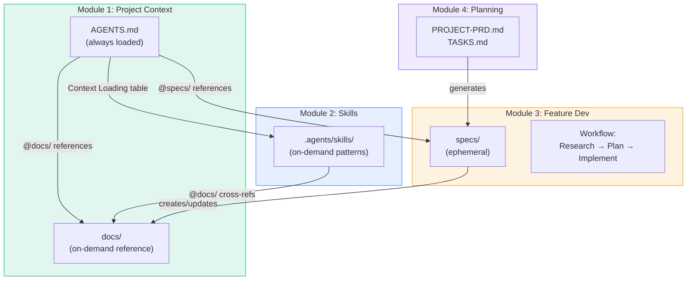
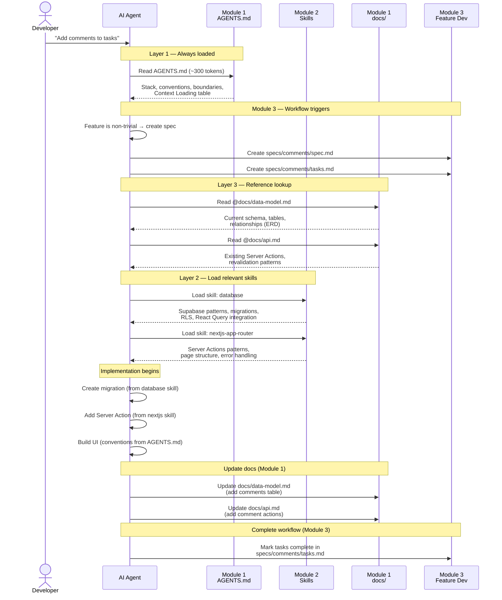
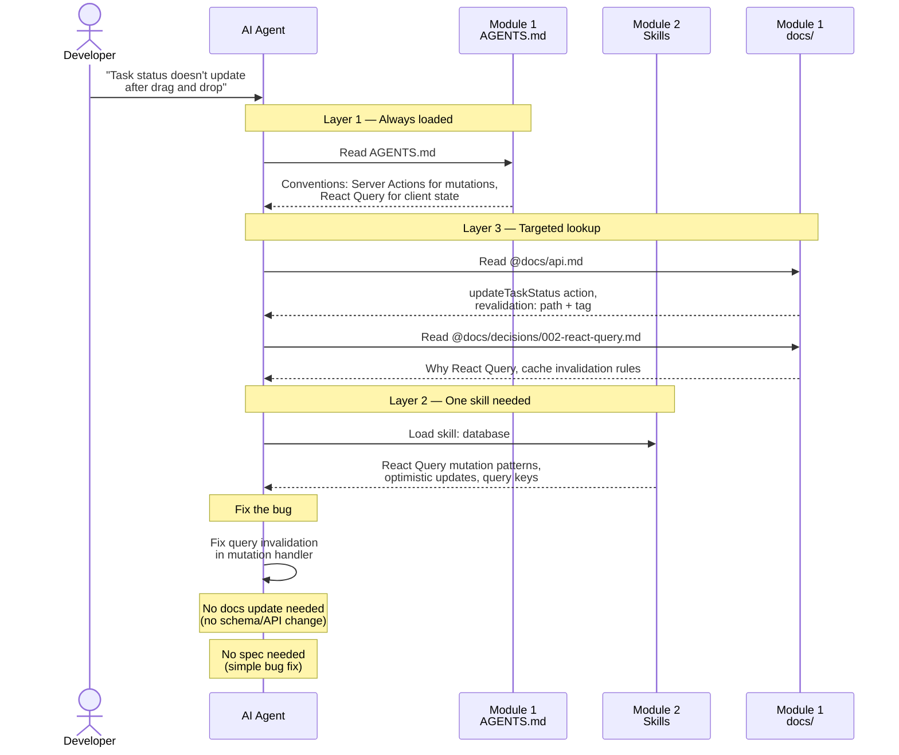
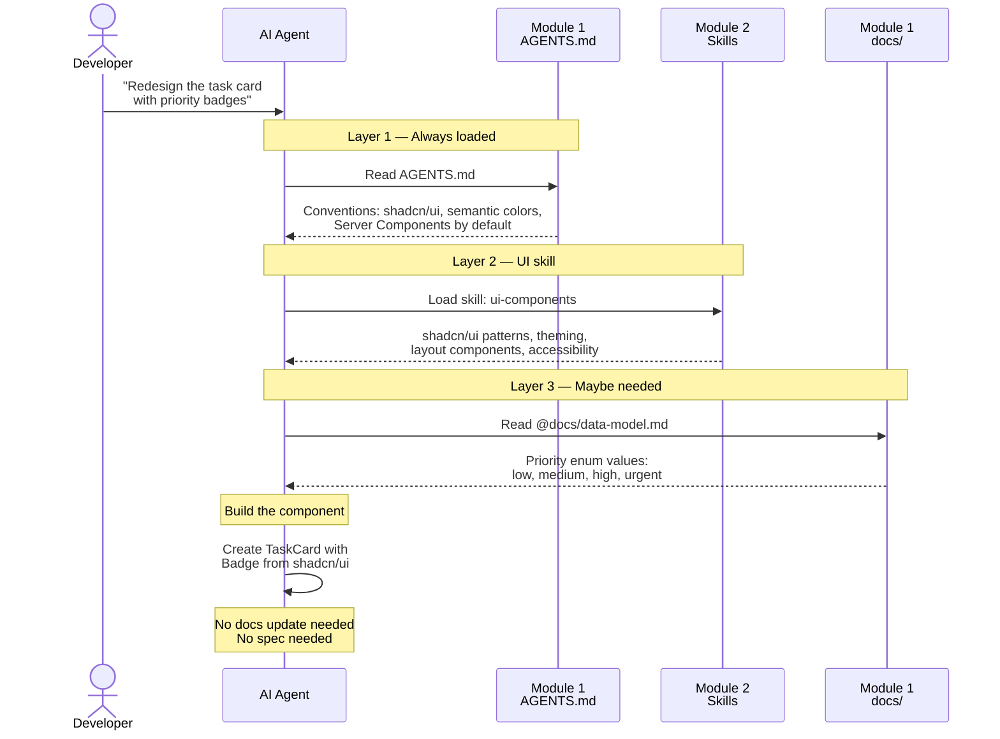
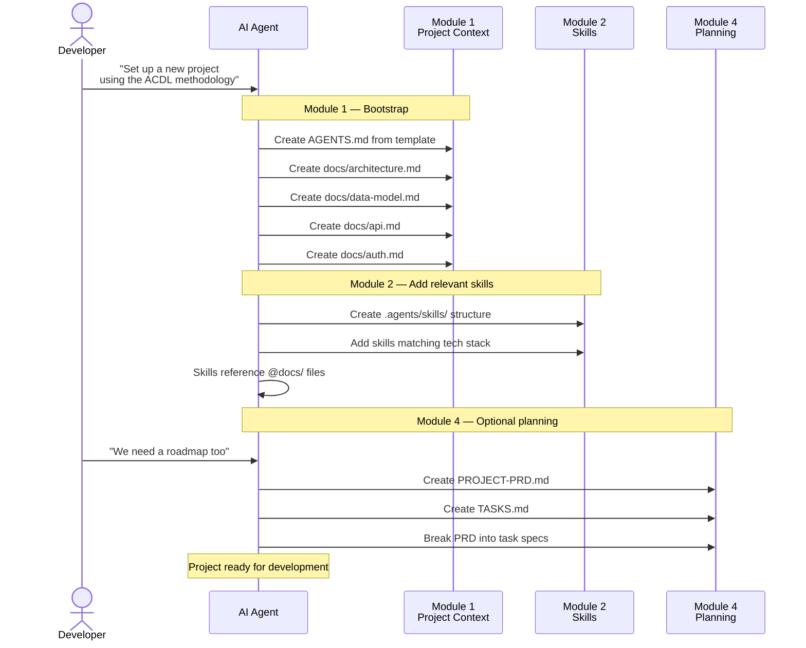
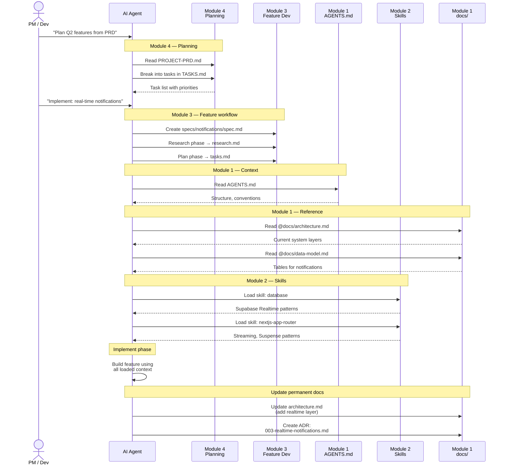
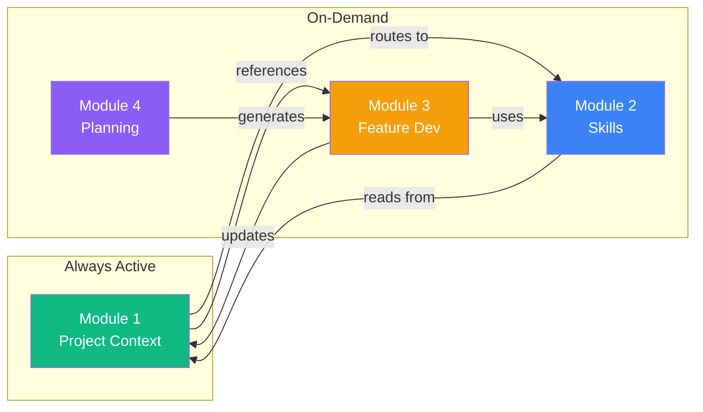

# Validation: Module Interaction Diagrams

> How AI agents use each module — validated through real scenario walkthroughs.

---

## Module Overview (4 Modules)



---

## Scenario 1: New Feature ("Add task comments")

The most complete flow — touches all 4 modules.



### Token Budget

| Step | Module | Tokens Loaded |
|------|--------|--------------|
| AGENTS.md | M1 | ~700 |
| data-model.md | M1 (docs) | ~1,150 |
| api.md | M1 (docs) | ~1,100 |
| database skill | M2 | ~1,750 |
| nextjs-app-router skill | M2 | ~1,620 |
| **Total** | | **~6,320** |

Only ~700 is always-on. The rest is task-relevant, loaded on-demand.
Old approach (14 always-on rules): **~5,000 tokens** loaded regardless of task relevance.

---

## Scenario 2: Bug Fix ("Task status not updating")

Lighter flow — skips Module 3 and Module 4.



### Token Budget

| Step | Module | Tokens Loaded |
|------|--------|--------------|
| AGENTS.md | M1 | ~700 |
| api.md | M1 (docs) | ~1,100 |
| ADR 002 | M1 (docs) | ~375 |
| database skill | M2 | ~1,750 |
| **Total** | | **~3,925** |

Only ~700 is always-on. Remaining ~3,225 loaded because it's relevant to the bug.

---

## Scenario 3: UI-Only Change ("Redesign task card")

Minimal flow — mostly Module 1 + one skill.



### Token Budget

| Step | Module | Tokens Loaded |
|------|--------|--------------|
| AGENTS.md | M1 | ~700 |
| ui-components skill | M2 | ~1,650 |
| data-model.md (partial) | M1 (docs) | ~1,150 |
| **Total** | | **~3,500** |

Only ~700 is always-on. Lightest coding scenario — one skill, one doc.

---

## Scenario 4: Project Setup (Day 1)

Module 1 setup, optionally Module 4.



---

## Scenario 5: Enterprise Planning (Module 4 → Module 3)

Shows how planning flows into feature development.



---

## Module Dependency Matrix

Which modules interact with which, and how:



| From → To | Relationship | Example |
|-----------|-------------|---------|
| M1 → M2 | **Routes** (Context Loading table) | "Building pages → load skill `nextjs-app-router`" |
| M1 → M3 | **References** (links to specs/) | "@specs/current-feature/" |
| M2 → M1 | **Reads** (cross-references docs) | Skill says "@docs/data-model.md" |
| M3 → M1 | **Updates** (new docs, ADRs) | Feature complete → update architecture.md |
| M4 → M3 | **Generates** (PRD → specs) | Break PRD task into specs/task-name/ |
| M3 → M2 | **Uses** (loads skills during implementation) | Implementing → load relevant skills |

---

## Interaction Frequency Per Module

```
Session Type          M1(Context)  M2(Skills)  M3(FeatureDev)  M4(Planning)
─────────────────────────────────────────────────────────────────────────────
Bug fix                  ██████       ████          ░░              ░░
UI change                ██████       ████          ░░              ░░
Small enhancement        ██████       ████          ████            ░░
New feature              ██████       ██████        ██████          ░░
Project setup            ██████       ████          ░░              ░░
Sprint planning          ████         ░░            ████            ██████
Architecture change      ██████       ██████        ██████          ░░

██████ = Always used    ████ = Usually used    ░░ = Rarely/never
```

### Key Insights

**Module 1 is always used** — it's the entry point for every interaction. This validates the decision to make it the most comprehensive module (absorbing Module 4's docs content).

**Module 2 is used in every coding task** — Skills provide the "how" that complements Module 1's "what."

**Module 3 is only for non-trivial features** — Simple bug fixes and UI tweaks skip it entirely.

**Module 4 is the rarest** — Only needed when planning from scratch or managing a backlog.

**The value is relevance, not raw token count.** Total session context (3,500-6,300 tokens) can exceed the old always-on rules (~5,000 tokens). The advantage is that:
- Only ~700 tokens are always-on (vs ~5,000)
- Every additional token loaded is directly relevant to the current task
- The AI doesn't wade through Supabase patterns when doing UI work, or testing patterns when writing migrations
- Relevant context > less irrelevant context

---

## Validation Checklist

- [x] Every scenario starts with Module 1 (AGENTS.md) — confirms it's the universal entry point
- [x] Skills load on-demand, never all at once — progressive disclosure works
- [x] Docs are referenced from both AGENTS.md and Skills — cross-referencing validated
- [x] Feature Dev (M3) creates/updates docs (M1) — docs stay fresh
- [x] Planning (M4) generates Feature Dev specs (M3) — clean pipeline
- [x] No circular dependencies between modules
- [x] Always-on context is only ~700 tokens (AGENTS.md) vs ~5,000 with old approach
- [x] Total session context (3,500-6,300) is all task-relevant — advantage is relevance, not raw count
- [x] Module 4 (old Reference Docs) content is naturally accessed via Module 1 — absorption validated

---

*Validated: 2026-02-08*
